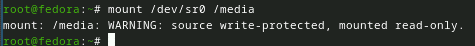

---
## Front matter
title: "Отчёт по лабораторной работе №1"
subtitle: "Установка ОС Linux"
author: "Чекмарев Александр Дмитриевич | Группа НПИбд-02-23"

## Generic otions
lang: ru-RU
toc-title: "Содержание"

## Bibliography
bibliography: bib/cite.bib
csl: pandoc/csl/gost-r-7-0-5-2008-numeric.csl

## Pdf output format
toc: true # Table of contents
toc-depth: 2
lof: true # List of figures
lot: true # List of tables
fontsize: 12pt
linestretch: 1.5
papersize: a4
documentclass: scrreprt
## I18n polyglossia
polyglossia-lang:
  name: russian
  options:
	- spelling=modern
	- babelshorthands=true
polyglossia-otherlangs:
  name: english
## I18n babel
babel-lang: russian
babel-otherlangs: english
## Fonts
mainfont: PT Serif
romanfont: PT Serif
sansfont: PT Sans
monofont: PT Mono
mainfontoptions: Ligatures=TeX
romanfontoptions: Ligatures=TeX
sansfontoptions: Ligatures=TeX,Scale=MatchLowercase
monofontoptions: Scale=MatchLowercase,Scale=0.9
## Biblatex
biblatex: true
biblio-style: "gost-numeric"
biblatexoptions:
  - parentracker=true
  - backend=biber
  - hyperref=auto
  - language=auto
  - autolang=other*
  - citestyle=gost-numeric
## Pandoc-crossref LaTeX customization
figureTitle: "Рис."
tableTitle: "Таблица"
listingTitle: "Листинг"
lofTitle: "Список иллюстраций"
lotTitle: "Список таблиц"
lolTitle: "Листинги"
## Misc options
indent: true
header-includes:
  - \usepackage{indentfirst}
  - \usepackage{float} # keep figures where there are in the text
  - \floatplacement{figure}{H} # keep figures where there are in the text
---

# Цель работы

Целью данной работы является приобретение практических навыков установки операционной системы на виртуальную машину, 
настройки минимально необходимых для дальнейшей работы сервисов.

# Выполнение лабораторной работы

## Установка Virtualbox и Linux Fedora Sway Spin 39

Скачаем и установим виртуальную машину через сайт: 
https://www.virtualbox.org/wiki/Downloads

  

    
В моем случае Windows. В установке ничего сложного нет, открываем .exe, выбираем нужный нам диск, где будет установлен VB, соглашаемся со всеми пунктами, ожидаем завершения установки.
Теперь нужно скачать дистрибутив Linux Fedora 39 на сайте: https://fedoraproject.org/spins/sway/download

Перейдем непосредственно к установке Линукса на виртуальную машину. 
Открываем VirtualBox, нажимаем на New. После вписываем имя, выбираем место и .iso образ Fedora

Указываем сколько нам нужно RAM, желательно выделить больше 4 или более гб и сколько будет использовано ядер процессора

Ставим 80 гб, как сказано в «Указания к работе» 

## Установка операционной системы

Запускаем наш Линукс, ожидаем погрузки. Начнем установку, используем комб. win + d

Начнем установку, используем комб. win + d, ищем (run) liveinst и выбираем его

В следующем окошке нас ожидает выбор языка, выбираем язык

Выбираем диск

Включаем root права, пишем пароль

Создаем пользователя
    

Приступаем к установке

Далее после завершения установки перезапускаем виртуальную машину

В настройках виртуальной машины, в пункте «Storage» убираем галочку с привода (Remove Disk…), чтобы стало пусто

При повторном запуске мы вводим данные от нашего аккаунта (пользователя)

## После установки (Настройка Линукса)

Откроем терминал Win+Enter
Переключимся на роль супер-пользователя: sudo -i
    
 

Обновим все пакеты: dnf -y update
    
 

Установим программы для удобства работы в консоли: dnf -y install tmux mc

 

При необходимости можно использовать автоматическое обновление.
Установка программного обеспечения: dnf install dnf-automatic

 

Можно задать необходимую конфигурацию в файле /etc/dnf/automatic.conf, но лично для меня это смысла не имеет, так что просто запустим таймер: systemctl enable --now dnf-automatic.timer

 

Отключим SELinux
В данном курсе мы не будем рассматривать работу с системой безопасности SELinux. Поэтому отключим его.
В файле /etc/selinux/config заменим значение SELINUX=enforcing на значение SELINUX=permissive

 

Перегрузим виртуальную машину: reboot

 

## Установка драйверов для VirtualBox

Войдем в ОС под заданной вами при установке учётной записью.
Нажмем комбинацию Win+Enter для запуска терминала.
Запустим терминальный мультиплексор tmux: tmux
   

Переключимся на роль супер-пользователя: sudo -i

Установим средства разработки: dnf -y group install "Development Tools"

Установим пакет DKMS: dnf -y install dkms

В меню виртуальной машины подключите образ диска дополнений гостевой ОС.
Подмонтируем диск: mount /dev/sr0 /media

Установим драйвера: /media/VBoxLinuxAdditions.run

Перегрузим виртуальную машину: reboot

## Настройка раскладки клавиатуры

Войдем в ОС под заданной вами при установке учётной записью.  Нажмем комбинацию Win+Enter для запуска терминала.
Запустим терминальный мультиплексор tmux: tmux
Перед созданием конф файла, создадим sway и config.d:

    
Создадим конфигурационный файл ~/.config/sway/config.d/95-system-keyboard-config.conf: 
touch ~/.config/sway/config.d/95-system-keyboard-config.conf

Отредактируем конфигурационный файл ~/.config/sway/config.d/95-system-keyboard-config.conf и впишем туда следующее:
exec_always /usr/libexec/sway-systemd/locale1-xkb-config --oneshot

Переключимся на роль супер-пользователя: sudo -i

Отредактируем конфигурационный файл /etc/X11/xorg.conf.d/00-keyboard.conf: 

Section "InputClass"
        Identifier "system-keyboard"
        MatchIsKeyboard "on"
        Option "XkbLayout" "us,ru"
        Option "XkbVariant" ",winkeys"
        Option "XkbOptions" "grp:rctrl_toggle,compose:ralt,terminate:ctrl_alt_bksp"
EndSection

Для этого можно использовать файловый менеджер mc и его встроенный редактор (или nano).

Перегрузим виртуальную машину: reboot

## Установка имени пользователя и названия хоста
        
Если при установке виртуальной машины вы задали имя пользователя или имя хоста, не удовлетворяющее соглашению об именовании, то вам необходимо исправить это.
Запустим виртуальную машину и залогинимся.
Нажмите комбинацию Win+Enter для запуска терминала.
Запустим терминальный мультиплексор tmux: tmux
Переключимся на роль супер-пользователя: sudo -i
Создадим пользователя (вместо username укажите ваш логин в дисплейном классе): adduser -G wheel username
Зададим пароль для пользователя (вместо username укажите ваш логин в дисплейном классе): passwd username

Действия выше мне делать не нужно, так как у меня все настроено как надо.

Установим имя хоста (вместо username укажите ваш логин в дисплейном классе): hostnamectl set-hostname username

 Проверим, что имя хоста установлено верно: hostnamectl
 

    
## Подключение общей папки
    
Внутри виртуальной машины добавьте своего пользователя в группу vboxsf (вместо username укажите ваш логин): gpasswd -a username vboxsf

Так как я работаю на windows, то создам папку на нем WorkLinux

В хостовой системе подключим разделяемую папку: 
vboxmanage sharedfolder add "$(id -un)_os-intro" --name=work --hostpath=work –automount

Введем следующее в cmd: 

Перегрузим виртуальную машину: reboot

## Установка программного обеспечения для создания документации

Нажмем комбинацию Win+Enter для запуска терминала.
Запустим терминальный мультиплексор tmux: tmux
Переключимся на роль супер-пользователя: sudo -i

**Работа с языком разметки Markdown**

Средство pandoc для работы с языком разметки Markdown.
Установка с помощью менеджера пакетов: dnf -y install pandoc

Для работы с перекрёстными ссылками мы используем пакет pandoc-crossref.
Пакет pandoc-crossref в стандартном репозитории отсутствует.
Придётся ставить вручную, скачав с сайта https://github.com/lierdakil/pandoc-crossref.
При установке pandoc-crossref следует обращать внимание, для какой версии pandoc он скомпилён.
Лучше установить pandoc и pandoc-crossref вручную.
Скачаем необходимую версию pandoc-crossref (https://github.com/lierdakil/pandoc-crossref/releases). Для нашего нынешнего pandoc v3.1.3

Посмотрим, для какой версии откомпилён pandoc-crossref.
Скачаем соответствующую версию pandoc (https://github.com/jgm/pandoc/releases).
Распакуем архивы.

Обе программы собраны в виде статически-линкованных бинарных файлов.
Поместим их в каталог /usr/local/bin.

**Texlive**
Установим дистрибутив TeXlive: dnf -y install texlive-scheme-full

# Домашняя работа

Дождитесь загрузки графического окружения и откройте терминал. В окне терминала проанализируйте последовательность загрузки системы, выполнив команду dmesg. Можно просто просмотреть вывод этой команды: dmesg | less

Можно использовать поиск с помощью grep: dmesg | grep -i "то, что ищем"

Получите следующую информацию.
Версия ядра Linux (Linux version).

Частота процессора (Detected Mhz processor).

Модель процессора (CPU0).

Объём доступной оперативной памяти (Memory available).

Тип обнаруженного гипервизора (Hypervisor detected).

Тип файловой системы корневого раздела.

Последовательность монтирования файловых систем.

# Контрольные вопросы

1) Какую информацию содержит учётная запись пользователя?
Системное имя, идентификатор пользователя, идентификатор группы,
полное имя, домашний каталог, начальная оболочка.

2) Укажите команды терминала и приведите примеры:

для получения справки по команде; man <команда> (man ls)

для перемещения по файловой системе; cd <каталог> (cd / -перемещение в корневой каталог)

для просмотра содержимого каталога; ls <каталог если нужно> (ls / -содержимое корневого каталога)

для определения объёма каталога; du -s <каталог> (du -s /etc)

для создания / удаления каталогов / файлов;; rm <ключ> <название файла/каталога>

Пустые каталоги можно удалять командой rmdir (если добавить ключ -s, то
можно удалять и не только пустые). Также любые файлы можно удалять
рекурсивно: rm -r <название файла/каталога>

для задания определённых прав на файл / каталог; chmod <xxx> <имя> (chmod 777 filename.txt)

для просмотра истории команд; history

3) Что такое файловая система? Приведите примеры с краткой характеристикой.
Файловая система - это способ организации и хранения данных на носителе информации, таком как жесткий диск или флэш-накопитель. Она определяет способ, которым файлы и каталоги структурируются, и как к ним обращаться.

Вот несколько примеров файловых систем в Linux:

ext4 (Fourth Extended Filesystem): Это одна из наиболее распространенных файловых систем в Linux. Она обеспечивает хорошую производительность и надежность, поддерживает большие размеры файлов и разделов. ext4 является стандартной файловой системой для многих дистрибутивов Linux.

Btrfs (B-tree File System): Это современная файловая система, которая поддерживает функции копирования на запись, снимков и сжатия данных. Btrfs предоставляет возможности по обнаружению и восстановлению поврежденных данных, а также управлению множеством дисков.

XFS (XFS File System): Эта файловая система изначально разработана для высокопроизводительных систем. Она обладает хорошей поддержкой больших файлов и разделов, а также высокой параллельной производительностью ввода-вывода.

ZFS (Zettabyte File System): Хотя ZFS не является частью ядра Linux из коробки из-за проблем лицензирования, он все равно доступен для установки и использования. ZFS предлагает мощные функции, такие как проверка целостности данных, снимки, моментальные копии и встроенное RAID.

F2FS (Flash-Friendly File System): Эта файловая система оптимизирована для использования на флэш-накопителях, таких как SSD. F2FS учитывает особенности флэш-памяти, такие как износ и способы записи, для повышения производительности и срока службы носителя.

4) Как посмотреть, какие файловые системы подмонтированы в ОС?
Командой mount
5) Как удалить зависший процесс?
Узнайте идентификатор процесса (PID): Вы можете использовать команду ps aux | grep <название процесса> для поиска запущенных процессов и их PID. Например:
ps aux | grep firefox
Это покажет список процессов, связанных с Firefox, и их PID.
Используйте команду kill для завершения процесса: Как только вы найдете PID зависшего процесса, используйте команду kill с этим PID для завершения процесса. Например
kill -9 <PID>
-9 это сигнал, который немедленно завершает процесс. Обычно это сработает, если процесс завис, и не реагирует на обычные сигналы завершения.

# Выводы

Я приобрел практические навыки установки операционной системы на виртуальную машину и настройки минимально необходимые для дальнейшей работы с Линуксом.

# Список литературы{.unnumbered}

::: {#refs}
:::
