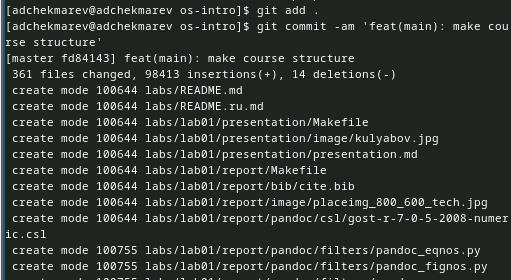

---
## Front matter
lang: ru-RU
title: Лабораторная работа №2
subtitle: Первоначальная настройка git
author:
  - Чекмарев Александр Дмитриевич | Группа НПИбд-02-23
institute:
  - Российский университет дружбы народов, Москва, Россия
date: 27 февраля 2024

## i18n babel
babel-lang: russian
babel-otherlangs: english

## Formatting pdf
toc: false
toc-title: Содержание
slide_level: 2
aspectratio: 169
section-titles: true
theme: metropolis
header-includes:
 - \metroset{progressbar=frametitle,sectionpage=progressbar,numbering=fraction}
 - '\makeatletter'
 - '\beamer@ignorenonframefalse'
 - '\makeatother'
 
 
 ## Fonts
mainfont: PT Serif
romanfont: PT Serif
sansfont: PT Sans
monofont: PT Mono
mainfontoptions: Ligatures=TeX
romanfontoptions: Ligatures=TeX
sansfontoptions: Ligatures=TeX,Scale=MatchLowercase
monofontoptions: Scale=MatchLowercase,Scale=0.9
---

# Информация

## Докладчик

:::::::::::::: {.columns align=center}
::: {.column width="70%"}

  * Чекмарев Александр Дмитриевич
  * Группа НПИбд-02-23
  * Российский университет дружбы народов
  * <https://github.com/nenokixd?tab=repositories>

:::
::: {.column width="30%"}

:::
::::::::::::::

# Вводная часть

## Объект и предмет исследования

- Первоначальна настройка git на Linux

## Цель работы

- Изучить идеологию и применение средств контроля версий.
- Освоить умения по работе с git.

# Ход лаборатороной работы

## Установка программного обеспечения

- Установка git и Установка gh

## Базовая настройка git

- Зададим имя и email владельца репозитория
- Настроим utf-8 в выводе сообщений git
- Настроим верификацию и подписание коммитов git
- Параметр autocrlf и safecrlf

## Создание ключа ssh

- по алгоритму rsa с ключём размером 4096 бит
- по алгоритму ed25519

## Создание ключа pgp

- Генерируем ключ: gpg --full-generate-key
- Из предложенных опций выбираем:
        тип RSA and RSA;
        размер 4096;
        выберите срок действия; значение по умолчанию — 0

## Настройка github

- Чтобы работать с github, нам нужно будет создать аккаунт на сайте https://github.com/.

## Добавление PGP ключа в GitHub

- Перейдем в настройки GitHub (https://github.com/settings/keys), нажмем на кнопку New GPG key и вставим полученный ключ в поле ввода.

## Настройка автоматических подписей коммитов git

- Используя введёный email, укажем Git применять его при подписи коммитов

## Настройка gh

- Для начала необходимо авторизоваться. Утилита задаст несколько наводящих вопросов.
- Авторизоваться можно через браузер.

## Шаблон для рабочего пространства

## Настройка каталога курса

- Удалим лишние файлы
- Создадим необходимые каталоги

## Подготовка перед отправкой файлов на сервер

- Подготовим файлы на отправку

## Отпрака файлов на сервер

## Вывод:

Я Изучил идеологию и применение средств контроля версий, а также освоил умения по работе с git.

