---
## Front matter
title: "Отчёт по лабораторной работе №2"
subtitle: "Первоначальная настройка git"
author: "Чекмарев Александр Дмитриевич | Группа НПИбд-02-23"

## Generic otions
lang: ru-RU
toc-title: "Содержание"

## Bibliography
bibliography: bib/cite.bib
csl: pandoc/csl/gost-r-7-0-5-2008-numeric.csl

## Pdf output format
toc: true # Table of contents
toc-depth: 2
lof: true # List of figures
lot: true # List of tables
fontsize: 12pt
linestretch: 1.5
papersize: a4
documentclass: scrreprt
## I18n polyglossia
polyglossia-lang:
  name: russian
  options:
	- spelling=modern
	- babelshorthands=true
polyglossia-otherlangs:
  name: english
## I18n babel
babel-lang: russian
babel-otherlangs: english
## Fonts
mainfont: PT Serif
romanfont: PT Serif
sansfont: PT Sans
monofont: PT Mono
mainfontoptions: Ligatures=TeX
romanfontoptions: Ligatures=TeX
sansfontoptions: Ligatures=TeX,Scale=MatchLowercase
monofontoptions: Scale=MatchLowercase,Scale=0.9
## Biblatex
biblatex: true
biblio-style: "gost-numeric"
biblatexoptions:
  - parentracker=true
  - backend=biber
  - hyperref=auto
  - language=auto
  - autolang=other*
  - citestyle=gost-numeric
## Pandoc-crossref LaTeX customization
figureTitle: "Рис."
tableTitle: "Таблица"
listingTitle: "Листинг"
lofTitle: "Список иллюстраций"
lotTitle: "Список таблиц"
lolTitle: "Листинги"
## Misc options
indent: true
header-includes:
  - \usepackage{indentfirst}
  - \usepackage{float} # keep figures where there are in the text
  - \floatplacement{figure}{H} # keep figures where there are in the text
---

# Цель работы

    • Изучить идеологию и применение средств контроля версий.
    • Освоить умения по работе с git.

# Выполнение лабораторной работы

## Установка программного обеспечения
Установка git
    • Установим git: dnf install git
    
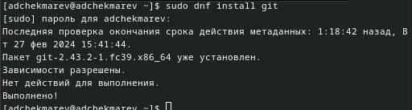
    
Установка gh
    • Установим gh: dnf install gh
    
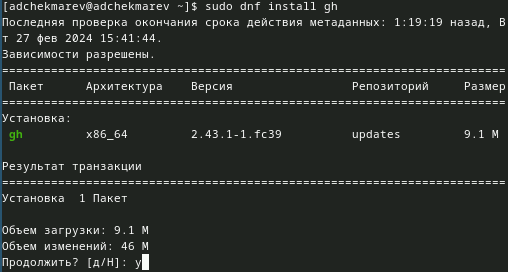

## Базовая настройка git

Зададим имя и email владельца репозитория: *git config --global user.name "Name Surname"*

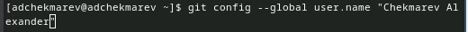

*git config --global user.email "work@mail"*

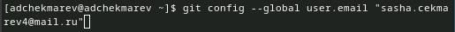

Настроим utf-8 в выводе сообщений git: *git config --global core.quotepath false*

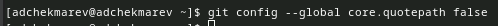

Настроим верификацию и подписание коммитов git (см. Верификация коммитов git с помощью GPG).
Зададим имя начальной ветки (будем называть её master):
*git config --global init.defaultBranch master*

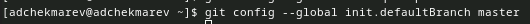

Параметр autocrlf:
*git config --global core.autocrlf input*

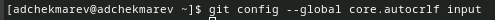

Параметр safecrlf:
*git config --global core.safecrlf warn*
    
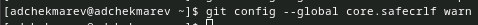

## Создание ключа ssh

по алгоритму rsa с ключём размером 4096 бит: *ssh-keygen -t rsa -b 4096*
    
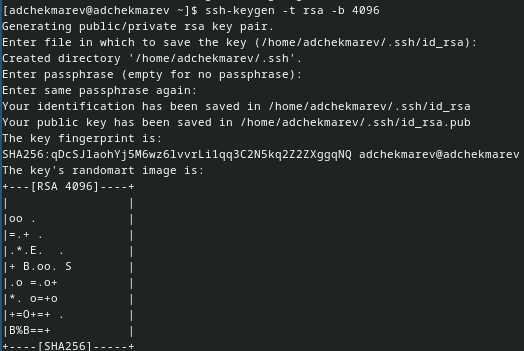 

по алгоритму ed25519: *ssh-keygen -t ed25519*
    
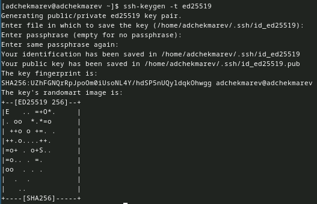 

## Создание ключа pgp

    • Генерируем ключ: gpg --full-generate-key
    • Из предложенных опций выбираем:
        ◦ тип RSA and RSA;
        ◦ размер 4096;
        ◦ выберите срок действия; значение по умолчанию — 0 (срок действия не истекает никогда).
    • GPG запросит личную информацию, которая сохранится в ключе:
        ◦ Имя (не менее 5 символов).
        ◦ Адрес электронной почты.
            ▪ При вводе email убедитесь, что он соответствует адресу, используемому на GitHub.
        ◦ Комментарий. Можно ввести что угодно или нажать клавишу ввода, чтобы оставить это поле пустым
    
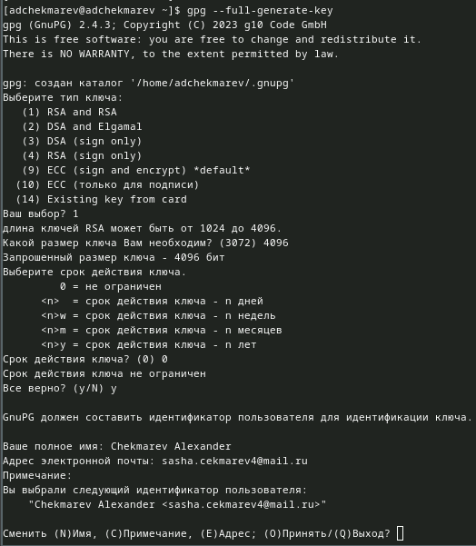

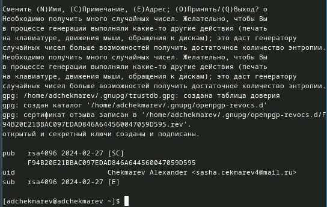

## Настройка github

Чтобы работать с github, нам нужно будет создать аккаунт на сайте https://github.com/. У меня аккаунт уже есть с прошлого семестра.

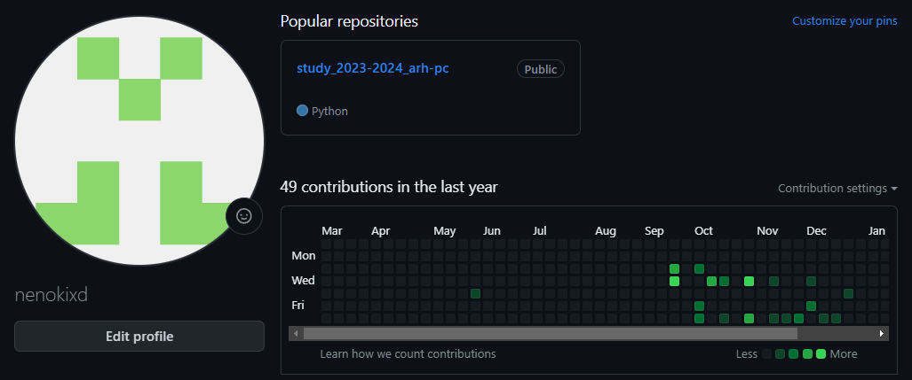
    
    
## Добавление PGP ключа в GitHub
        
    • Выводим список ключей и копируем отпечаток приватного ключа: *gpg --list-secret-keys --keyid-format LONG*

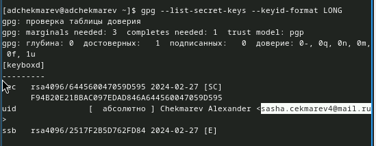

    • Отпечаток ключа — это последовательность байтов, используемая для идентификации более длинного, по сравнению с самим отпечатком ключа.
    • Формат строки: sec   Алгоритм/Отпечаток_ключа Дата_создания [Флаги] [Годен_до] ID_ключа
    • Cкопируем ваш сгенерированный PGP ключ в буфер обмена: *gpg --armor --export <PGP Fingerprint> | xclip -sel clip*

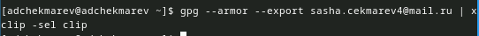

Перейдем в настройки GitHub (https://github.com/settings/keys), нажмем на кнопку New GPG key и вставим полученный ключ в поле ввода.

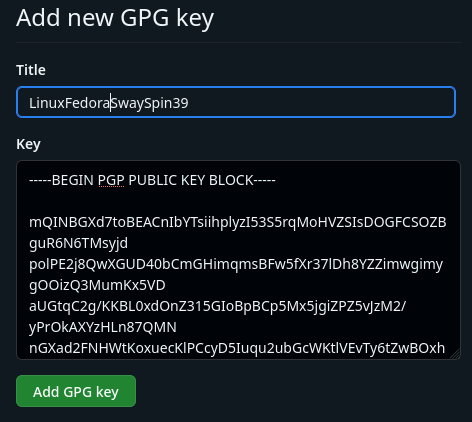

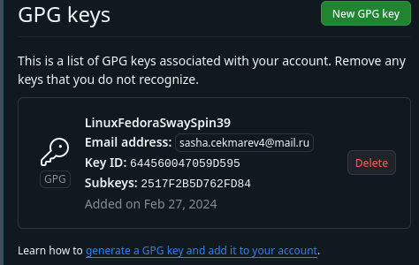

    
## Настройка автоматических подписей коммитов git
    
    • Используя введёный email, укажем Git применять его при подписи коммитов:
*git config --global user.signingkey <PGP Fingerprint>*
*git config --global commit.gpgsign true*
*git config --global gpg.program $(which gpg2)*
             
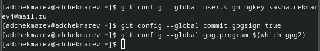
                 
## Настройка gh

Для начала необходимо авторизоваться: gh auth login
Утилита задаст несколько наводящих вопросов.
Авторизоваться можно через браузер.

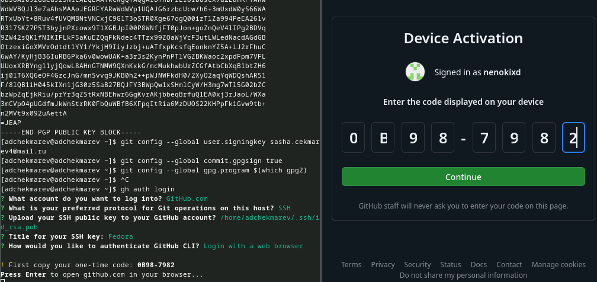

## Шаблон для рабочего пространства

Рабочее пространство для лабораторной работы
Репозиторий: https://github.com/yamadharma/course-directory-student-template.

Сознание репозитория курса на основе шаблона
Необходимо создать шаблон рабочего пространства (см. Рабочее пространство для лабораторной работы).
Например, для 2023–2024 учебного года и предмета «Операционные системы» (код предмета os-intro) создание репозитория примет следующий вид: *mkdir -p ~/work/study/2023-2024/"Операционные системы"*

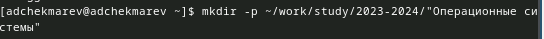

*cd ~/work/study/2023-2024/"Операционные системы"*

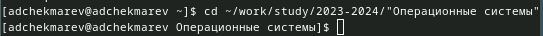

*gh repo create study_2023-2024_os-intro --template=yamadharma/course-directory-student-template –public*

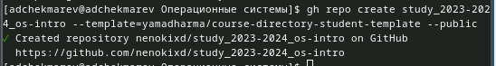

*git clone --recursive git@github.com:<owner>/study_2023-2024_os-intro.git os-intro*

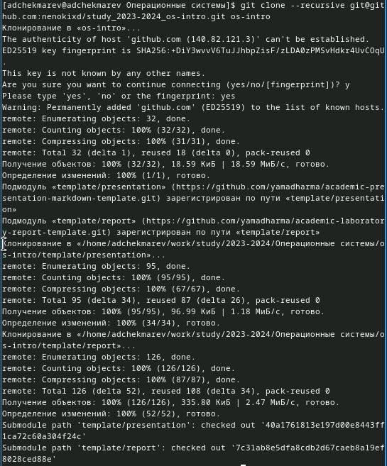

**Настройка каталога курса**

Перейдите в каталог курса: *cd ~/work/study/2023-2024/"Операционные системы"/os-intro*

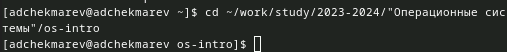

Удалите лишние файлы: *rm package.json*

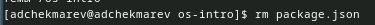

Создайте необходимые каталоги:
*echo os-intro > COURSE*
*make*

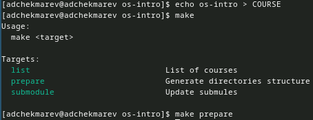

Отправьте файлы на сервер:

*git add .*
*git commit -am 'feat(main): make course structure'*

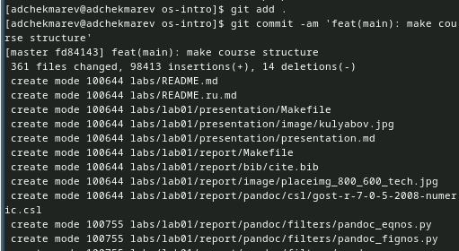

*git push*

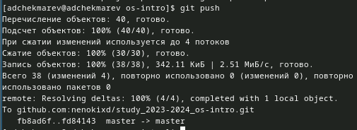

# Контрольные вопросы

1) Что такое системы контроля версий (VCS) и для решения каких задач они предназначаются?
    
    Системы контроля версий (VCS) - это инструменты, которые отслеживают изменения в файловой системе с течением времени. Они предназначены для управления изменениями в коде и других файлах проекта, позволяя разработчикам работать над проектом одновременно, откатывать изменения, если что-то идет не так, и отслеживать историю изменений.
    
2) Объясните следующие понятия VCS и их отношения: хранилище, commit, история, рабочая копия.

    Хранилище (repository): Это место, где хранятся все файлы и история изменений проекта.
    Commit: Это операция сохранения изменений в репозитории. При коммите фиксируются все изменения, сделанные с момента предыдущего коммита.
    История (history): Это записи о всех коммитах, сделанных в репозитории.
    Рабочая копия (working copy): Это копия файлов из репозитория, с которой вы работаете на вашем компьютере.

3) Что представляют собой и чем отличаются централизованные и децентрализованные VCS? Приведите примеры VCS каждого вида.

    Централизованные VCS имеют одно основное хранилище, к которому подключаются все клиенты. Децентрализованные VCS позволяют каждому клиенту иметь собственное полноценное хранилище. Примеры централизованных VCS: Subversion (SVN). Примеры децентрализованных VCS: Git, Mercurial.

4) Опишите действия с VCS при единоличной работе с хранилищем.

При единоличной работе с хранилищем в VCS вы создаете, изменяете и фиксируете изменения в рабочей копии и затем коммитите их в репозиторий.

5) Опишите порядок работы с общим хранилищем VCS.

Порядок работы с общим хранилищем VCS включает получение последних изменений из репозитория (pull), внесение своих изменений, фиксацию изменений (commit) и отправку их в репозиторий (push).

6) Каковы основные задачи, решаемые инструментальным средством git?

Основные задачи инструмента git:

    Отслеживание изменений в файлах.
    Управление версиями проекта.
    Работа с удаленными репозиториями.
    Ветвление и слияние изменений.
    Работа с ветками.

7) Назовите и дайте краткую характеристику командам git.

Некоторые команды git:

    git init: Создает новый репозиторий.
    git add: Добавляет файлы в индекс для последующего коммита.
    git commit: Фиксирует изменения в репозитории.
    git push: Отправляет изменения в удаленный репозиторий.
    git pull: Получает изменения из удаленного репозитория и объединяет их с текущей веткой.

8) Приведите примеры использования при работе с локальным и удалённым репозиториями.

Примеры использования при работе с локальным и удаленным репозиториями:

    Локальный: Создание нового репозитория с помощью git init.
    Удаленный: Клонирование существующего удаленного репозитория с помощью git clone.

9) Что такое и зачем могут быть нужны ветви (branches)?

Ветви (branches) - это параллельные линии разработки в репозитории, которые позволяют работать над разными фичами или исправлениями, не затрагивая основную ветку. Они могут быть нужны, чтобы изолировать разные функциональные изменения или исправления ошибок.

10) Как и зачем можно игнорировать некоторые файлы при commit?

Файлы могут быть проигнорированы при коммите с помощью файла .gitignore. В этом файле перечисляются шаблоны файлов или папок, которые не должны быть добавлены в репозиторий.

# Выводы

Я Изучил идеологию и применение средств контроля версий, а также освоил умения по работе с git.

# Список литературы{.unnumbered}

::: {#refs}
:::
