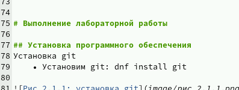
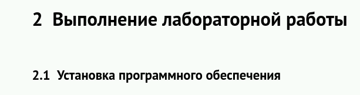
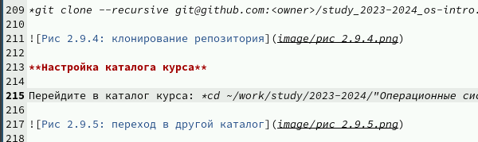
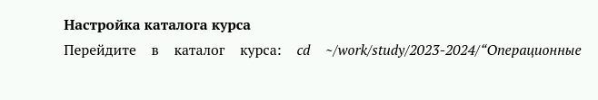
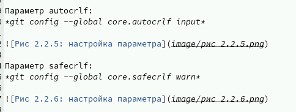
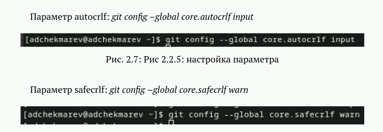
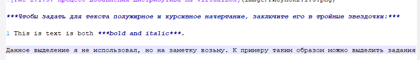
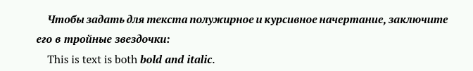
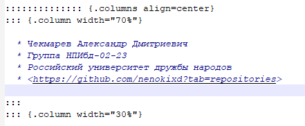
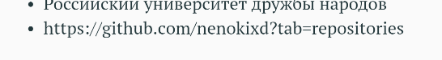

---
## Front matter
lang: ru-RU
title: Лабораторная работа №3
subtitle: Markdown
author:
  - Чекмарев Александр Дмитриевич | Группа НПИбд-02-23
institute:
  - Российский университет дружбы народов, Москва, Россия
date: 27 февраля 2024

## i18n babel
babel-lang: russian
babel-otherlangs: english

## Formatting pdf
toc: false
toc-title: Содержание
slide_level: 2
aspectratio: 169
section-titles: true
theme: metropolis
header-includes:
 - \metroset{progressbar=frametitle,sectionpage=progressbar,numbering=fraction}
 - '\makeatletter'
 - '\beamer@ignorenonframefalse'
 - '\makeatother'
 
 
 ## Fonts
mainfont: PT Serif
romanfont: PT Serif
sansfont: PT Sans
monofont: PT Mono
mainfontoptions: Ligatures=TeX
romanfontoptions: Ligatures=TeX
sansfontoptions: Ligatures=TeX,Scale=MatchLowercase
monofontoptions: Scale=MatchLowercase,Scale=0.9
---

# Информация

## Докладчик

:::::::::::::: {.columns align=center}
::: {.column width="70%"}

  * Чекмарев Александр Дмитриевич
  * Группа НПИбд-02-23
  * Российский университет дружбы народов
  * <https://github.com/nenokixd?tab=repositories>

:::
::: {.column width="30%"}


:::
::::::::::::::

# Вводная часть


## Объект и предмет исследования

- работа с помощью Markdown

## Цель работы

- Научиться оформлять отчёты с помощью легковесного языка разметки Markdown.


# Базовые сведения о Markdown

## Заголовок

- Чтобы создать заголовок, используйте знак ( # ), например:

1 # This is heading 1
2 ## This is heading 2
3 ### This is heading 3
4 #### This is heading 4

{#fig:001 width=50%} {#fig:001 width=50%}


## Полужирное начертание

- Чтобы задать для текста полужирное начертание, заключите его в двойные звездочки:  
This text is **bold**.

{#fig:001 width=60%} {#fig:001 width=70%}


## Курсивное начертание

- Чтобы задать для текста курсивное начертание, заключите его в одинарные звездочки:  
This text is *italic*.

{#fig:001 width=50%} {#fig:001 width=50%}


## Полужирное и курсивное начертание

- Чтобы задать для текста полужирное и курсивное начертание, заключите его в тройные
звездочки:  
This is text is both ***bold and italic***.

{#fig:001 width=90%} {#fig:001 width=90%}


## Цитирование

- Блоки цитирования создаются с помощью символа >:  
1 > The drought had lasted now for ten million years, and the reign of
the terrible lizards had long since ended. Here on the Equator, in
the continent which would one day be known as Africa, the battle
for existence had reached a new climax of ferocity, and the victor
was not yet in sight. In this barren and desiccated land, only the
small or the swift or the fierce could flourish, or even hope to
survive.

## Неупорядоченный список
Неупорядоченный (маркированный) список можно отформатировать с помощью звездочек или тире:  
- List item 1  
- List item 2  
- List item 3  
Чтобы вложить один список в другой, добавьте отступ для элементов дочернего списка:
```
- List item 1
  - List item A
  - List item B
- List item 2
```
## Упорядоченный список

- Упорядоченный список можно отформатировать с помощью соответствующих цифр:

1. First instruction
1. Second instruction
1. Third instruction

- Чтобы вложить один список в другой, добавьте отступ для элементов дочернего списка:

1. First instruction
  1. Sub-instruction
  1. Sub-instruction
1. Second instruction

## Встроенная ссылка

- Синтаксис Markdown для встроенной ссылки состоит из части [link text] , представляющей текст гиперссылки, и части (file-name.md) – URL-адреса или имени файла,
на который дается ссылка:

[link text](file-name.md)

Один из моих примеров, но формат написания ссылки отличается:

{#fig:001 width=50%} {#fig:001 width=50%}


## Ограждение

- Markdown поддерживает как встраивание фрагментов кода в предложение, так и их размещение между предложениями в виде отдельных огражденных блоков. Огражденные блоки кода — это простой способ выделить синтаксис для фрагментов кода. Общий формат огражденных блоков кода:

``` language
your code goes in here
```
## Верхние и нижние индексы

- Нижний H2 записывается как:
H~2~O
- Верхний 2^10 записывается как:
2^10

## Внутритекстовые формулы

- Внутритекстовые формулы делаются аналогично формулам LaTeX. Например, формула
$\sin^2 (x) + \cos^2 (x) = 1$ запишется как:
```
$\sin^2 (x) + \cos^2 (x) = 1$
```

## Выключные формулы

- Выключные формулы запишутся как: $\sin^2 (x) + \cos^2 (x) = 1$
```
{#eq:eq:sin2+cos2} со ссылкой в тексте «Смотри формулу ([-@eq:eq:sin2+cos2]).» записывается как

$$
\sin^2 (x) + \cos^2 (x) = 1
$$ {#eq:eq:sin2+cos2}

Смотри формулу ([-@eq:eq:sin2+cos2]).
```
# Обработка файлов в формате Markdown

- Для обработки файлов в формате Markdown будем использовать Pandoc https://pandoc.org/. Конкретно, нам понадобится программа pandoc, pandoc-citeproc https://github.com/jgm/pandoc/releases, pandoc-crossref https://github.com/lierdakil/pandoc-crossref/releases.
- Преобразовать файл README.md можно следующим образом:  
pandoc README.md -o README.pdf  
или так  
pandoc README.md -o README.docx

## Makefile

- Можно использовать следующий Makefile
```
1 FILES = $(patsubst %.md, %.docx, $(wildcard *.md))
2 FILES += $(patsubst %.md, %.pdf, $(wildcard *.md))
3
4 LATEX_FORMAT =
5
6 FILTER = --filter pandoc-crossref
7
8 %.docx: %.md
9 -pandoc "$<" $(FILTER) -o "$@"
10
11 %.pdf: %.md
12 -pandoc "$<" $(LATEX_FORMAT) $(FILTER) -o "$@"
13
14 all: $(FILES)
15 @echo $(FILES)
16
17 clean:
18 -rm $(FILES) *~
```
## Вывод:

Я научился оформлять отчёты с помощью легковесного языка разметки Markdown.


