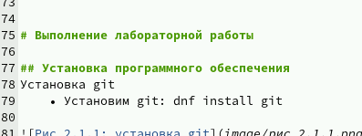
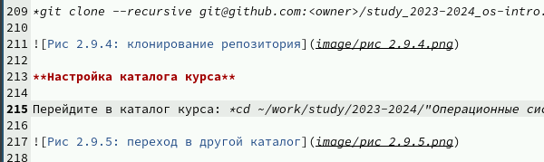
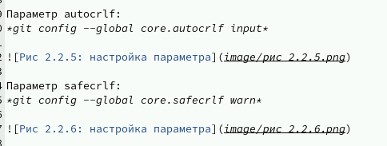
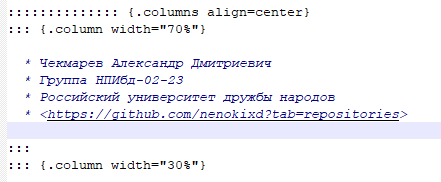

---
## Front matter
title: "Отчёт по лабораторной работе №3"
subtitle: "Markdown"
author: "Чекмарев Александр Дмитриевич | Группа НПИбд-02-23"

## Generic otions
lang: ru-RU
toc-title: "Содержание"

## Bibliography
bibliography: bib/cite.bib
csl: pandoc/csl/gost-r-7-0-5-2008-numeric.csl

## Pdf output format
toc: true # Table of contents
toc-depth: 2
lof: true # List of figures
lot: true # List of tables
fontsize: 12pt
linestretch: 1.5
papersize: a4
documentclass: scrreprt
## I18n polyglossia
polyglossia-lang:
  name: russian
  options:
	- spelling=modern
	- babelshorthands=true
polyglossia-otherlangs:
  name: english
## I18n babel
babel-lang: russian
babel-otherlangs: english
## Fonts
mainfont: PT Serif
romanfont: PT Serif
sansfont: PT Sans
monofont: PT Mono
mainfontoptions: Ligatures=TeX
romanfontoptions: Ligatures=TeX
sansfontoptions: Ligatures=TeX,Scale=MatchLowercase
monofontoptions: Scale=MatchLowercase,Scale=0.9
## Biblatex
biblatex: true
biblio-style: "gost-numeric"
biblatexoptions:
  - parentracker=true
  - backend=biber
  - hyperref=auto
  - language=auto
  - autolang=other*
  - citestyle=gost-numeric
## Pandoc-crossref LaTeX customization
figureTitle: "Рис."
tableTitle: "Таблица"
listingTitle: "Листинг"
lofTitle: "Список иллюстраций"
lotTitle: "Список таблиц"
lolTitle: "Листинги"
## Misc options
indent: true
header-includes:
  - \usepackage{indentfirst}
  - \usepackage{float} # keep figures where there are in the text
  - \floatplacement{figure}{H} # keep figures where there are in the text
---

# Цель работы

Научиться оформлять отчёты с помощью легковесного языка разметки Markdown.


# Выполнение лабораторной работы

## Базовые сведения о Markdown

**Чтобы создать заголовок, используйте знак ( # ), например:**

```
- # This is heading 1
- ## This is heading 2
- ### This is heading 3
- #### This is heading 4
```

К примеру я это использовал чтобы задать заголовки и подзаголовки во время работы над 2-ой лабораторной



**Чтобы задать для текста полужирное начертание, заключите его в двойные звездочки:**

В отчете иногда приходилось выделить какую-то подтему и я использовал двойные звездочки



**Чтобы задать для текста курсивное начертание, заключите его в одинарные звездочки.**

Один из примеров в моем отчете:



***Чтобы задать для текста полужирное и курсивное начертание, заключите его в тройные звездочки:***  
  
This is text is both ***bold and italic***.  
  
Данное выделение я не использовал, но на заметку возьму. 
К примеру таким образом можно выделить задания или что-то подобное


**Блоки цитирования создаются с помощью символа >:**  

1 > The drought had lasted now for ten million years, and the reign of
the terrible lizards had long since ended. Here on the Equator, in
the continent which would one day be known as Africa, the battle
for existence had reached a new climax of ferocity, and the victor
was not yet in sight. In this barren and desiccated land, only the
small or the swift or the fierce could flourish, or even hope to
survive.  

Цитирование мне пока не удовалось нигде использовать.

**Неупорядоченный (маркированный) список можно отформатировать с помощью звездочек или тире:**
```
- List item 1
- List item 2
- List item 3
```
**Чтобы вложить один список в другой, добавьте отступ для элементов дочернего списка:**

- List item 1
- List item A
- List item B
- List item 2

**Упорядоченный список можно отформатировать с помощью соответствующих цифр:**

1. First instruction
1. Second instruction
1. Third instruction

**Чтобы вложить один список в другой, добавьте отступ для элементов дочернего списка:**
```
1. First instruction
 1. Sub-instruction
 1. Sub-instruction
1. Second instruction
```
**Синтаксис Markdown для встроенной ссылки состоит из части [link text], представляющей текст гиперссылки, и части (file-name.md) – URL-адреса или имени файла,на который дается ссылка:**
```
[link text](file-name.md)
```
Именно такую встроенную ссылку я не использовал, но было что-то похожее при работе с презентацией



**Markdown поддерживает как встраивание фрагментов кода в предложение, так и их размещение между предложениями в виде отдельных огражденных блоков. Огражденные блоки кода — это простой способ выделить синтаксис для фрагментов кода. Общий формат огражденных блоков кода:**

``` language
your code goes in here
```

Верхние и нижние индексы записывается как:

1. H~2~O

2. 2^10^

Внутритекстовые формулы делаются аналогично формулам LaTeX. Например, формула $\sin^2 (x) + \cos^2 (x) = 1$ запишется как:
```
$\sin^2 (x) + \cos^2 (x) = 1$
```
Выключные формулы:

sin^2(x) + cos^2(x) = 1

{#eq:eq:sin2+cos2} со ссылкой в тексте «Смотри формулу ([-@eq:eq:sin2+cos2]).» записывается как

$$
\sin^2 (x) + \cos^2 (x) = 1
$$ {#eq:eq:sin2+cos2}

Смотри формулу ([-@eq:eq:sin2+cos2]).


## Обработка файлов в формате Markdown

Для обработки файлов в формате Markdown будем использовать Pandoc *https://pandoc.org/*
Конкретно, нам понадобится программа pandoc, pandoc-citeproc *https://github.com/jgm/pandoc/releases*, pandoc-crossref *https://github.com/lierdakil/pandoc-crossref/releases*
Преобразовать файл README.md можно следующим образом:  

pandoc README.md -o README.pdf  

или так  

pandoc README.md -o README.docx  

Можно использовать следующий Makefile
```
1 FILES = $(patsubst %.md, %.docx, $(wildcard *.md))
2 FILES += $(patsubst %.md, %.pdf, $(wildcard *.md))
3
4 LATEX_FORMAT =
5
6 FILTER = --filter pandoc-crossref
7
8 %.docx: %.md
9 -pandoc "$<" $(FILTER) -o "$@"
10
11 %.pdf: %.md
12 -pandoc "$<" $(LATEX_FORMAT) $(FILTER) -o "$@"
13
14 all: $(FILES)
15 @echo $(FILES)
16
17 clean:
18 -rm $(FILES) *~
```
## Блок про задание

Не думаю, что есть смысл расписывать про то как я делал 2-ую лаб. работу с учетом того, что в отчете 2-ой лаб. работы требовалось скинуть отчет сделанный с помощью Markdown. Так или иначе все файлы по 2-ой лаб работе пристуствуют в "Очет о выполнении. Лаб. Работа №2". 

# Выводы

Я научился оформлять отчёты с помощью легковесного языка разметки Markdown.

# Список литературы{.unnumbered}

::: {#refs}
:::
