---
## Front matter
lang: ru-RU
title: Лабораторная работа №4
subtitle: Продвинутое использование git
author:
  - Чекмарев Александр Дмитриевич | Группа НПИбд-02-23
institute:
  - Российский университет дружбы народов, Москва, Россия
date: 8 марта 2024

## i18n babel
babel-lang: russian
babel-otherlangs: english

## Formatting pdf
toc: false
toc-title: Содержание
slide_level: 2
aspectratio: 169
section-titles: true
theme: metropolis
header-includes:
 - \metroset{progressbar=frametitle,sectionpage=progressbar,numbering=fraction}
 - '\makeatletter'
 - '\beamer@ignorenonframefalse'
 - '\makeatother'
 
 
 ## Fonts
mainfont: PT Serif
romanfont: PT Serif
sansfont: PT Sans
monofont: PT Mono
mainfontoptions: Ligatures=TeX
romanfontoptions: Ligatures=TeX
sansfontoptions: Ligatures=TeX,Scale=MatchLowercase
monofontoptions: Scale=MatchLowercase,Scale=0.9
---

# Информация

## Докладчик

:::::::::::::: {.columns align=center}
::: {.column width="70%"}

  * Чекмарев Александр Дмитриевич
  * Группа НПИбд-02-23
  * Российский университет дружбы народов
  * <https://github.com/nenokixd?tab=repositories>

:::
::: {.column width="30%"}

:::
::::::::::::::

# Вводная часть

## Объект и предмет исследования

- Работа с репозиториями git

## Цель работы

- Получение навыков продвинутой работы с репозиториями git.

# Установка программного обеспечения

## Установка из коллекции репозиториев Copr

- Установка из коллекции репозиториев Copr (https://copr.fedorainfracloud.org/coprs/elegos/gitflow/):

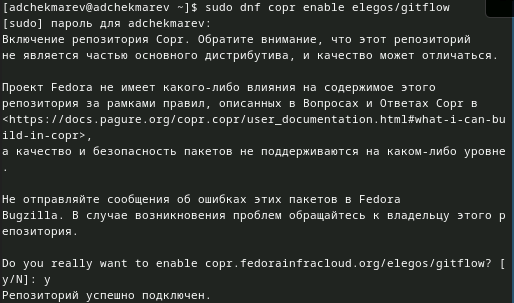{#fig:001 width=60%}

## Установка git-glow

- Установка самого git-glow 

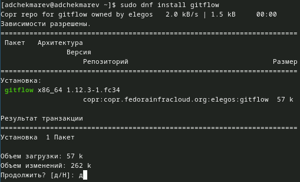{#fig:001 width=60%}

## Установка Node.js

- На Node.js базируется программное обеспечение для семантического версионирования и общепринятых коммитов.
- Установим nodejs

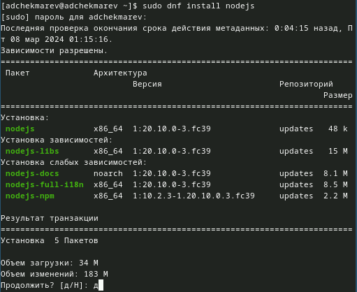

## Установка pnpm

- Так как у нас выводится ошибка после *apt-get install pnpm* (невозможно найти пакет), то перейдем к ручной установке.
- Перейдем на https://pnpm.io/installation и ввдем следующую команду: *wget -qO- https://get.pnpm.io/install.sh | sh -*

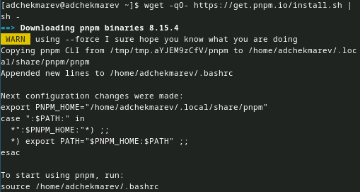{#fig:001 width=50%}

## Настройка Node.js

- Сначала перелгонимися
- После запустим pnpm

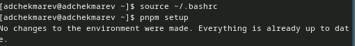

# Общепринятые коммиты

## commitizen и standard-changelog

- Данная программа используется для помощи в форматировании коммитов

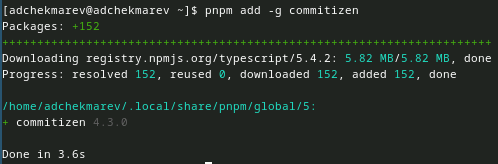{#fig:001 width=50%}

- Данная программа используется для помощи в создании логов

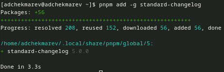{#fig:001 width=50%}

# Практический сценарий использования git

-  Создадим репозиторий на GitHub. Для примера назовём его git-extended
-  Далее клонируем репозиторий
-  Делаем первый коммит и выкладываем на github:

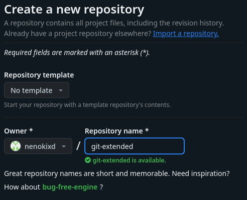{#fig:001 width=40%}{#fig:001 width=40%}

## Конфигурация общепринятых коммитов

- Конфигурация для пакетов Node.js: *pnpm init*
 
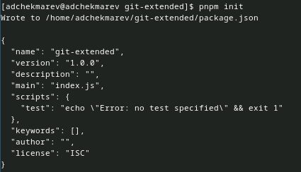{#fig:001 width=60%}

## Заполнение .json
 
- Необходимо заполнить несколько параметров пакета. Файл package.json приобретает вид: 
 
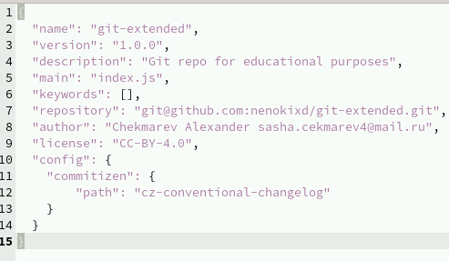{#fig:001 width=60%}
 
## Добваление файлов, коммит, отправка на гитхаб

- Добавим новые файлы, выполним коммит, отправим на github 
 
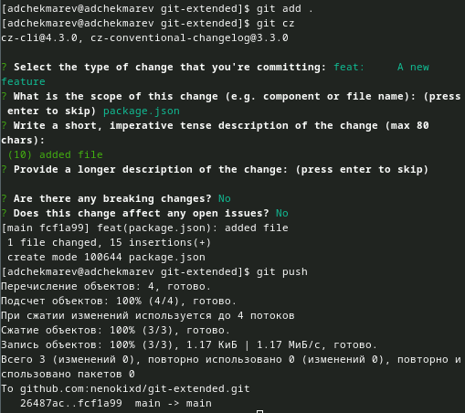{#fig:001 width=50%}

## Инициализация git-flow

-  Инициализируем git-flow, загрузим весь репозиторий в хранилище

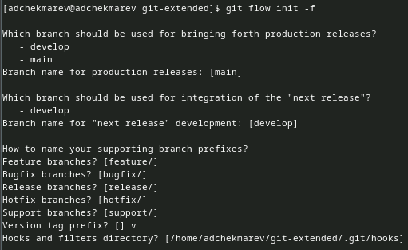{#fig:001 width=60%}
 
## Загрузка репозитория и установка внешней папки

- Загрузим весь репозиторий в хранилище

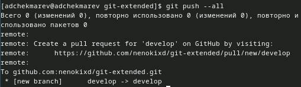{#fig:001 width=50%}

- Установим внешнюю ветку как вышестоящую для этой ветки 

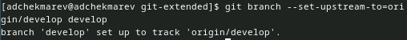{#fig:001 width=45%}

## Создание релиза и журнала изменений

- Создадим релиз с версией 1.0.0

 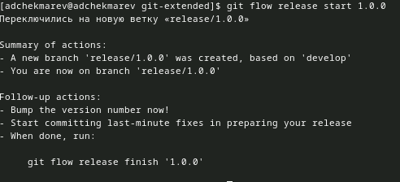{#fig:001 width=45%}

- Создадим журнал изменений 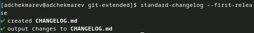{#fig:001 width=45%}

- Добавим журнал изменений в индекс 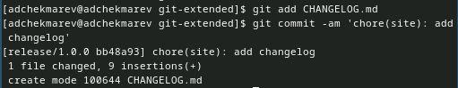{#fig:001 width=45%}

## Залив релизной ветки в основную

- Зальём релизную ветку в основную ветку
 
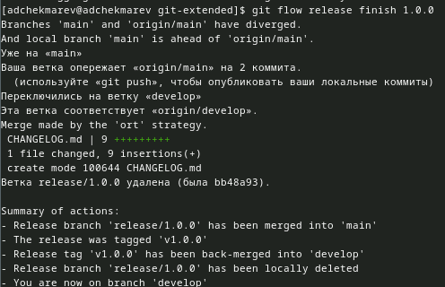{#fig:001 width=60%}

## Отправка данных на github и создание релиза

- Отправим данные на github

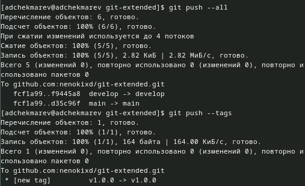{#fig:001 width=40%}

- Создадим релиз на github. Для этого будем использовать утилиты работы с github
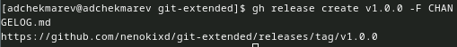{#fig:001 width=55%}
 
## Работа с репозиторием git (Разработка новой функциональности)

- Создадим ветку для новой функциональности
 
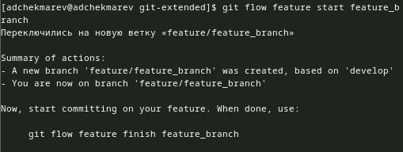{#fig:001 width=40%}

- Продолжаем работу c git как обычно.
- По окончании разработки новой функциональности следующим шагом следует объединить ветку feature_branch c develop:
 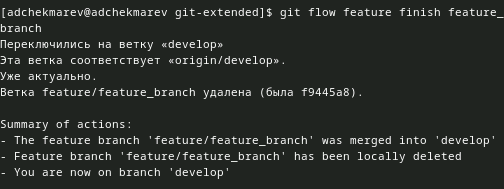{#fig:001 width=40%}
 
## Создание релиза git-flow

- Создадим релиз с версией 1.2.3.

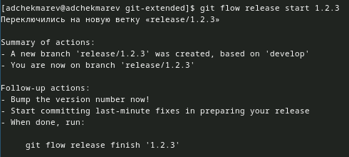{#fig:001 width=40%}

- Обновим номер версии в файле package.json
 
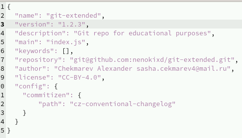{#fig:001 width=40%}

## Создание журнала и добавление в индекс

- Создадим журнал изменений и добавим его в индекс

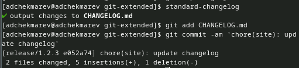{#fig:001 width=70%}

## Зальем релизную ветку

- Зальём релизную ветку в основную ветку 

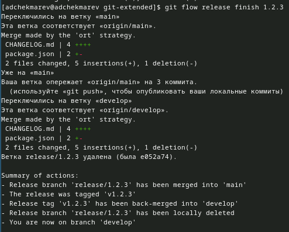{#fig:001 width=50%}

## Отправка актуального релиза

- Отправим данные на github и создадим релиз на github с комментарием из журнала изменений.
 
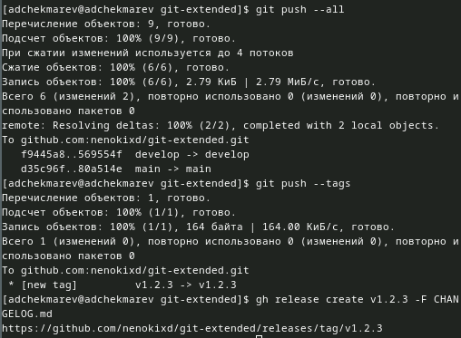{#fig:001 width=50%}

## Вывод:

Я получил навыки продвинутой работы с репозиториями git.

