---
## Front matter
title: "Отчёт по лабораторной работе №4"
subtitle: "Продвинутое использование git"
author: "Чекмарев Александр Дмитриевич | Группа НПИбд-02-23"

## Generic otions
lang: ru-RU
toc-title: "Содержание"

## Bibliography
bibliography: bib/cite.bib
csl: pandoc/csl/gost-r-7-0-5-2008-numeric.csl

## Pdf output format
toc: true # Table of contents
toc-depth: 2
lof: true # List of figures
lot: true # List of tables
fontsize: 12pt
linestretch: 1.5
papersize: a4
documentclass: scrreprt
## I18n polyglossia
polyglossia-lang:
  name: russian
  options:
	- spelling=modern
	- babelshorthands=true
polyglossia-otherlangs:
  name: english
## I18n babel
babel-lang: russian
babel-otherlangs: english
## Fonts
mainfont: PT Serif
romanfont: PT Serif
sansfont: PT Sans
monofont: PT Mono
mainfontoptions: Ligatures=TeX
romanfontoptions: Ligatures=TeX
sansfontoptions: Ligatures=TeX,Scale=MatchLowercase
monofontoptions: Scale=MatchLowercase,Scale=0.9
## Biblatex
biblatex: true
biblio-style: "gost-numeric"
biblatexoptions:
  - parentracker=true
  - backend=biber
  - hyperref=auto
  - language=auto
  - autolang=other*
  - citestyle=gost-numeric
## Pandoc-crossref LaTeX customization
figureTitle: "Рис."
tableTitle: "Таблица"
listingTitle: "Листинг"
lofTitle: "Список иллюстраций"
lotTitle: "Список таблиц"
lolTitle: "Листинги"
## Misc options
indent: true
header-includes:
  - \usepackage{indentfirst}
  - \usepackage{float} # keep figures where there are in the text
  - \floatplacement{figure}{H} # keep figures where there are in the text
---

# Цель работы

Получение навыков продвинутой работы с репозиториями git.

# Выполнение лабораторной работы

## Установка программного обеспечения

### Установка git-flow

Установим git-flow

Установка из коллекции репозиториев Copr  
(https://copr.fedorainfracloud.org/coprs/elegos/gitflow/):

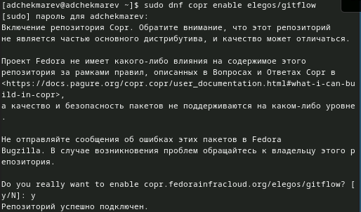

Теперь сам git-glow

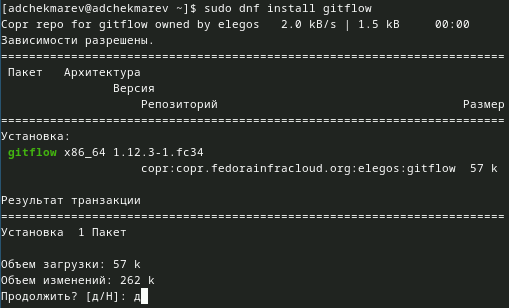

### Установка Node.js

Установим Node.js

На Node.js базируется программное обеспечение для семантического версионирования и общепринятых коммитов.

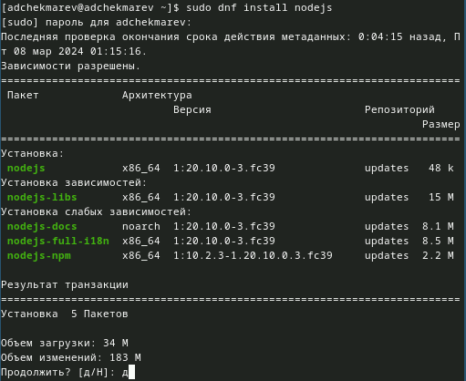

Так как у нас выводится ошибка при установке pnpm (невозможно найти пакет), то перейдем к ручной установке.

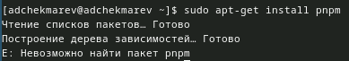

Перейдем на https://pnpm.io/installation и ввдем следующую команду: *wget -qO- https://get.pnpm.io/install.sh | sh -*

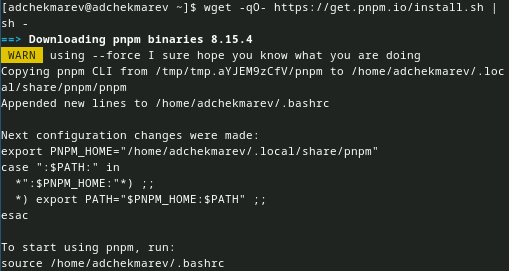

### Настройка Node.js

Перейдем к настройке Node.js

Сначала перелгонимися: *source ~/.bashrc*  
После запустим pnpm

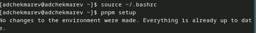

## Общепринятые коммиты

### commitizen

Данная программа используется для помощи в форматировании коммитов: *pnpm add -g commitizen*

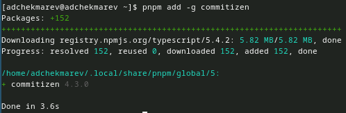

При этом устанавливается скрипт git-cz, который мы и будем использовать для коммитов.

### standard-changelog

Данная программа используется для помощи в создании логов: *pnpm add -g standard-changelog*

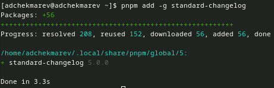

### Практический сценарий использования git

1. Создание репозитория git
  - Подключение репозитория к github
 Создадим репозиторий на GitHub. Для примера назовём его git-extended.

 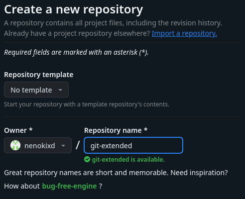

 Далее скачаем/клонируем репозиторий

 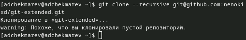

 Делаем первый коммит и выкладываем на github:  
 git add .  
 git commit -m "first commit"  
 git remote add origin git@github.com:<username>/git-extended.git  
 git push -u origin master
 
 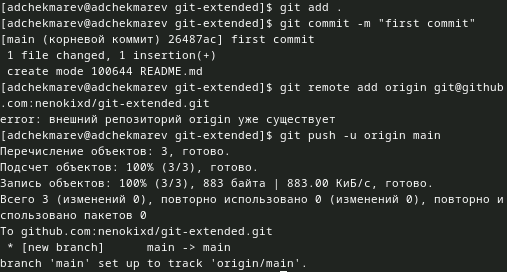

  - Конфигурация общепринятых коммитов  
 Конфигурация для пакетов Node.js  
 *pnpm init*
 
 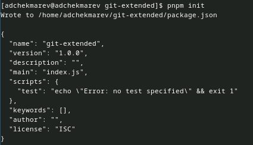
 
 Необходимо заполнить несколько параметров пакета.
 
 Название пакета.  
 Лицензия пакета. Список лицензий для npm: https://spdx.org/licenses/. Предлагается выбирать лицензию CC-BY-4.0.  
 Сконфигурируем формат коммитов. Для этого добавим в файл package.json команду для формирования коммитов:  
 
 "config": {  
     "commitizen": {  
         "path": "cz-conventional-changelog"   
     }  
 }
 
 
 Таким образом, файл package.json приобретает вид:

 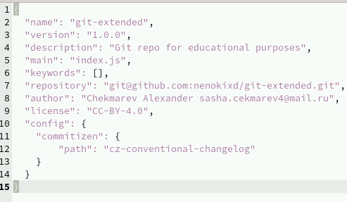
 
 Добавим новые файлы, выполним коммит, отправим на github:  
 git add .  
 git cz  
 git push  
 
 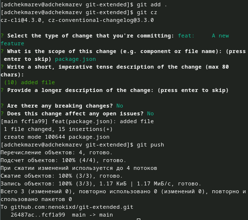

  - Конфигурация git-flow

 Инициализируем git-flow: *git flow init*
 
 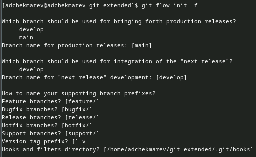

 Префикс для ярлыков установим в v.

 Проверим, что мы на ветке develop: *git branch*
 
 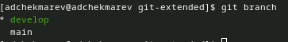

 Загрузим весь репозиторий в хранилище: *git push --all*
 
 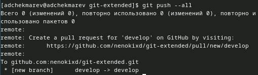

 Установим внешнюю ветку как вышестоящую для этой ветки: *git branch --set-upstream-to=origin/develop develop*
 
 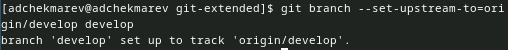

 Создадим релиз с версией 1.0.0: *git flow release start 1.0.0*

 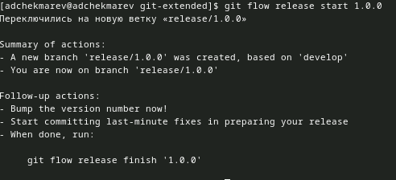

 Создадим журнал изменений: *standard-changelog --first-release*

 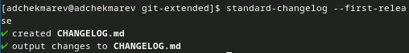

 Добавим журнал изменений в индекс  
 
 git add CHANGELOG.md  
 git commit -am 'chore(site): add changelog'
 
 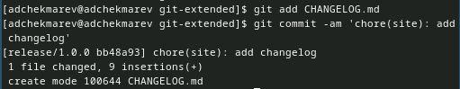

 Зальём релизную ветку в основную ветку: *git flow release finish 1.0.0*
 
 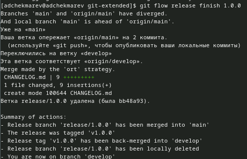

 
 Отправим данные на github  

 git push --all  
 git push --tags
 
 
 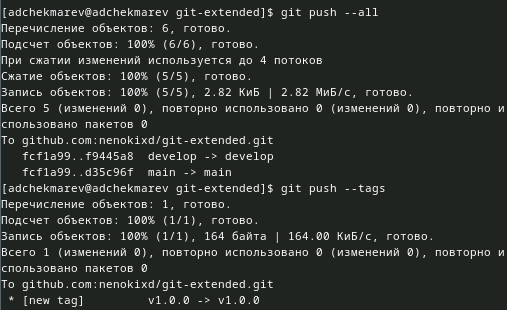

 Создадим релиз на github. Для этого будем использовать утилиты работы с github:  
 *gh release create v1.0.0 -F CHANGELOG.md*
 
 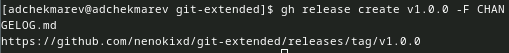

2. Работа с репозиторием git
  - Разработка новой функциональности
 Создадим ветку для новой функциональности: *git flow feature start feature_branch*
 
 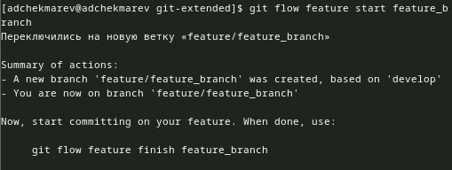

 
 Далее, продолжаем работу c git как обычно.
 По окончании разработки новой функциональности следующим шагом следует объединить ветку feature_branch c develop:  
 *git flow feature finish feature_branch*
 
 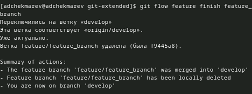

 
  - Создание релиза git-flow
 Создадим релиз с версией 1.2.3: *git flow release start 1.2.3*

 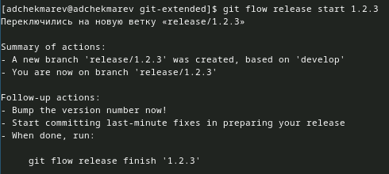

 Обновим номер версии в файле package.json.
 
 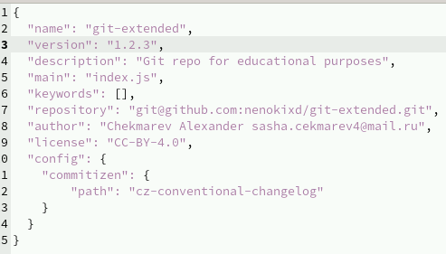

 Создадим журнал изменений и добавим его в индекс:  
 
 standard-changelog  
 git add CHANGELOG.md  
 git commit -am 'chore(site): update changelog'
 
 
 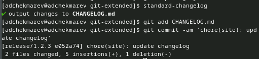

 Зальём релизную ветку в основную ветку: *git flow release finish 1.2.3*

 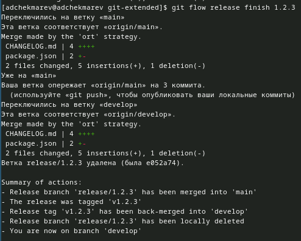

 Отправим данные на github и создадим релиз на github с комментарием из журнала изменений:  
 
 git push --all  
 git push --tags  
 gh release create v1.2.3 -F CHANGELOG.md
 
 
 

# Выводы

Я получил навыки продвинутой работы с репозиториями git.

# Список литературы{.unnumbered}

::: {#refs}
:::
