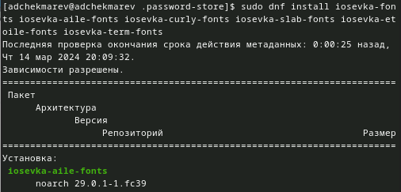

---
## Front matter
lang: ru-RU
title: Лабораторная работа №5
subtitle: Настройка рабочей среды
author:
  - Чекмарев Александр Дмитриевич | Группа НПИбд-02-23
institute:
  - Российский университет дружбы народов, Москва, Россия
date: 14 марта 2024

## i18n babel
babel-lang: russian
babel-otherlangs: english

## Formatting pdf
toc: false
toc-title: Содержание
slide_level: 2
aspectratio: 169
section-titles: true
theme: metropolis
header-includes:
 - \metroset{progressbar=frametitle,sectionpage=progressbar,numbering=fraction}
 - '\makeatletter'
 - '\beamer@ignorenonframefalse'
 - '\makeatother'
 
 
 ## Fonts
mainfont: PT Serif
romanfont: PT Serif
sansfont: PT Sans
monofont: PT Mono
mainfontoptions: Ligatures=TeX
romanfontoptions: Ligatures=TeX
sansfontoptions: Ligatures=TeX,Scale=MatchLowercase
monofontoptions: Scale=MatchLowercase,Scale=0.9
---

# Информация

## Докладчик

:::::::::::::: {.columns align=center}
::: {.column width="70%"}

  * Чекмарев Александр Дмитриевич
  * Группа НПИбд-02-23
  * Российский университет дружбы народов
  * <https://github.com/nenokixd?tab=repositories>

:::
::: {.column width="30%"}

:::
::::::::::::::

# Вводная часть

## Объект и предмет исследования

- Настройка рабочей среды linux

## Цель работы

- Получение навыков работы с pass и chezmoi

# Менеджер паролей pass

## Установка pass

- Установим pass

## Установка gopass

- Установим gopass

## Просмотр списка ключей

- Посмотрим список ключей

## Инициализация хранилища и создание структуры

- Инициализируем хранилище и создаем структуру

{#fig:001 width=80%}

## Создание репозитория

- Создадим репозиторий на сайте гитхаб:

## Настройка репозитория

- Зададим адрес репозитория на хостинге 

- Для синхронизации выполним следующие команда 

## Настройка пароля

- Следует заметить, что отслеживаются только изменения, сделанные через сам gopass (или pass).
- Если изменения сделаны непосредственно на файловой системе, необходимо вручную закоммитить и выложить изменения:

{#fig:001 width=70%}

- Проверка статуса синхронизации 

## Установка плагина browserpass

- Плагин browserpass для Firefox

## Интерфейс для взаимодействия

- Интерфейс для взаимодействия с браузером (native messaging)

## Установка  browserpass

- Непосредственно установка на сам linux

## Сохранение пароля

- Добавить новый пароль

- Отобразим пароль

## Заменя пароля

- Заменим существующий пароль

# Управление файлами конфигурации

## Дополнительное программное обеспечение

- Установим дополнительные программные обеспечения

## Установка шрифтов

- Непосредственно сама установка шрифтов

## Установка бинарного файл

- Установим бинарный файл. Скрипт определяет архитектуру процессора и операционную систему и скачивает необходимый файл:
с помощью wget:

## Создание собственного репозитория с помощью утилит

- Создадим свой репозиторий для конфигурационных файлов на основе шаблона

## Инициализация chezmoi

- Инициализируем chezmoi с нашим репозиторием dotfiles:

## Внесение изменений

- Если нас устраивают изменения, внесённые chezmoi, запустим chezmoi apply -v

## Инициализация chezmoi на второй машине и проверка изменений

- На второй машине инициализируем chezmoi с репозиторием dotfiles через ssh:

- Проверим, какие изменения внесёт chezmoi в домашний каталог

## Внесение изменений

- Если нас устраивают изменения, внесённые chezmoi, запустим chezmoi apply -v

{#fig:001 width=50%}

- При существующем каталоге chezmoi можно получить и применить последние изменения из нашего репозитория

## Настройка новой машины с помощью одной команды

- Можно установить свои dotfiles на новый компьютер с помощью одной команды через ssh

# Ежедневные операции c chezmoi

## Извлечение последних изменений из репозитория и применения их

- Можно извлечь изменения из репозитория и применить их одной командой

- Это запускается git pull --autostash --rebase в вашем исходном каталоге, а затем chezmoi apply.

## Извлечение последних изменений из репозитория и просмотр изменений, фактически не применяя изменения

- Выполним:

- Это запускается git pull --autostash --rebase в вашем исходном каталоге, а chezmoi diff затем показывает разницу между целевым состоянием, вычисленным из вашего исходного каталога, и фактическим состоянием.

## Внесение изменений

- Если мы довольны изменениями, то можем применить их

## Автоматическое фиксирование и отправка изменений в репозиторий

- Можно автоматически фиксировать и отправлять изменения в исходный каталог в репозиторий.
- Эта функция отключена по умолчанию.
- Чтобы включить её, добавим в файл конфигурации ~/.config/chezmoi/chezmoi.toml следующее:

 
## Вывод:

Я научился пользоваться pass и chezmoi

