---
## Front matter
title: "Отчёт по лабораторной работе №5"
subtitle: "Настройка рабочей среды"
author: "Чекмарев Александр Дмитриевич | Группа НПИбд-02-23"

## Generic otions
lang: ru-RU
toc-title: "Содержание"

## Bibliography
bibliography: bib/cite.bib
csl: pandoc/csl/gost-r-7-0-5-2008-numeric.csl

## Pdf output format
toc: true # Table of contents
toc-depth: 2
lof: true # List of figures
lot: true # List of tables
fontsize: 12pt
linestretch: 1.5
papersize: a4
documentclass: scrreprt
## I18n polyglossia
polyglossia-lang:
  name: russian
  options:
	- spelling=modern
	- babelshorthands=true
polyglossia-otherlangs:
  name: english
## I18n babel
babel-lang: russian
babel-otherlangs: english
## Fonts
mainfont: PT Serif
romanfont: PT Serif
sansfont: PT Sans
monofont: PT Mono
mainfontoptions: Ligatures=TeX
romanfontoptions: Ligatures=TeX
sansfontoptions: Ligatures=TeX,Scale=MatchLowercase
monofontoptions: Scale=MatchLowercase,Scale=0.9
## Biblatex
biblatex: true
biblio-style: "gost-numeric"
biblatexoptions:
  - parentracker=true
  - backend=biber
  - hyperref=auto
  - language=auto
  - autolang=other*
  - citestyle=gost-numeric
## Pandoc-crossref LaTeX customization
figureTitle: "Рис."
tableTitle: "Таблица"
listingTitle: "Листинг"
lofTitle: "Список иллюстраций"
lotTitle: "Список таблиц"
lolTitle: "Листинги"
## Misc options
indent: true
header-includes:
  - \usepackage{indentfirst}
  - \usepackage{float} # keep figures where there are in the text
  - \floatplacement{figure}{H} # keep figures where there are in the text
---

# Цель работы

Получение навыков работы с pass и chezmoi

# Выполнение лабораторной работы

## Менеджер паролей pass

### Установка

Установим pass

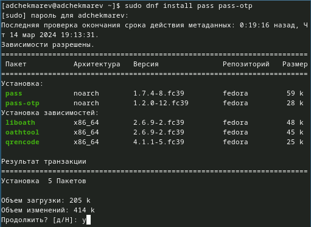

Установим gopass

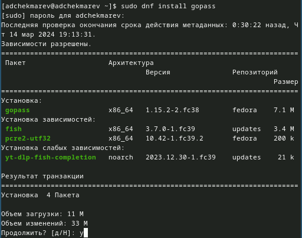

### Настройка

Посмотрим список ключей: gpg --list-secret-keys

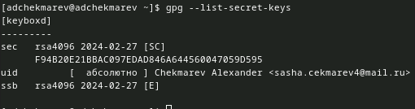

Если ключа нет, то можно создать новый (мне не нужно):  
gpg --full-generate-key

Инициализируем хранилище и создадим структуру:   

pass init <gpg-id or email>  
pass git init

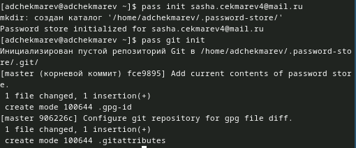

Также можно задать адрес репозитория на хостинге (репозиторий необходимо предварительно создать).
Создадим репозиторий на сайте гитхаб:

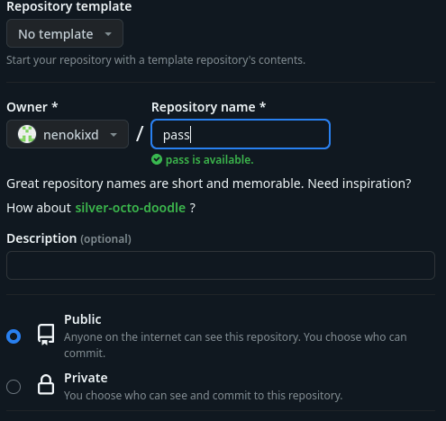

Зададим адрес репозитория на хостинге:   

pass git remote add origin git@github.com:<git_username>/<git_repo>.git

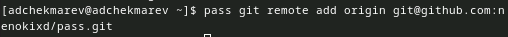

Для синхронизации выполним следующие команда:  

pass git pull

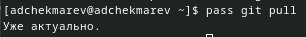

pass git push

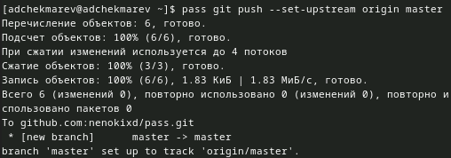

**Прямые изменения**

Следует заметить, что отслеживаются только изменения, сделанные через сам gopass (или pass).
Если изменения сделаны непосредственно на файловой системе, необходимо вручную закоммитить и выложить изменения:  

cd ~/.password-store/  
git add .  
git commit -am 'edit manually'  
git push

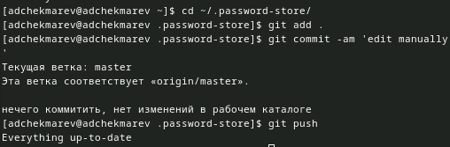

Проверить статус синхронизации можно командой  

pass git status

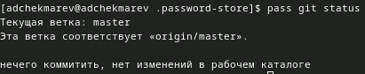

### Настройка интерфейса с браузером

Для взаимодействия с браузером используется интерфейс native messaging.
Поэтому кроме плагина к браузеру устанавливается программа, обеспечивающая интерфейс native messaging.
Плагин browserpass для Firefox: https://addons.mozilla.org/en-US/firefox/addon/browserpass-ce/.

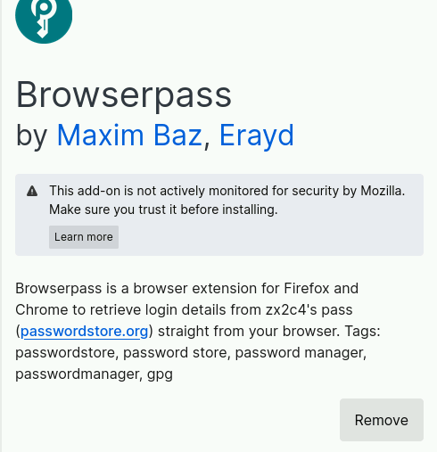

Интерфейс для взаимодействия с браузером (native messaging)

Репозиторий: https://github.com/browserpass/browserpass-native  

dnf copr enable maximbaz/browserpass

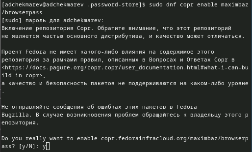

dnf install browserpass

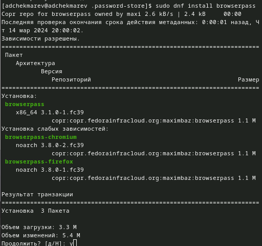

### Сохранение пароля

Добавить новый пароль

Выполним:  

pass insert [OPTIONAL DIR]/[FILENAME]

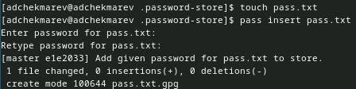

OPTIONAL DIR: необязательное имя каталога, определяющее файловую структуру для вашего хранилища паролей;
FILENAME: имя файла, который будет использоваться для хранения пароля.
Отобразим пароль для указанного имени файла:  

pass [OPTIONAL DIR]/[FILENAME]

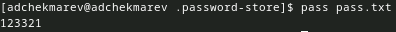

Заменим существующий пароль:  

pass generate --in-place FILENAME

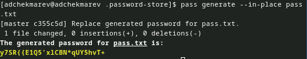

## Управление файлами конфигурации

### Дополнительное программное обеспечение

Установим дополнительное программное обеспечение:  
  
sudo dnf -y install \  
     dunst \  
     fontawesome-fonts \  
     powerline-fonts \  
     light \  
     fuzzel \  
     swaylock \  
     kitty \  
     waybar swaybg \  
     wl-clipboard \  
     mpv \  
     grim \  
     slurp  
	 
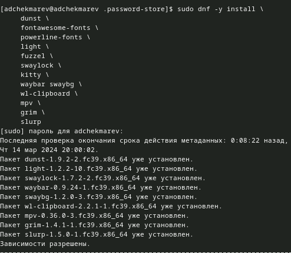

Установим шрифты:  

sudo dnf copr enable peterwu/iosevka

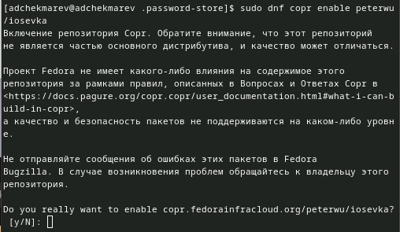

sudo dnf search iosevka

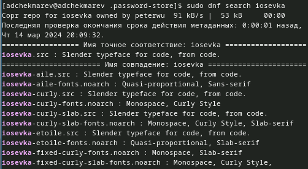

sudo dnf install iosevka-fonts iosevka-aile-fonts iosevka-curly-fonts iosevka-slab-fonts iosevka-etoile-fonts iosevka-term-fonts

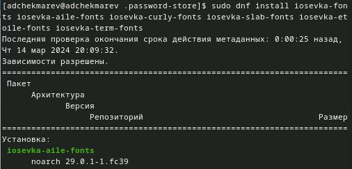

### Установка

Установка бинарного файла. Скрипт определяет архитектуру процессора и операционную систему и скачивает необходимый файл:
с помощью wget:  

sh -c "$(wget -qO- chezmoi.io/get)"

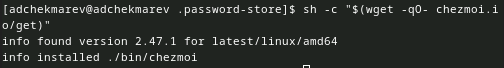

### Создание собственного репозитория с помощью утилит

Будем использовать утилиты командной строки для работы с github.
Создадим свой репозиторий для конфигурационных файлов на основе шаблона:  

gh repo create dotfiles --template="yamadharma/dotfiles-template" --private

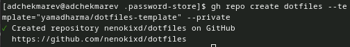

### Подключение репозитория к своей системе

Инициализируем chezmoi с нашим репозиторием dotfiles:  

chezmoi init git@github.com:<username>/dotfiles.git

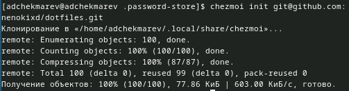

Проверим, какие изменения внесёт chezmoi в домашний каталог, запустив:  

chezmoi diff

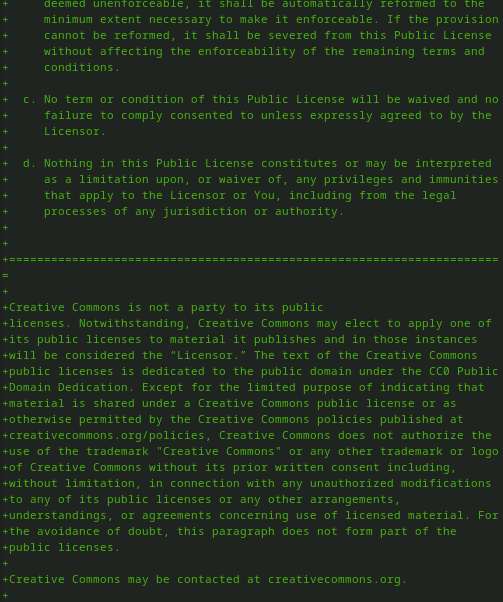

Если нас устраивают изменения, внесённые chezmoi, запустим:  

chezmoi apply -v

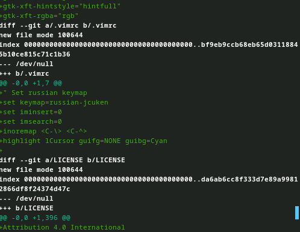

### Использование chezmoi на нескольких машинах

На второй машине инициализируйте chezmoi с репозиторием dotfiles:  

chezmoi init https://github.com/<username>/dotfiles.git

Или через ssh:  

chezmoi init git@github.com:<username>/dotfiles.git

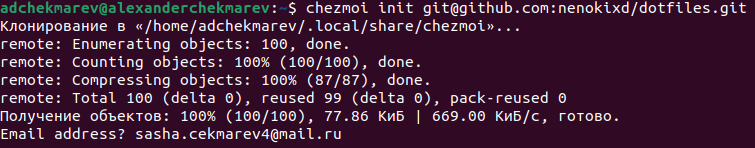

Проверим, какие изменения внесёт chezmoi в домашний каталог, запустив:  

chezmoi diff

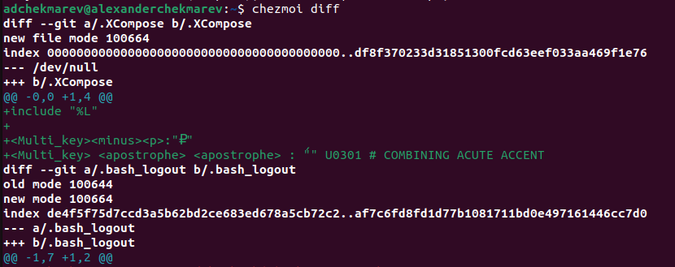

Если вас устраивают изменения, внесённые chezmoi, запустите:  

chezmoi apply -v

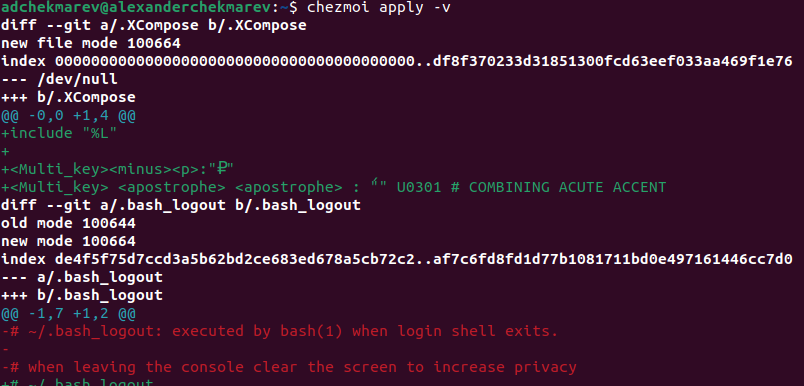

Если вас не устраивают изменения в файле, отредактируйте его с помощью:  

chezmoi edit file_name

Также можно вызвать инструмент слияния, чтобы объединить изменения между текущим содержимым файла, файлом в вашей рабочей копии и измененным содержимым файла:  

chezmoi merge file_name

При существующем каталоге chezmoi можно получить и применить последние изменения из вашего репозитория:  

chezmoi update -v

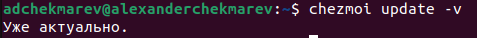

### Настройка новой машины с помощью одной команды

Можно установить свои dotfiles на новый компьютер с помощью одной команды:  

chezmoi init --apply https://github.com/<username>/dotfiles.git  

Через ssh:   

chezmoi init --apply git@github.com:<username>/dotfiles.git

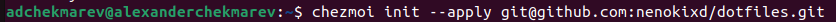

## Ежедневные операции c chezmoi

1. Извлечем последние изменения из репозитория и примените их

Можно извлечь изменения из репозитория и применить их одной командой:  

chezmoi update

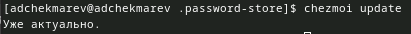

Это запускается git pull --autostash --rebase в вашем исходном каталоге, а затем chezmoi apply.

2. Извлечем последние изменения из своего репозитория и посмотрим, что изменится, фактически не применяя изменения

Выполним:  

chezmoi git pull -- --autostash --rebase && chezmoi diff

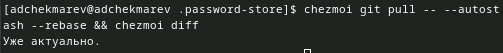

Это запускается git pull --autostash --rebase в вашем исходном каталоге, а chezmoi diff затем показывает разницу между целевым состоянием, вычисленным из вашего исходного каталога, и фактическим состоянием.

Если мы довольны изменениями, то можем применить их:  

chezmoi apply

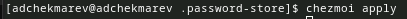

3. Автоматически фиксируйте и отправляйте изменения в репозиторий

Можно автоматически фиксировать и отправлять изменения в исходный каталог в репозиторий.
Эта функция отключена по умолчанию.
Чтобы включить её, добавим в файл конфигурации ~/.config/chezmoi/chezmoi.toml следующее:  
  
[git]  
    autoCommit = true  
    autoPush = true  
	

Всякий раз, когда в исходный каталог вносятся изменения, chezmoi фиксирует изменения с помощью автоматически сгенерированного сообщения фиксации и отправляет их в ваш репозиторий.
Будьте осторожны при использовании autoPush. Если ваш репозиторий dotfiles является общедоступным, и вы случайно добавили секрет в виде обычного текста, этот секрет будет отправлен в ваш общедоступный репозиторий.

# Выводы

Я научился пользоваться pass и chezmoi

# Список литературы{.unnumbered}

::: {#refs}
:::
