---
## Front matter
lang: ru-RU
title: Лабораторная работа №6
subtitle: Основы интерфейса взаимодействия пользователя с системой Unix на уровне командной строки
author:
  - Чекмарев Александр Дмитриевич | Группа НПИбд-02-23
institute:
  - Российский университет дружбы народов, Москва, Россия
date: 15 марта 2024

## i18n babel
babel-lang: russian
babel-otherlangs: english

## Formatting pdf
toc: false
toc-title: Содержание
slide_level: 2
aspectratio: 169
section-titles: true
theme: metropolis
header-includes:
 - \metroset{progressbar=frametitle,sectionpage=progressbar,numbering=fraction}
 - '\makeatletter'
 - '\beamer@ignorenonframefalse'
 - '\makeatother'
 
 
 ## Fonts
mainfont: PT Serif
romanfont: PT Serif
sansfont: PT Sans
monofont: PT Mono
mainfontoptions: Ligatures=TeX
romanfontoptions: Ligatures=TeX
sansfontoptions: Ligatures=TeX,Scale=MatchLowercase
monofontoptions: Scale=MatchLowercase,Scale=0.9
---

# Информация

## Докладчик

:::::::::::::: {.columns align=center}
::: {.column width="70%"}

  * Чекмарев Александр Дмитриевич
  * Группа НПИбд-02-23
  * Российский университет дружбы народов
  * <https://github.com/nenokixd?tab=repositories>

:::
::: {.column width="30%"}

:::
::::::::::::::

## Цель работы

- Приобретение практических навыков взаимодействия пользователя с системой посредством командной строки.

## Задания

1. Определите полное имя вашего домашнего каталога. Далее относительно этого каталога будут выполняться последующие упражнения.
2. Выполните следующие действия:
2.1. Перейдите в каталог /tmp.
2.2. Выведите на экран содержимое каталога /tmp. Для этого используйте команду ls с различными опциями. Поясните разницу в выводимой на экран информации.
2.3. Определите, есть ли в каталоге /var/spool подкаталог с именем cron?
2.4. Перейдите в Ваш домашний каталог и выведите на экран его содержимое. Определите, кто является владельцем файлов и подкаталогов?

## Задания

3. Выполните следующие действия:
3.1. В домашнем каталоге создайте новый каталог с именем newdir.
3.2. В каталоге ~/newdir создайте новый каталог с именем morefun.
3.3. В домашнем каталоге создайте одной командой три новых каталога с именами letters, memos, misk. Затем удалите эти каталоги одной командой.
3.4. Попробуйте удалить ранее созданный каталог ~/newdir командой rm. Проверьте, был ли каталог удалён.
3.5. Удалите каталог ~/newdir/morefun из домашнего каталога. Проверьте, был ли каталог удалён.

## Задания

4. С помощью команды man определите, какую опцию команды ls нужно использовать для просмотра содержимое не только указанного каталога, но и подкаталогов, входящих в него.
5. С помощью команды man определите набор опций команды ls, позволяющий отсортировать по времени последнего изменения выводимый список содержимого каталога с развёрнутым описанием файлов.
6. Используйте команду man для просмотра описания следующих команд: cd, pwd, mkdir, rmdir, rm. Поясните основные опции этих команд.
7. Используя информацию, полученную при помощи команды history, выполните модификацию и исполнение нескольких команд из буфера команд.

# Выполнение лабораторной работы

## Определение имени каталога и переход в каталог tmp и просмотр его содержимого

- Определим полное имя нашего домашнего каталога.

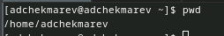

- Перейдем в каталог /tmp

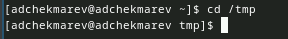

## Просмотр содержимого tmp

- Выведем содержимое этого каталога

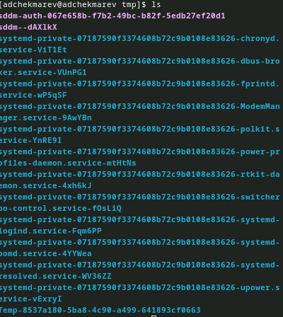

## Выведем содержимое с опцией -a

- -a (имена скрытых файлов)

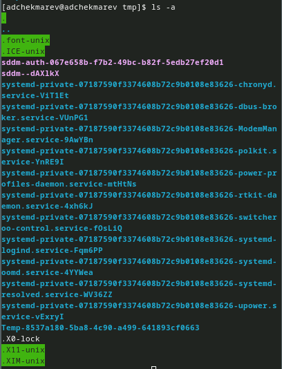

## Выведем содержимое с опцией -l

- -l (подробная информация о файлах и каталогах)

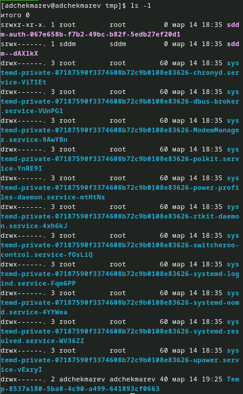

## Выведем содержимое с опцией -F

- -F (информация о типах файлов (каталог, исполняемый файл, ссылка))

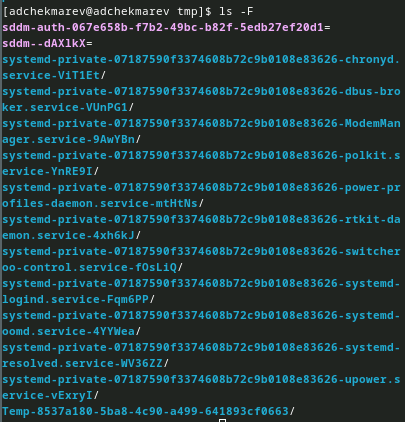

## Выведем содержимое с опцией -alF

- -alF (команда с различными опциями)

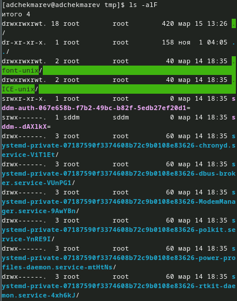

## Вывод содержимого spool

- Определим, есть ли в каталоге /var/spool подкаталог с именем cron.

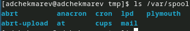

## Переход в домащний каталог и вывод его содержимого

- Перейдем в наш домашний каталог и выведем на экран его содержимое

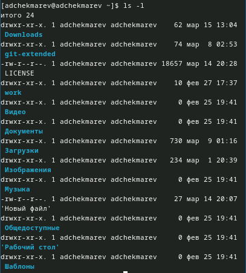

## Создание каталогов и их удаление

- В домашнем каталоге создадим каталог newdir.

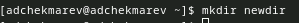

- В каталоге ~/newdir создадим каталог morefun.

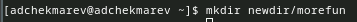

- В домашнем каталоге создадим одной командой три новых каталога с именами letters, memos, misk. 
- Затем удалим эти каталоги одной командой.

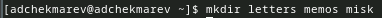 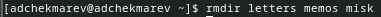

## Удаление каталога newdir и morefun

- Попробуем удалить ранее созданный каталог ~/newdir командой rm.

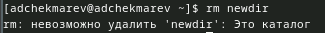

- Удалим каталог ~/newdir/morefun из домашнего каталога. Проверим, был ли каталог удалён.

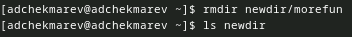

## Команда man ls

- С помощью команды man определим, какую опцию команды ls нужно использовать для просмотра содержимого не только указанного каталога, но и подкаталогов, входящих в него.

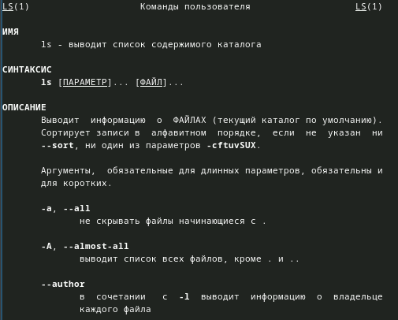

## Команда man ls

- С помощью команды man определите набор опций команды ls, позволяющий отсортировать по времени последнего изменения выводимый список содержимого каталога с развёрнутым описанием файлов.

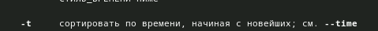 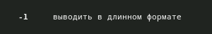

## Команда man cd

- Фрагмент описания команд для cd

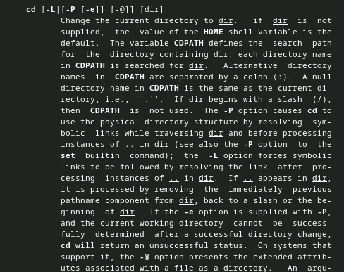

## Команда man pwd

- Фрагмент описания команд для pwd

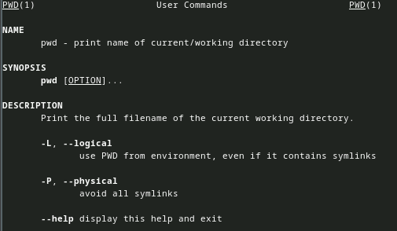

## Команда man mkdir

- Фрагмент описания команд для mkdir

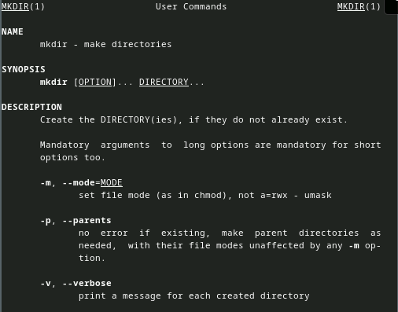

## Команда man rmdir

- Фрагмент описания команд для rmdir

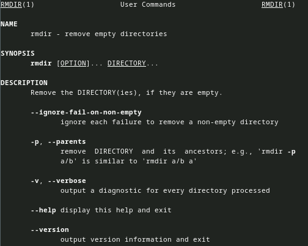

## Команда man rm

- Фрагмент описания команд для rm

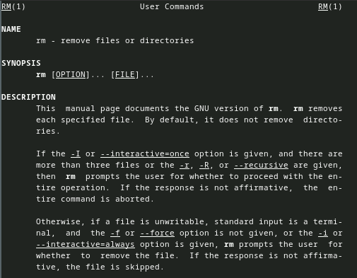

## Получение истории использованных команд

- Полученная информация

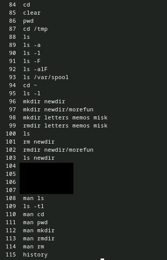

## Модификация команд 

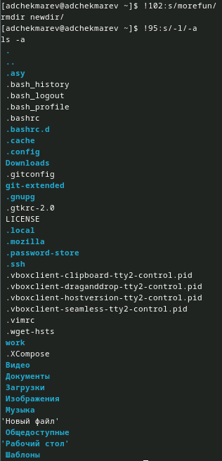

## Выводы

Я приобрел практические навыки взаимодействия пользователя с системой посредством командной строки.

