---
## Front matter
title: "Отчёт по лабораторной работе №6"
subtitle: "Основы интерфейса взаимодействия пользователя с системой Unix на уровне командной строки"
author: "Чекмарев Александр Дмитриевич | Группа НПИбд-02-23"

## Generic otions
lang: ru-RU
toc-title: "Содержание"

## Bibliography
bibliography: bib/cite.bib
csl: pandoc/csl/gost-r-7-0-5-2008-numeric.csl

## Pdf output format
toc: true # Table of contents
toc-depth: 2
lof: true # List of figures
lot: true # List of tables
fontsize: 12pt
linestretch: 1.5
papersize: a4
documentclass: scrreprt
## I18n polyglossia
polyglossia-lang:
  name: russian
  options:
	- spelling=modern
	- babelshorthands=true
polyglossia-otherlangs:
  name: english
## I18n babel
babel-lang: russian
babel-otherlangs: english
## Fonts
mainfont: PT Serif
romanfont: PT Serif
sansfont: PT Sans
monofont: PT Mono
mainfontoptions: Ligatures=TeX
romanfontoptions: Ligatures=TeX
sansfontoptions: Ligatures=TeX,Scale=MatchLowercase
monofontoptions: Scale=MatchLowercase,Scale=0.9
## Biblatex
biblatex: true
biblio-style: "gost-numeric"
biblatexoptions:
  - parentracker=true
  - backend=biber
  - hyperref=auto
  - language=auto
  - autolang=other*
  - citestyle=gost-numeric
## Pandoc-crossref LaTeX customization
figureTitle: "Рис."
tableTitle: "Таблица"
listingTitle: "Листинг"
lofTitle: "Список иллюстраций"
lotTitle: "Список таблиц"
lolTitle: "Листинги"
## Misc options
indent: true
header-includes:
  - \usepackage{indentfirst}
  - \usepackage{float} # keep figures where there are in the text
  - \floatplacement{figure}{H} # keep figures where there are in the text
---

# Цель работы

Приобретение практических навыков взаимодействия пользователя с системой посредством командной строки.

# Задания

1. Определите полное имя вашего домашнего каталога. Далее относительно этого каталога будут выполняться последующие упражнения.
2. Выполните следующие действия:  
2.1. Перейдите в каталог /tmp.  
2.2. Выведите на экран содержимое каталога /tmp. Для этого используйте команду ls с различными опциями.   Поясните разницу в выводимой на экран информации.  
2.3. Определите, есть ли в каталоге /var/spool подкаталог с именем cron?  
2.4. Перейдите в Ваш домашний каталог и выведите на экран его содержимое. Определите, кто является владельцем файлов и подкаталогов?
3. Выполните следующие действия:  
3.1. В домашнем каталоге создайте новый каталог с именем newdir.  
3.2. В каталоге ~/newdir создайте новый каталог с именем morefun.  
3.3. В домашнем каталоге создайте одной командой три новых каталога с именами letters, memos, misk. Затем удалите эти каталоги одной командой.  
3.4. Попробуйте удалить ранее созданный каталог ~/newdir командой rm. Проверьте, был ли каталог удалён.  
3.5. Удалите каталог ~/newdir/morefun из домашнего каталога. Проверьте, был ли каталог удалён.
4. С помощью команды man определите, какую опцию команды ls нужно использовать для просмотра содержимое не только указанного каталога, но и подкаталогов, входящих в него.
5. С помощью команды man определите набор опций команды ls, позволяющий отсортировать по времени последнего изменения выводимый список содержимого каталога с развёрнутым описанием файлов.
6. Используйте команду man для просмотра описания следующих команд: cd, pwd, mkdir, rmdir, rm. Поясните основные опции этих команд.
7. Используя информацию, полученную при помощи команды history, выполните модификацию и исполнение нескольких команд из буфера команд.

# Выполнение лабораторной работы

Определим полное имя нашего домашнего каталога.

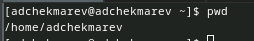

Перейдем в каталог /tmp

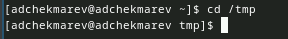

Выведем содержимое этого каталога

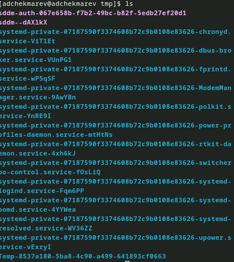

Выведем содержимое с различными опциями:

1. -a (имена скрытых файлов)

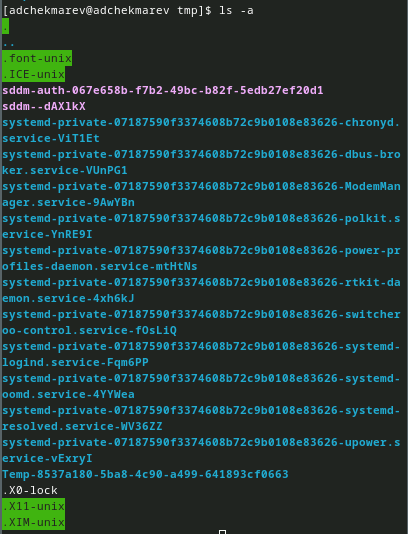

2. -l (подробная информация о файлах и каталогах)

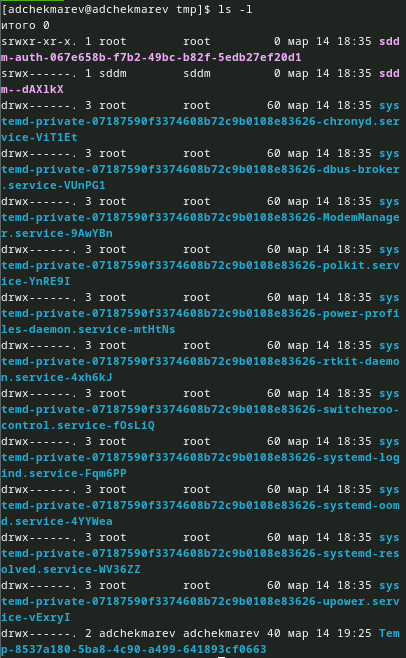

3. -F (информация о типах файлов (каталог, исполняемый файл, ссылка))

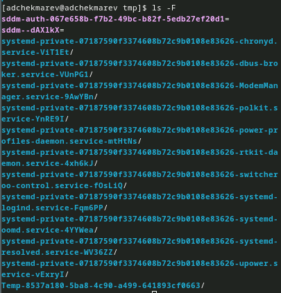

4. -alF (команда с различными опциями)

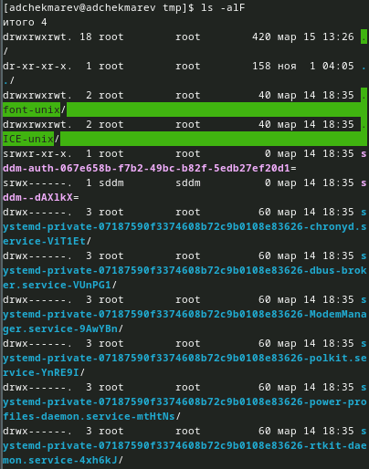

Определим, есть ли в каталоге /var/spool подкаталог с именем cron. Да, он есть

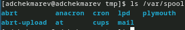

Перейдем в наш домашний каталог и выведем на экран его содержимое. Как видно на скриншоте, я являюсь владельцем

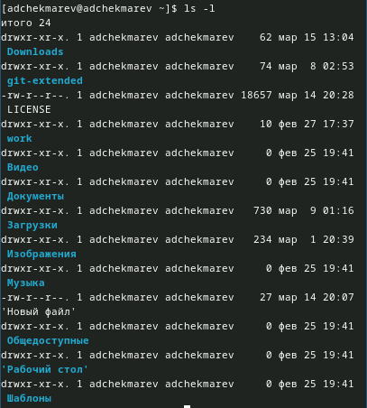

Выполним следующие действия:

В домашнем каталоге создадим новый каталог с именем newdir.

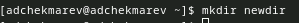

В каталоге ~/newdir создадим новый каталог с именем morefun.

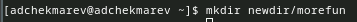

В домашнем каталоге создадим одной командой три новых каталога с именами letters, memos, misk. Затем удалим эти каталоги одной командой.

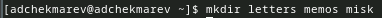

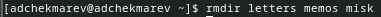

Попробуем удалить ранее созданный каталог ~/newdir командой rm. Проверим, был ли каталог удалён. Как видно выводится ошибка

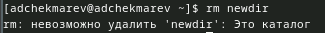

Удалим каталог ~/newdir/morefun из домашнего каталога. Проверим, был ли каталог удалён.

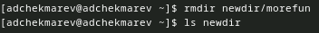

С помощью команды man определим, какую опцию команды ls нужно использовать для просмотра содержимого не только указанного каталога, но и подкаталогов, входящих в него.

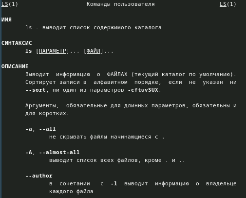

С помощью команды man определите набор опций команды ls, позволяющий отсортировать по времени последнего изменения выводимый список содержимого каталога с развёрнутым описанием файлов.

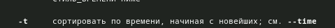

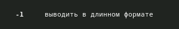

Можно использовать 2 опции -t и -l

Используем команду man для просмотра описания следующих команд: cd, pwd, mkdir, rmdir, rm.

1. cd 

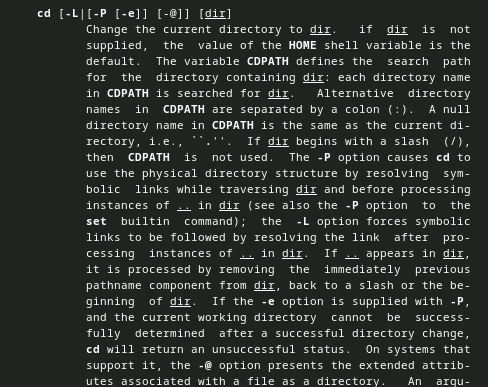

2. pwd

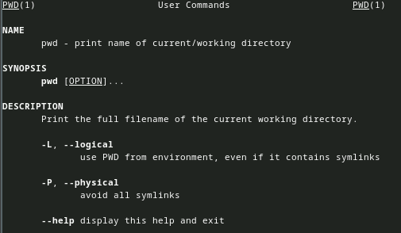

3. mkdir

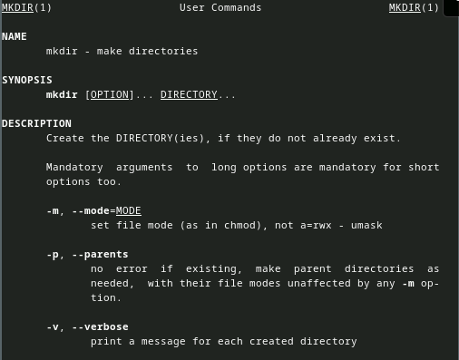

4. rmdir

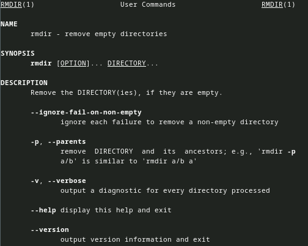

5. rm

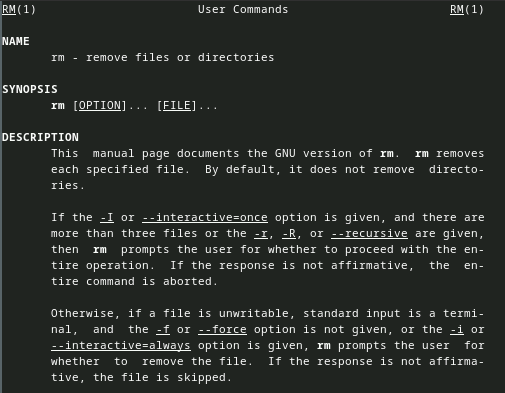

Используя информацию, полученную при помощи команды history, выполним модификацию и исполнение нескольких команд из буфера команд.  

Полученная информация

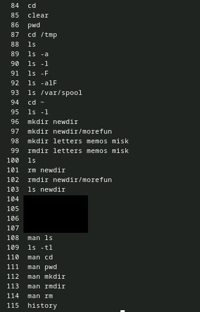

Использование модификации команд

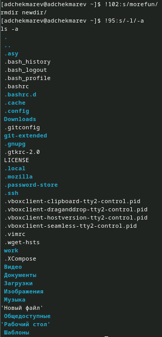

# Контрольные вопросы

1. Что такое командная строка?  

Командная строка - это интерфейс взаимодействия с операционной системой, который позволяет пользователю вводить команды для выполнения различных задач.  

2. При помощи какой команды можно определить абсолютный путь текущего каталога?
Приведите пример.  

Для определения абсолютного пути текущего каталога можно использовать команду pwd. Например: pwd Downloads  

3. При помощи какой команды и каких опций можно определить только тип файлов
и их имена в текущем каталоге? Приведите примеры.  

C помощью команды ls -F. Например: ls -F /Документы  

4. Каким образом отобразить информацию о скрытых файлах? Приведите примеры.  

С помощью команды ls -a. Например: ls -a /var  

5. При помощи каких команд можно удалить файл и каталог? Можно ли это сделать
одной и той же командой? Приведите примеры.  

Для удаления файлов используется команда rm, а для удаления каталогов - rmdir
Например:  
rm example.txt  
rmdir example_dir  

С помощью ключа -R можно удалить файл и каталог  

6. Каким образом можно вывести информацию о последних выполненных пользователем командах? работы?  

С помощью команды history  

7. Как воспользоваться историей команд для их модифицированного выполнения? Приведите примеры.  

С помощью !:s/. Например: !102:s/morefun/  

8. Приведите примеры запуска нескольких команд в одной строке.  

cd; mkdir dir; rm -R dir  

9. Дайте определение и приведите примера символов экранирования.  

Символы экранирования используются для изменения обычного значения символа, например, символы $, *, !, и т.д.  

Например: !100:s/-a//dir  

10. Охарактеризуйте вывод информации на экран после выполнения команды ls с опцией l.  

Вывод информации на экран после выполнения команды ls -l содержит детальную информацию о файлах, включая права доступа, количество ссылок, владельца, группу, размер, дату и время последнего изменения и имя файла.  

11. Что такое относительный путь к файлу? Приведите примеры использования относительного и абсолютного пути при выполнении какой-либо команды.  

Относительный путь к файлу указывает путь к файлу относительно текущего рабочего каталога. Примеры использования относительного и абсолютного пути при выполнении команды cd:  
cd Documents/  - относительный путь  
cd /home/user/Documents/  - абсолютный путь  

12. Как получить информацию об интересующей вас команде?  

Информацию о команде можно получить, используя команду man

13. Какая клавиша или комбинация клавиш служит для автоматического дополнения вводимых команд?  
  
Клавиша Tab

# Выводы

Я приобрел практические навыки взаимодействия пользователя с системой посредством командной строки.

# Список литературы{.unnumbered}

::: {#refs}
:::
