---
## Front matter
lang: ru-RU
title: Лабораторная работа №7
subtitle: Анализ файловой системы Linux. Команды для работы с файлами и каталогами
author:
  - Чекмарев Александр Дмитриевич | Группа НПИбд-02-23
institute:
  - Российский университет дружбы народов, Москва, Россия
date: 21 марта 2024

## i18n babel
babel-lang: russian
babel-otherlangs: english

## Formatting pdf
toc: false
toc-title: Содержание
slide_level: 2
aspectratio: 169
section-titles: true
theme: metropolis
header-includes:
 - \metroset{progressbar=frametitle,sectionpage=progressbar,numbering=fraction}
 - '\makeatletter'
 - '\beamer@ignorenonframefalse'
 - '\makeatother'
 
 
 ## Fonts
mainfont: PT Serif
romanfont: PT Serif
sansfont: PT Sans
monofont: PT Mono
mainfontoptions: Ligatures=TeX
romanfontoptions: Ligatures=TeX
sansfontoptions: Ligatures=TeX,Scale=MatchLowercase
monofontoptions: Scale=MatchLowercase,Scale=0.9
---

# Информация

## Докладчик

:::::::::::::: {.columns align=center}
::: {.column width="70%"}

  * Чекмарев Александр Дмитриевич
  * Группа НПИбд-02-23
  * Российский университет дружбы народов
  * <https://github.com/nenokixd?tab=repositories>

:::
::: {.column width="30%"}

:::
::::::::::::::

## Цель работы

- Ознакомление с файловой системой Linux, её структурой, именами и содержанием каталогов. Приобретение практических навыков по применению команд для работы с файлами и каталогами, по управлению процессами (и работами), по проверке использования диска и обслуживанию файловой системы.

## Задания

1. Выполните все примеры, приведённые в первой части описания лабораторной работы.
2. Выполните следующие действия, зафиксировав в отчёте по лабораторной работе используемые при этом команды и результаты их выполнения:  
2.1. Скопируйте файл /usr/include/sys/io.h в домашний каталог и назовите его equipment. Если файла io.h нет, то используйте любой другой файл в каталоге /usr/include/sys/ вместо него.  
2.2. В домашнем каталоге создайте директорию ~/ski.plases. 

## Задания

2.4. Переименуйте файл ~/ski.plases/equipment в ~/ski.plases/equiplist.  
2.5. Создайте в домашнем каталоге файл abc1 и скопируйте его в каталог ~/ski.plases, назовите его equiplist2.  
2.6. Создайте каталог с именем equipment в каталоге ~/ski.plases.  
2.7. Переместите файлы ~/ski.plases/equiplist и equiplist2 в каталог ~/ski.plases/equipment.  
2.8. Создайте и переместите каталог ~/newdir в каталог ~/ski.plases и назовите его plans.

## Задания

3. Определите опции команды chmod, необходимые для того, чтобы присвоить перечисленным ниже файлам выделенные права доступа, считая, что в начале таких прав нет:  
3.1. drwxr--r-- ... australia  
3.2. drwx--x--x ... play  
3.3. -r-xr--r-- ... my_os  
3.4. -rw-rw-r-- ... feathers  
При необходимости создайте нужные файлы.

## Задания

4. Проделайте приведённые ниже упражнения, записывая в отчёт по лабораторной работе используемые при этом команды:  
4.1. Просмотрите содержимое файла /etc/password.  
4.2. Скопируйте файл ~/feathers в файл ~/file.old.  
4.3. Переместите файл ~/file.old в каталог ~/play.  
4.4. Скопируйте каталог ~/play в каталог ~/fun.  
4.5. Переместите каталог ~/fun в каталог ~/play и назовите его games.  
4.6. Лишите владельца файла ~/feathers права на чтение.  
4.7. Что произойдёт, если вы попытаетесь просмотреть файл ~/feathers командой cat?  

## Задания

4.8. Что произойдёт, если вы попытаетесь скопировать файл ~/feathers?  
4.9. Дайте владельцу файла ~/feathers право на чтение.  
4.10. Лишите владельца каталога ~/play права на выполнение.  
4.11. Перейдите в каталог ~/play. Что произошло?  
4.12. Дайте владельцу каталога ~/play право на выполнение.  
5. Прочитайте man по командам mount, fsck, mkfs, kill и кратко их охарактеризуйте, приведя примеры.

# Выполнение лабораторной работы

## Копирование файлов и каталогов (1)

- Копирование файла в текущем каталоге

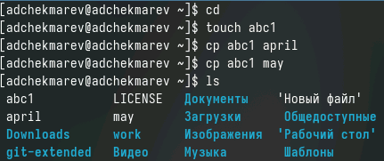{#fig:001 width=60%}

- Копирование нескольких файлов в каталог

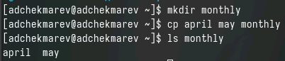

## Копирование файлов и каталогов (2)

- Копирование файлов в произвольном каталоге

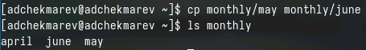

## Рекурсивного копирования 

- Копирование каталогов в текущем каталоге

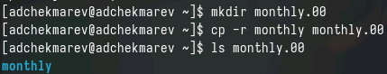

- Копирование каталогов в произвольном каталоге

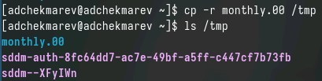

## Перемещение и переименование файлов и каталогов (1)

- Переименование файлов в текущем каталоге

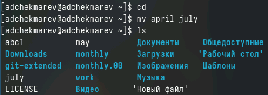{#fig:001 width=50%}

- Перемещение файлов в другой каталог

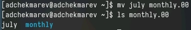{#fig:001 width=70%}

- Переименование каталогов в текущем каталоге

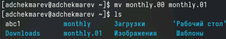{#fig:001 width=90%}

## Перемещение и переименование файлов и каталогов (2)

- Перемещение каталога в другой каталог

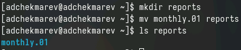

- Переименование каталога, не являющегося текущим

## Изменение прав доступа (1)

- Создание файла с правом выполнения

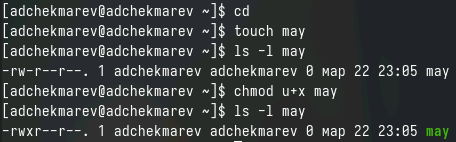 

- Лишение прав на выполнение

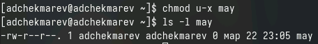

## Изменение прав доступа (2)

- Создание каталога с запретом на чтение

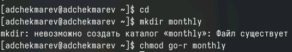

- Создание файла с правом записи

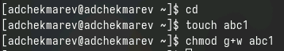

## Копирование, перемещение, переименование файлов. Создание директории

- Копирование файла и переименование

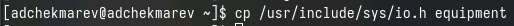{#fig:001 width=80%}

- Создание директории

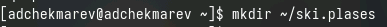{#fig:001 width=80%}

- Перемещение файла в каталог

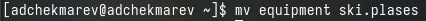{#fig:001 width=80%}

- Переименование файла

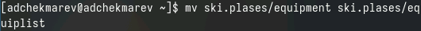{#fig:001 width=80%}

## Создание, копирование, перемещение файлов и каталогов

- Создание файла и его копирование в каталог

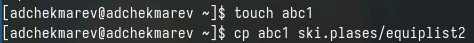{#fig:001 width=70%}

- Создание каталога в каталоге

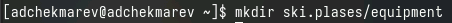{#fig:001 width=70%}

- Перемещение файлов в каталог

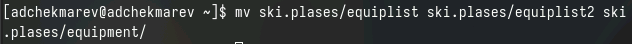{#fig:001 width=80%}

- Создание и перемещение каталога в каталог с его переименованием

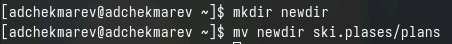{#fig:001 width=70%}

## Работа с опциями команды chmod

Присвоим каждому из каталогов и файлов определённые права доступа

- drwxr--r-- ... australia

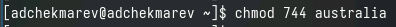

- drwx--x--x ... play

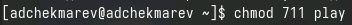

- -r-xr--r-- ... my_os

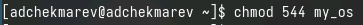

- -rw-rw-r-- ... feathers

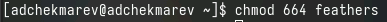

## Просмотр содержимого, копирование и перемещение файлов и каталогов

- Просмотр содержимого "password"?

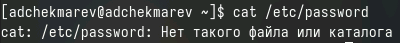{#fig:001 width=70%}

- Копирование файла

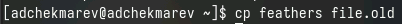{#fig:001 width=80%}

- Перемещение файла

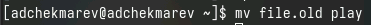{#fig:001 width=80%}

- Копирование каталога

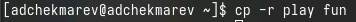{#fig:001 width=70%}

## Перемещение каталога. Лишение прав и проверка

- Перемещение каталога с переименованием

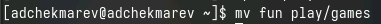{#fig:001 width=70%}

- Лишение прав на чтение

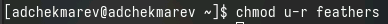{#fig:001 width=70%}

- Попытка просмотра файлов командой cat

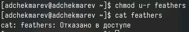{#fig:001 width=60%}

- Попытка копирования файла

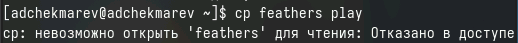{#fig:001 width=70%}

## Выдача и лишение прав владельца

- Выдача прав на чтение

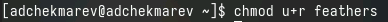

- Лишение прав на выполнение

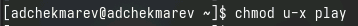

- Переход в каталог

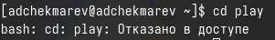

- Выдача прав на выполнение

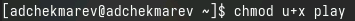

## Просмотр mount

- Прочитаем man mount

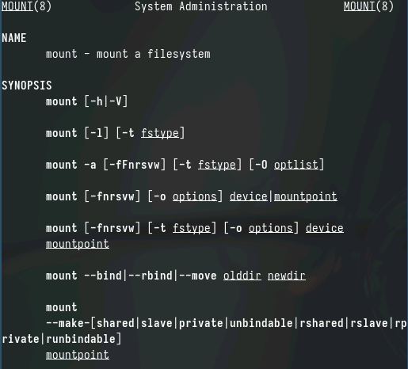

## Просмотр fsck

- Прочитаем man fsck

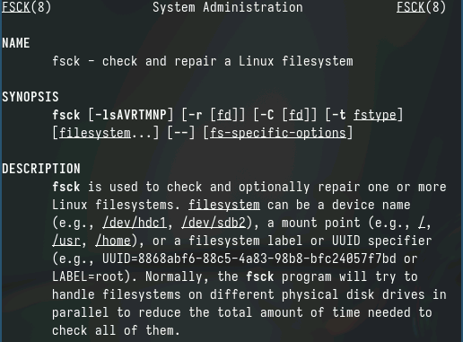

## Просмотр mkfs

- Прочитаем man mkfs

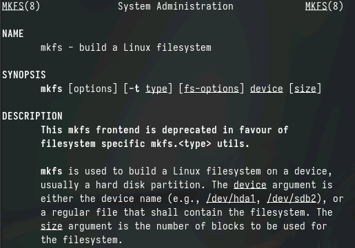

## Просмотр kill

- Прочитаем man kill

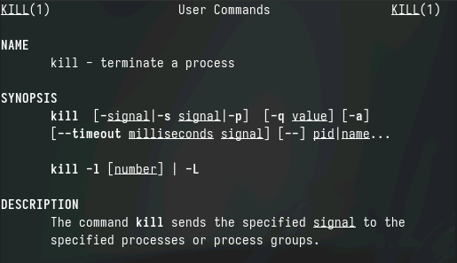

## Выводы

Я ознакомился с файловой системой Linux, её структурой, именами и содержанием
каталогов. Я приобрел практические навыки по применению команд для работы
с файлами и каталогами, по управлению процессами (и работами), по проверке использования диска и обслуживанию файловой системы

