---
## Front matter
title: "Отчёт по лабораторной работе №7"
subtitle: "Анализ файловой системы Linux. Команды для работы с файлами и каталогами"
author: "Чекмарев Александр Дмитриевич | Группа НПИбд-02-23"

## Generic otions
lang: ru-RU
toc-title: "Содержание"

## Bibliography
bibliography: bib/cite.bib
csl: pandoc/csl/gost-r-7-0-5-2008-numeric.csl

## Pdf output format
toc: true # Table of contents
toc-depth: 2
lof: true # List of figures
lot: true # List of tables
fontsize: 12pt
linestretch: 1.5
papersize: a4
documentclass: scrreprt
## I18n polyglossia
polyglossia-lang:
  name: russian
  options:
	- spelling=modern
	- babelshorthands=true
polyglossia-otherlangs:
  name: english
## I18n babel
babel-lang: russian
babel-otherlangs: english
## Fonts
mainfont: PT Serif
romanfont: PT Serif
sansfont: PT Sans
monofont: PT Mono
mainfontoptions: Ligatures=TeX
romanfontoptions: Ligatures=TeX
sansfontoptions: Ligatures=TeX,Scale=MatchLowercase
monofontoptions: Scale=MatchLowercase,Scale=0.9
## Biblatex
biblatex: true
biblio-style: "gost-numeric"
biblatexoptions:
  - parentracker=true
  - backend=biber
  - hyperref=auto
  - language=auto
  - autolang=other*
  - citestyle=gost-numeric
## Pandoc-crossref LaTeX customization
figureTitle: "Рис."
tableTitle: "Таблица"
listingTitle: "Листинг"
lofTitle: "Список иллюстраций"
lotTitle: "Список таблиц"
lolTitle: "Листинги"
## Misc options
indent: true
header-includes:
  - \usepackage{indentfirst}
  - \usepackage{float} # keep figures where there are in the text
  - \floatplacement{figure}{H} # keep figures where there are in the text
---

# Цель работы

Ознакомление с файловой системой Linux, её структурой, именами и содержанием каталогов. Приобретение практических навыков по применению команд для работы с файлами и каталогами, по управлению процессами (и работами), по проверке использования диска и обслуживанию файловой системы.

# Задания

1. Выполните все примеры, приведённые в первой части описания лабораторной работы.  
2. Выполните следующие действия, зафиксировав в отчёте по лабораторной работе используемые при этом команды и результаты их выполнения:  
2.1. Скопируйте файл /usr/include/sys/io.h в домашний каталог и назовите его equipment. Если файла io.h нет, то используйте любой другой файл в каталоге /usr/include/sys/ вместо него.  
2.2. В домашнем каталоге создайте директорию ~/ski.plases.  
2.3. Переместите файл equipment в каталог ~/ski.plases.  
2.4. Переименуйте файл ~/ski.plases/equipment в ~/ski.plases/equiplist.  
2.5. Создайте в домашнем каталоге файл abc1 и скопируйте его в каталог ~/ski.plases, назовите его equiplist2.  
2.6. Создайте каталог с именем equipment в каталоге ~/ski.plases.  
2.7. Переместите файлы ~/ski.plases/equiplist и equiplist2 в каталог ~/ski.plases/equipment.  
2.8. Создайте и переместите каталог ~/newdir в каталог ~/ski.plases и назовите его plans.  
3. Определите опции команды chmod, необходимые для того, чтобы присвоить перечисленным ниже файлам выделенные права доступа, считая, что в начале таких прав нет:  
3.1. drwxr--r-- ... australia  
3.2. drwx--x--x ... play  
3.3. -r-xr--r-- ... my_os  
3.4. -rw-rw-r-- ... feathers  
При необходимости создайте нужные файлы.  
4. Проделайте приведённые ниже упражнения, записывая в отчёт по лабораторной работе используемые при этом команды:  
4.1. Просмотрите содержимое файла /etc/password.  
4.2. Скопируйте файл ~/feathers в файл ~/file.old.  
4.3. Переместите файл ~/file.old в каталог ~/play.  
4.4. Скопируйте каталог ~/play в каталог ~/fun.  
4.5. Переместите каталог ~/fun в каталог ~/play и назовите его games.  
4.6. Лишите владельца файла ~/feathers права на чтение.  
4.7. Что произойдёт, если вы попытаетесь просмотреть файл ~/feathers командой cat?  
4.8. Что произойдёт, если вы попытаетесь скопировать файл ~/feathers?  
4.9. Дайте владельцу файла ~/feathers право на чтение.  
4.10. Лишите владельца каталога ~/play права на выполнение.  
4.11. Перейдите в каталог ~/play. Что произошло?  
4.12. Дайте владельцу каталога ~/play право на выполнение.  
5. Прочитайте man по командам mount, fsck, mkfs, kill и кратко их охарактеризуйте, приведя примеры.

# Выполнение лабораторной работы

## 1-ое Задание

### Копирование файлов и каталогов

Команда cp используется для копирования файлов и каталогов.

Создадим файл abc1, скопируем файл ~/abc1 в файл april и в файл may

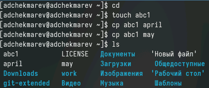

Создадим каталог mkdir. Скопируем файлы april и may в каталог monthly

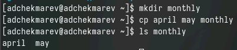

Скопируем файл monthly/may в файл с именем june

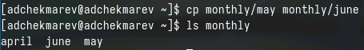

Для рекурсивного копирования каталогов, содержащих файлы, используется команда cp с опцией r.

Создадим каталог monthly.00. Скопируем каталог monthly в каталог monthly.00

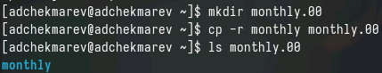

Скопируем каталог monthly.00 в каталог /tmp

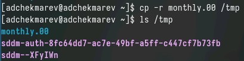

### Перемещение и переименование файлов и каталогов

Команды mv и mvdir предназначены для перемещения и переименования файлов и каталогов.

Изменим название файла april на july в домашнем каталоге

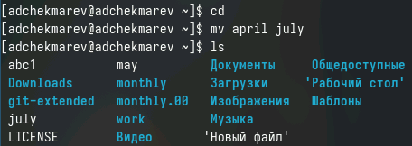

Переместим файл july в каталог monthly.00

Переименуем каталог monthly.00 в monthly.01

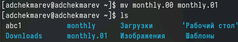

Создадим каталог reports. Переместим каталог monthly.01 в каталог reports

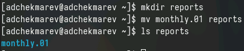

Переименуем каталог reports/monthly.01 в reports/monthly

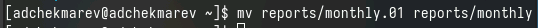

### Изменение прав доступа

Создадим файл may с правом выполенния для владельца

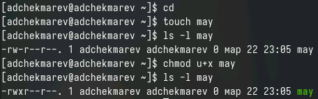

Лишим владельца файла права на выполнение

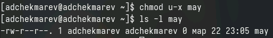

Создадим каталог monthly с запретом на чтение

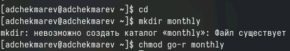

Создадим файл abc1 с правом записи для членов группы

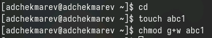

## 2-ое Задание

Скопируем файл /usr/include/sys/io.h в домашний каталог и назовем его equipment

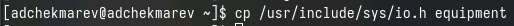

В домашнем каталоге создадим директорию ~/ski.plases

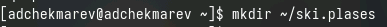

Переместим файл equipment в каталог ~/ski.plases

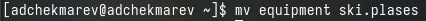

Переименуем файл ~/ski.plases/equipment в ~/ski.plases/equiplist.

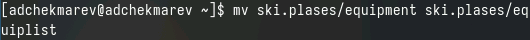

Создадим в домашнем каталоге файл abc1 и скопируем его в каталог ~/ski.plases, назовем его equiplist2

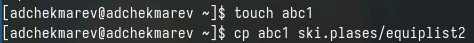

Создадим каталог с именем equipment в каталоге ~/ski.plases

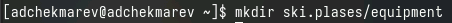

Переместим файлы ~/ski.plases/equiplist и equiplist2 в каталог ~/ski.plases/equipment.

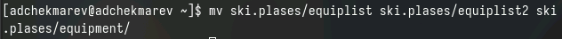

Создадим и переместим каталог ~/newdir в каталог ~/ski.plases и назовем его plans.

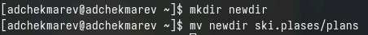

## 3-ье Задание

Определим опции команды chmod, необходимые для того, чтобы присвоить перечисленным ниже файлам выделенные права доступа, считая, что в начале таких прав нет

Присвоим каждому из каталогов и файлов определённые права доступа

3.1 drwxr--r-- ... australia

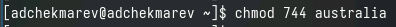

3.2 drwx--x--x ... play

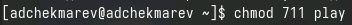

3.3 -r-xr--r-- ... my_os

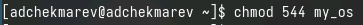

3.4 -rw-rw-r-- ... feathers

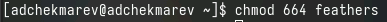

## 4-ое Задание

Просмотрим содержимое файла /etc/password. ???

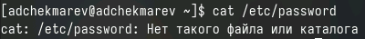

Скопируем файл ~/feathers в файл ~/file.old.

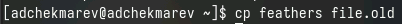

Переместим файл ~/file.old в каталог ~/play.

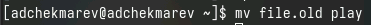

Скопируем каталог ~/play в каталог ~/fun.

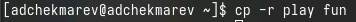

Переместим каталог ~/fun в каталог ~/play и назовем его games.

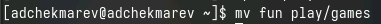

Лишим владельца файла ~/feathers права на чтение.

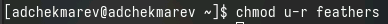

Посмотрим что произойдет, если мы попытаемся просмотреть файл ~/feathers командой cat

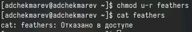

Посмотрим что произойдет, если мы попытаемся скопировать файл ~/feathers

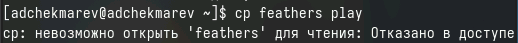

Дадим владельцу файла ~/feathers право на чтение.

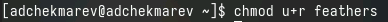

Лишим владельца каталога ~/play права на выполнение.

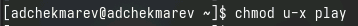

Перейдем в каталог ~/play

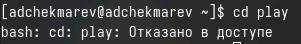

Дадим владельцу каталога ~/play право на выполнение.

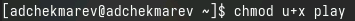

## 5-ое Задание

Прочитаем man по командам mount, fsck, mkfs, kill и кратко их охарактеризуем, приведя примеры.

1. mount

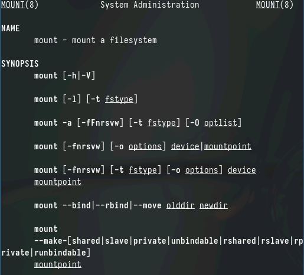

2. fsck

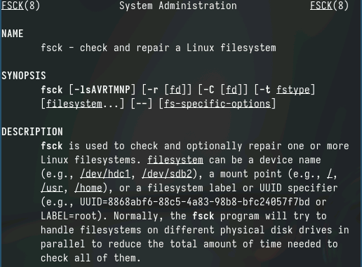

3. mkfs

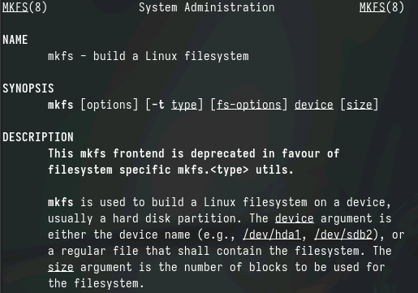

4. kill

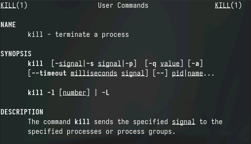

# Контрольные вопросы

1. Дайте характеристику каждой файловой системе, существующей на жёстком диске компьютера, на котором вы выполняли лабораторную работу.

Характеристика некоторых файловых систем:  

ext4: Распространенная и стабильная файловая система Linux, поддерживающая большие файлы и разделы.  
btrfs: Предоставляет функции копирования снимков, проверки целостности данных и сжатия.  
xfs: Поддерживает большие объемы и высокую производительность при работе с большими файлами.  
swap: Файловая система, используемая для размещения файла подкачки.  

2. Приведите общую структуру файловой системы и дайте характеристику каждой директории первого уровня этой структуры.

Общая структура файловой системы в Linux включает в себя директории:  

/bin: исполняемые файлы, необходимые для запуска системы.  
/boot: файлы загрузчика.  
/etc: конфигурационные файлы.  
/home: домашние каталоги пользователей.  
/lib и /lib64: библиотеки.  
/usr: вторичная иерархия для данных разделов.  
/var: переменные файлы, такие как журналы и кэши.  
/sbin: системные исполняемые файлы.  
/tmp: временные файлы.  

3. Какая операция должна быть выполнена, чтобы содержимое некоторой файловой системы было доступно операционной системе?

Чтобы файловая система была доступна операционной системе, её нужно смонтировать (mount).  

4. Назовите основные причины нарушения целостности файловой системы. Как устранить повреждения файловой системы?

Основные причины нарушения целостности файловой системы могут включать отключение питания во время операций записи, неправильное завершение работы системы или физические повреждения диска. Повреждения могут быть устранены с помощью инструментов проверки файловой системы, таких как fsck.  

5. Как создаётся файловая система?

Файловая система создается с помощью специальных инструментов, таких как mkfs, которые форматируют определенное устройство и создают на нем файловую систему.  

6. Дайте характеристику командам для просмотра текстовых файлов.

Для просмотра текстовых файлов можно использовать команды:  

cat: выводит содержимое файла на экран.  
less/more: позволяют просматривать текстовые файлы постранично.  
head/tail: выводят начало или конец файла соответственно.  

7. Приведите основные возможности команды cp в Linux.

Основные возможности команды cp в Linux включают копирование файлов и директорий, сохранение атрибутов файлов и директорий, рекурсивное копирование поддиректорий.  

8. Приведите основные возможности команды mv в Linux.

Основные возможности команды mv в Linux включают перемещение файлов и директорий, переименование файлов и директорий.  

9. Что такое права доступа? Как они могут быть изменены?

Права доступа определяют, кто и как может получить доступ к файлам и директориям. Они могут быть изменены с помощью команды chmod, которая изменяет права доступа к файлам и директориям в системе.

# Выводы

Я ознакомился с файловой системой Linux, её структурой, именами и содержанием каталогов. 
Я приобрел практические навыки по применению команд для работы с файлами и каталогами, по управлению процессами (и работами), по проверке использования диска и обслуживанию файловой системы.

# Список литературы{.unnumbered}

::: {#refs}
:::
