---
## Front matter
lang: ru-RU
title: Лабораторная работа №8
subtitle: Поиск файлов. Перенаправление ввода-вывода. Просмотр запущенных процессов
author:
  - Чекмарев Александр Дмитриевич | Группа НПИбд-02-23
institute:
  - Российский университет дружбы народов, Москва, Россия
date: 30 марта 2024

## i18n babel
babel-lang: russian
babel-otherlangs: english

## Formatting pdf
toc: false
toc-title: Содержание
slide_level: 2
aspectratio: 169
section-titles: true
theme: metropolis
header-includes:
 - \metroset{progressbar=frametitle,sectionpage=progressbar,numbering=fraction}
 - '\makeatletter'
 - '\beamer@ignorenonframefalse'
 - '\makeatother'
 
 
 ## Fonts
mainfont: PT Serif
romanfont: PT Serif
sansfont: PT Sans
monofont: PT Mono
mainfontoptions: Ligatures=TeX
romanfontoptions: Ligatures=TeX
sansfontoptions: Ligatures=TeX,Scale=MatchLowercase
monofontoptions: Scale=MatchLowercase,Scale=0.9
---

# Информация

## Докладчик

:::::::::::::: {.columns align=center}
::: {.column width="70%"}

  * Чекмарев Александр Дмитриевич
  * Группа НПИбд-02-23
  * Российский университет дружбы народов
  * <https://github.com/nenokixd?tab=repositories>

:::
::: {.column width="30%"}

:::
::::::::::::::

## Цель работы

- Ознакомление с инструментами поиска файлов и фильтрации текстовых данных.
- Приобретение практических навыков: по управлению процессами (и заданиями), по проверке использования диска и обслуживанию файловых систем.

## Задания

1. Осуществите вход в систему, используя соответствующее имя пользователя.  
2. Запишите в файл file.txt названия файлов, содержащихся в каталоге /etc. Допишите в этот же файл названия файлов, содержащихся в вашем домашнем каталоге.  
3. Выведите имена всех файлов из file.txt, имеющих расширение .conf, после чего запишите их в новый текстовой файл conf.txt.  
4. Определите, какие файлы в вашем домашнем каталоге имеют имена, начинавшиеся с символа c? Предложите несколько вариантов, как это сделать.  
5. Выведите на экран (по странично) имена файлов из каталога /etc, начинающиеся с символа h.  
6. Запустите в фоновом режиме процесс, который будет записывать в файл ~/logfile файлы, имена которых начинаются с log.  

## Задания

7. Удалите файл ~/logfile.
8. Запустите из консоли в фоновом режиме редактор gedit.  
9. Определите идентификатор процесса gedit, используя команду ps, конвейер и фильтр grep. Как ещё можно определить идентификатор процесса?  
10. Прочтите справку (man) команды kill, после чего используйте её для завершения процесса gedit.  
11. Выполните команды df и du, предварительно получив более подробную информацию об этих командах, с помощью команды man.  
12. Воспользовавшись справкой команды find, выведите имена всех директорий, имеющихся в вашем домашнем каталоге.

# Выполнение лабораторной работы

## Вход в систему

- Вход в аккаунт

## Запись названий файлов каталога /etc и домашнего каталога

- Запишем в файл file.txt названия файлов, содержащихся в каталоге /etc и проверим

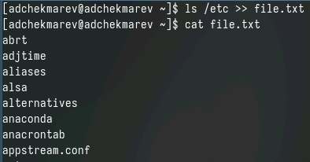{#fig:001 width=40%}

- Запишем названия файлов домашнего каталога и проверим

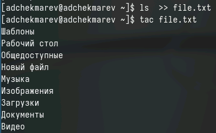{#fig:001 width=50%}

## Вывод имен файлов с .conf и их запись в .txt

- Выведем имена всех файлов из file.txt, имеющих расширение .conf

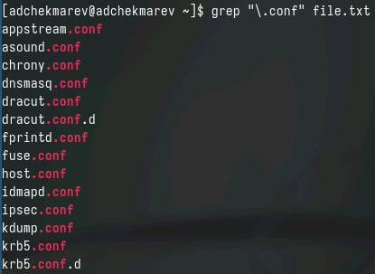{#fig:001 width=40%}

- Запишем их в новый текстовой файл conf.txt

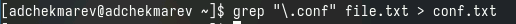{#fig:001 width=50%}

## Определение файлов на "c"

- Определим, какие файлы в домашнем каталоге имеют имена, начинающиеся с символа c

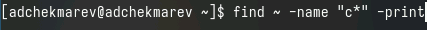

- Демонстрация фрагмента из вывода

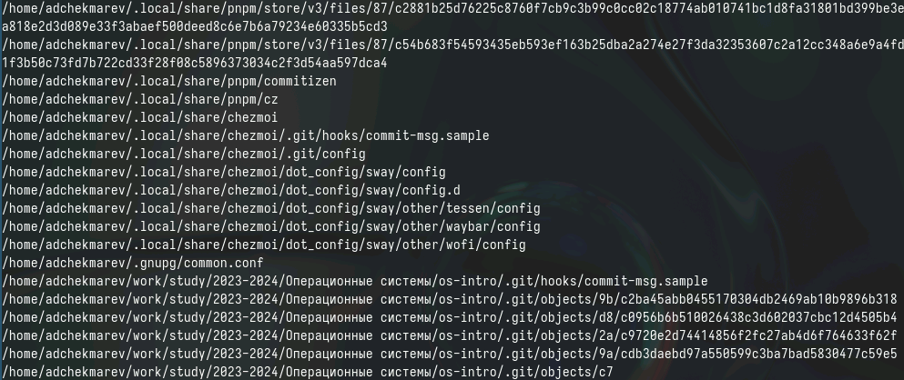{#fig:001 width=50%}

## Примеры некоторых команд для нахождения файлов на "с"

- Команда ls | grep c*

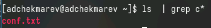 

- Команда ls -Ra | grep ^c

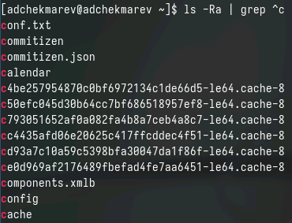

## Вывод на экран по странично

- Выведем на экран имена файлов из каталога /etc, начинающиеся с символа h.

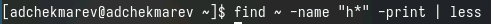

- Фрагмент вывода

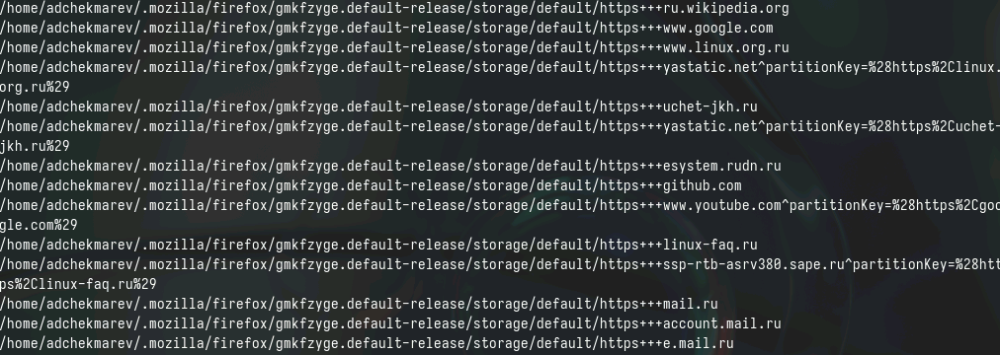{#fig:001 width=60%}

## Запуск фонового процесса записи и удаление файла

- Запустим в фоновом режиме процесс, который будет записывать в файл ~/logfile файлы, имена которых начинаются с log.

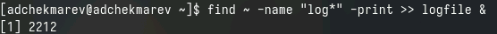

- Удалим файл ~/logfile.

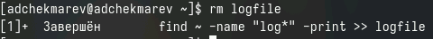

## Запуск редактора gedit, определение идентификатор процесса с примером

- Запустим из консоли в фоновом режиме редактор gedit.

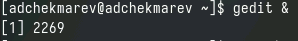

- Определим идентификатор процесса gedit, используя команду ps, конвейер и фильтр grep.

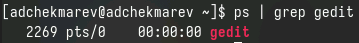

- Команда pidof gedit

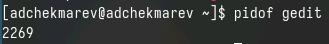

## Команда kill

- Прочитаем справку (man) команды kill, после чего используем её для завершения процесса gedit.

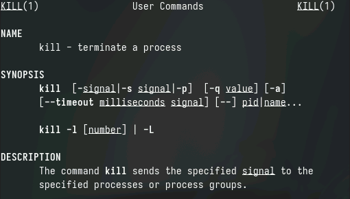{#fig:001 width=50%}

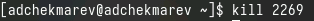{#fig:001 width=50%}

## Информация о команде df

- man df

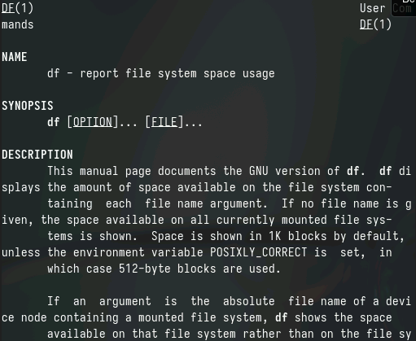{#fig:001 width=60%}

## Информация о команда du

- man du

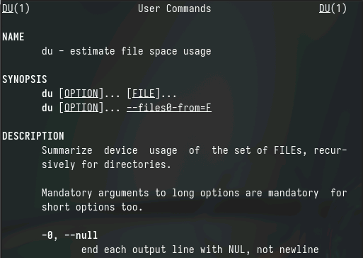{#fig:001 width=60%}

## Выполнение команды df

- Выполним команду df

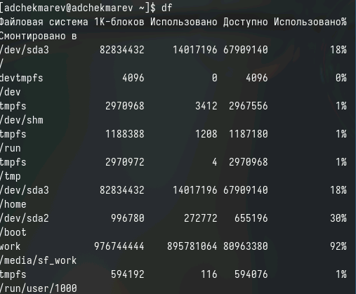{#fig:001 width=60%}

## Выполнение команды du

- Выполним команду du

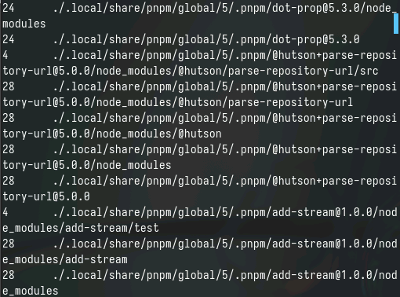{#fig:001 width=50%}

## Информация о команде find 

- Воспользуемся справкой команды find. man find

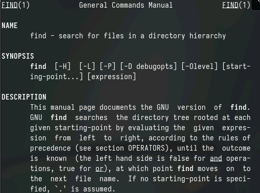

## Выполнение команды find 

- Выведем имена всех директорий, имеющихся в домашнем каталоге.

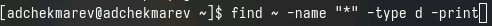

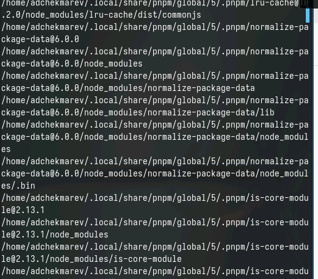{#fig:001 width=50%}

## Выводы

Я знакомился с инструментами поиска файлов и фильтрации текстовых данных.
Приобрел практические навыки: по управлению процессами (и заданиями), по проверке использования диска и обслуживанию файловых систем.
