---
## Front matter
title: "Отчёт по лабораторной работе №8"
subtitle: "Поиск файлов. Перенаправление ввода-вывода. Просмотр запущенных процессов"
author: "Чекмарев Александр Дмитриевич | Группа НПИбд-02-23"

## Generic otions
lang: ru-RU
toc-title: "Содержание"

## Bibliography
bibliography: bib/cite.bib
csl: pandoc/csl/gost-r-7-0-5-2008-numeric.csl

## Pdf output format
toc: true # Table of contents
toc-depth: 2
lof: true # List of figures
lot: true # List of tables
fontsize: 12pt
linestretch: 1.5
papersize: a4
documentclass: scrreprt
## I18n polyglossia
polyglossia-lang:
  name: russian
  options:
	- spelling=modern
	- babelshorthands=true
polyglossia-otherlangs:
  name: english
## I18n babel
babel-lang: russian
babel-otherlangs: english
## Fonts
mainfont: PT Serif
romanfont: PT Serif
sansfont: PT Sans
monofont: PT Mono
mainfontoptions: Ligatures=TeX
romanfontoptions: Ligatures=TeX
sansfontoptions: Ligatures=TeX,Scale=MatchLowercase
monofontoptions: Scale=MatchLowercase,Scale=0.9
## Biblatex
biblatex: true
biblio-style: "gost-numeric"
biblatexoptions:
  - parentracker=true
  - backend=biber
  - hyperref=auto
  - language=auto
  - autolang=other*
  - citestyle=gost-numeric
## Pandoc-crossref LaTeX customization
figureTitle: "Рис."
tableTitle: "Таблица"
listingTitle: "Листинг"
lofTitle: "Список иллюстраций"
lotTitle: "Список таблиц"
lolTitle: "Листинги"
## Misc options
indent: true
header-includes:
  - \usepackage{indentfirst}
  - \usepackage{float} # keep figures where there are in the text
  - \floatplacement{figure}{H} # keep figures where there are in the text
---

# Цель работы

Ознакомление с инструментами поиска файлов и фильтрации текстовых данных.
Приобретение практических навыков: по управлению процессами (и заданиями), по проверке использования диска и обслуживанию файловых систем.
# Задания

1. Осуществите вход в систему, используя соответствующее имя пользователя.  
2. Запишите в файл file.txt названия файлов, содержащихся в каталоге /etc. Допишите в этот же файл названия файлов, содержащихся в вашем домашнем каталоге.  
3. Выведите имена всех файлов из file.txt, имеющих расширение .conf, после чего запишите их в новый текстовой файл conf.txt.  
4. Определите, какие файлы в вашем домашнем каталоге имеют имена, начинавшиеся с символа c? Предложите несколько вариантов, как это сделать.  
5. Выведите на экран (по странично) имена файлов из каталога /etc, начинающиеся с символа h.  
6. Запустите в фоновом режиме процесс, который будет записывать в файл ~/logfile файлы, имена которых начинаются с log.  
7. Удалите файл ~/logfile.  
8. Запустите из консоли в фоновом режиме редактор gedit.  
9. Определите идентификатор процесса gedit, используя команду ps, конвейер и фильтр grep. Как ещё можно определить идентификатор процесса?  
10. Прочтите справку (man) команды kill, после чего используйте её для завершения процесса gedit.  
11. Выполните команды df и du, предварительно получив более подробную информацию об этих командах, с помощью команды man.  
12. Воспользовавшись справкой команды find, выведите имена всех директорий, имеющихся в вашем домашнем каталоге.  

# Выполнение лабораторной работы

Осуществим вход в систему, используя соответствующее имя пользователя.

Запишем в файл file.txt названия файлов, содержащихся в каталоге /etc. 

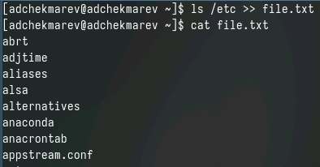

Допишем в этот же файл названия файлов, содержащихся в домашнем каталоге.

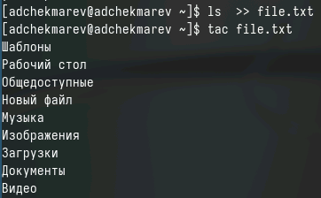

Выведем имена всех файлов из file.txt, имеющих расширение .conf

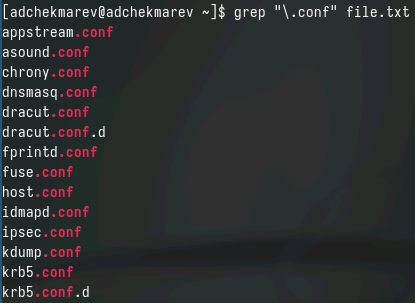

Запишем их в новый текстовой файл conf.txt

Определим, какие файлы в домашнем каталоге имеют имена, начинающиеся с символа c

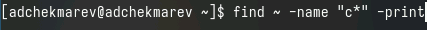

Демонстрация фрагмента из вывода:

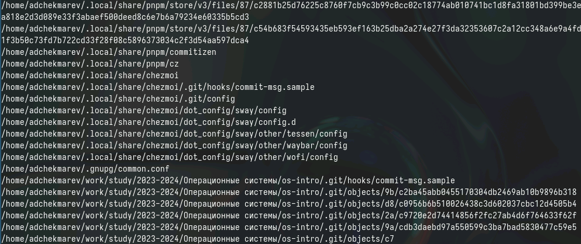

Также можно воспользоватьяс командой ls | grep c*

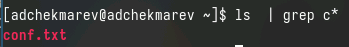

И командой ls -Ra | grep ^c

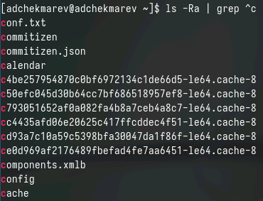

Выведем на экран (по странично) имена файлов из каталога /etc, начинающиеся с символа h.

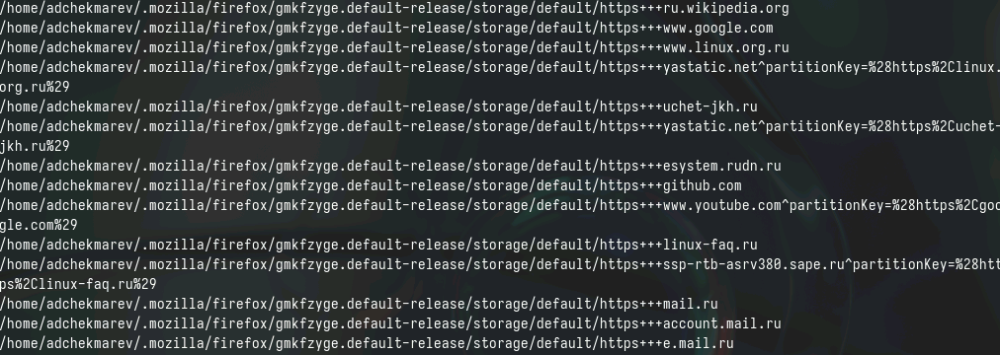

Запустим в фоновом режиме процесс, который будет записывать в файл ~/logfile файлы, имена которых начинаются с log.

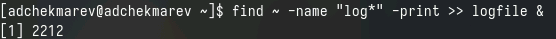

Удалим файл ~/logfile.

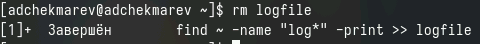

Запустим из консоли в фоновом режиме редактор gedit.

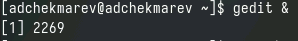

Определим идентификатор процесса gedit, используя команду ps, конвейер и фильтр grep.

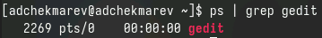

Также можно воспользоваться командой pidof gedit для определения идентификатора

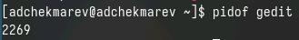

Прочитаем справку (man) команды kill, после чего используем её для завершения процесса gedit.

man kill

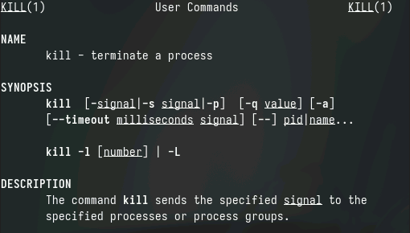

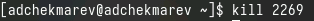

Выполним команды df и du, предварительно получив более подробную информацию об этих командах, с помощью команды man.

1. man df

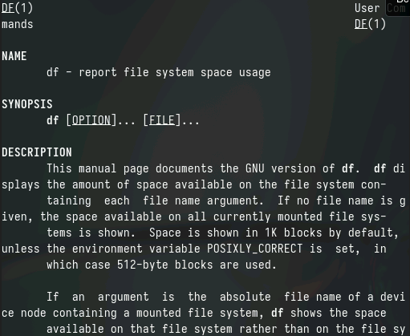

2. man du

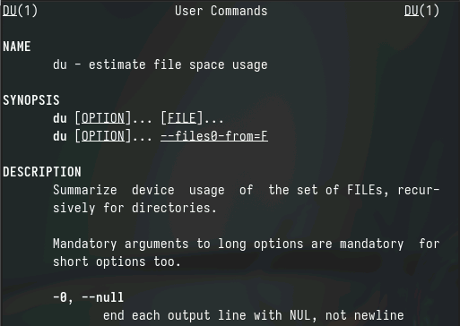

Выполним команду df

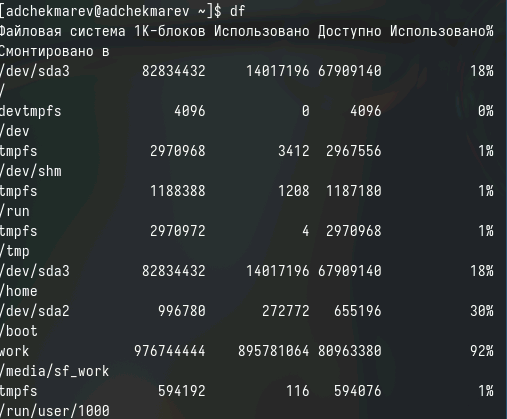

Выполним команду du

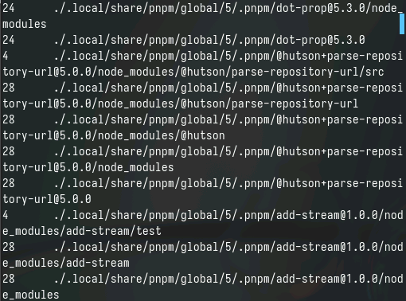

Воспользуемся справкой команды find.

man find

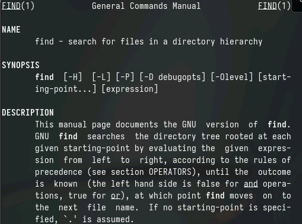

Выведем имена всех директорий, имеющихся в домашнем каталоге.

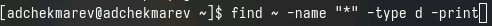

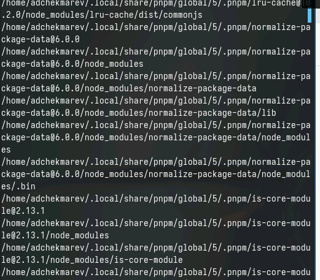

# Контрольные вопросы

1. Какие потоки ввода вывода вы знаете?  

Стандартный ввод (stdin): обычно это клавиатура.  
Стандартный вывод (stdout): обычно это текстовый вывод на экран.  
Стандартный вывод ошибок (stderr): вывод ошибок, отдельно от основного вывода программы, также на экран.  

2. Объясните разницу между операцией > и >>.  

> перенаправляет вывод команды в файл, перезаписывая его содержимое.  
>> добавляет вывод команды в конец файла, не удаляя предыдущее содержимое.  

3. Что такое конвейер?  

Конвейер - это последовательность из двух или более команд, разделённых   символом |, где вывод одной команды служит вводом для следующей. Это позволяет обрабатывать данные последовательно несколькими командами.  

4. Что такое процесс? Чем это понятие отличается от программы?  

Программа — это исполняемый файл, который содержит набор инструкций.  
Процесс — это экземпляр запущенной программы, исполняющийся в операционной системе, имеющий свои системные ресурсы и контекст выполнения.  

5. Что такое PID и GID?  

PID (Process ID) — уникальный номер, идентифицирующий процесс в системе.  
GID (Group ID) — номер, идентифицирующий группу пользователей, имеющих определённые права доступа к файлам и процессам.  

6. Что такое задачи и какая команда позволяет ими управлять?  

Задачи — это процессы, выполняющиеся в системе.  
Команда jobs показывает список задач, запущенных из текущего терминала.   Команды fg, bg и kill позволяют управлять задачами, например, возобновлять приостановленную задачу в фоне или убивать задачи.  

7. Найдите информацию об утилитах top и htop. Каковы их функции?  

top — утилита, показывающая информацию о процессах и использовании системных ресурсов в реальном времени.  
htop — улучшенная версия top, с более удобным интерфейсом и дополнительными возможностями управления процессами.  

8. Назовите и дайте характеристику команде поиска файлов. Приведите примеры использования этой команды.  

find — команда для поиска файлов и каталогов. Может искать по имени, размеру, типу и другим критериям.  
Примеры:  
find /home -name '*.txt' — ищет все файлы с расширением .txt в домашнем каталоге.  
find / -size +100M — ищет все файлы больше 100 МБ в файловой системе.  

9. Можно ли по контексту (содержанию) найти файл? Если да, то как?  

Да, можно использовать grep или его аналоги (egrep, fgrep).  
Пример: grep -R 'искомый_текст' /путь/к/каталогу — рекурсивно ищет текст в файлах каталога.  

10. Как определить объем свободной памяти на жёстком диске?  

Команда df -h показывает объем используемой и свободной памяти на всех подключенных устройствах хранения данных с человеко-читаемыми единицами измерения.  

11. Как определить объем вашего домашнего каталога?  

Команда du -sh ~/ показывает общий размер файлов в домашнем каталоге в удобочитаемом формате.  

12. Как удалить зависший процесс?  

Сначала найдите PID процесса с помощью ps или top.  
Затем используйте kill PID для отправки сигнала завершения процессу. Если это не помогает, используйте kill -9 PID для принудительного завершения.

# Выводы

Я знакомился с инструментами поиска файлов и фильтрации текстовых данных.
Приобрел практические навыки: по управлению процессами (и заданиями), по проверке использования диска и обслуживанию файловых систем.

# Список литературы{.unnumbered}

::: {#refs}
:::
