---
## Front matter
lang: ru-RU
title: Лабораторная работа №9
subtitle: Командная оболочка Midnight Commander
author:
  - Чекмарев Александр Дмитриевич | Группа НПИбд-02-23
institute:
  - Российский университет дружбы народов, Москва, Россия
date: 6 апреля 2024

## i18n babel
babel-lang: russian
babel-otherlangs: english

## Formatting pdf
toc: false
toc-title: Содержание
slide_level: 2
aspectratio: 169
section-titles: true
theme: metropolis
header-includes:
 - \metroset{progressbar=frametitle,sectionpage=progressbar,numbering=fraction}
 - '\makeatletter'
 - '\beamer@ignorenonframefalse'
 - '\makeatother'
 
 
 ## Fonts
mainfont: PT Serif
romanfont: PT Serif
sansfont: PT Sans
monofont: PT Mono
mainfontoptions: Ligatures=TeX
romanfontoptions: Ligatures=TeX
sansfontoptions: Ligatures=TeX,Scale=MatchLowercase
monofontoptions: Scale=MatchLowercase,Scale=0.9
---

# Информация

## Докладчик

:::::::::::::: {.columns align=center}
::: {.column width="70%"}

  * Чекмарев Александр Дмитриевич
  * Группа НПИбд-02-23
  * Российский университет дружбы народов
  * <https://github.com/nenokixd?tab=repositories>

:::
::: {.column width="30%"}

:::
::::::::::::::

## Цель работы

- Освоение основных возможностей командной оболочки Midnight Commander.
- Приобретение навыков практической работы по просмотру каталогов и файлов; манипуляций с ними.

## Задания по mc

1. Изучите информацию о mc, вызвав в командной строке man mc.
2. Запустите из командной строки mc, изучите его структуру и меню.
3. Выполните несколько операций в mc, используя управляющие клавиши (операции
с панелями; выделение/отмена выделения файлов, копирование/перемещение файлов, получение информации о размере и правах доступа на файлы и/или каталоги
и т.п.)
4. Выполните основные команды меню левой (или правой) панели. Оцените степень
подробности вывода информации о файлах.

## Задания по mc

5. Используя возможности подменю Файл , выполните:
– просмотр содержимого текстового файла;
– редактирование содержимого текстового файла (без сохранения результатов
редактирования);
– создание каталога;
– копирование в файлов в созданный каталог.

## Задания по mc

6. С помощью соответствующих средств подменю Команда осуществите:
– поиск в файловой системе файла с заданными условиями (например, файла
с расширением .c или .cpp, содержащего строку main);
– выбор и повторение одной из предыдущих команд;
– переход в домашний каталог;
– анализ файла меню и файла расширений.
7. Вызовите подменю Настройки . Освойте операции, определяющие структуру экрана mc
(Full screen, Double Width, Show Hidden Files и т.д.)

## Задания по встроенному редактору mc

1. Создайте текстовой файл text.txt.
2. Откройте этот файл с помощью встроенного в mc редактора.
3. Вставьте в открытый файл небольшой фрагмент текста, скопированный из любого
другого файла или Интернета.
4. Проделайте с текстом следующие манипуляции, используя горячие клавиши:
4.1. Удалите строку текста.
4.2. Выделите фрагмент текста и скопируйте его на новую строку.
4.3. Выделите фрагмент текста и перенесите его на новую строку.
4.4. Сохраните файл.

## Задания по встроенному редактору mc

4.5. Отмените последнее действие.
4.6. Перейдите в конец файла (нажав комбинацию клавиш) и напишите некоторый
текст.
4.7. Перейдите в начало файла (нажав комбинацию клавиш) и напишите некоторый
текст.
4.8. Сохраните и закройте файл.
5. Откройте файл с исходным текстом на некотором языке программирования (например C или Java)
6. Используя меню редактора, включите подсветку синтаксиса, если она не включена,
или выключите, если она включена.

# Выполнение лабораторной работы

## Изучение информацию о mc

- Изучим информацию о mc, вызвав в командной строке man mc

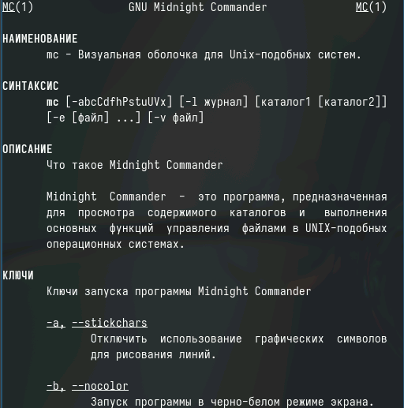

## Запуск mc

- Запустим из командной строки mc, изучим его структуру и меню

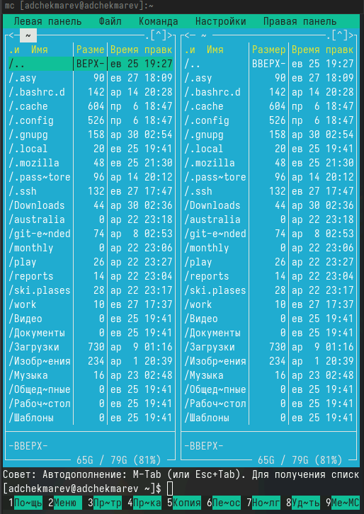{#fig:001 width=50%}

## Выделение/отмена выделения файлов 

- Выделение файлов

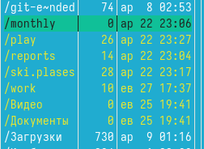{#fig:001 width=40%}

## Копирование файла

- Скопируем файл

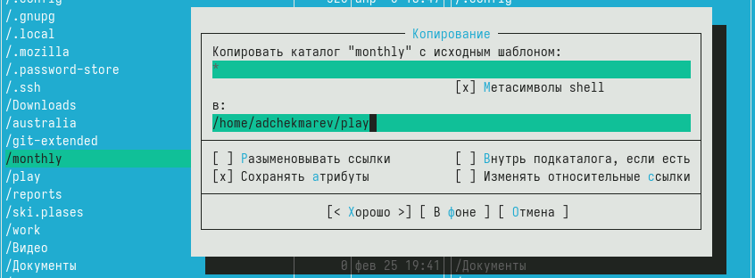{#fig:001 width=50%}

## Перемещение файла

- Переместим файл

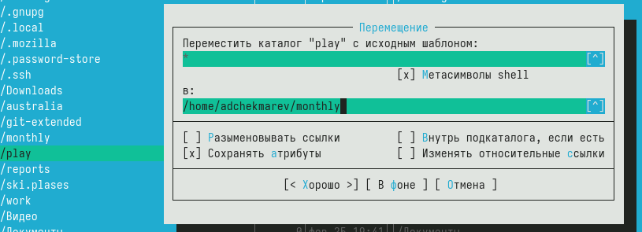{#fig:001 width=50%}

## Получение информация о файле

- Получим информации о размере и правах доступа файла

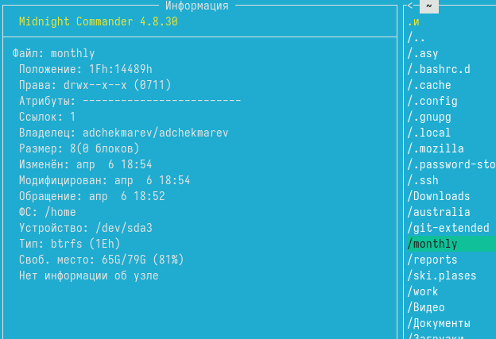 

## Быстрый просмотр

- быстрый просмотр

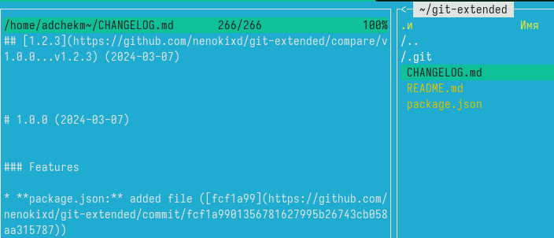

## Команда Дерево

- Дерево

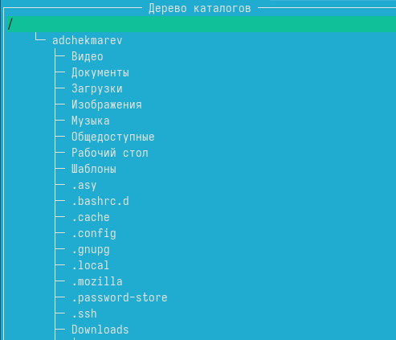

## Просмотр содержимого текстового файла

- Просмотр содержимого файла

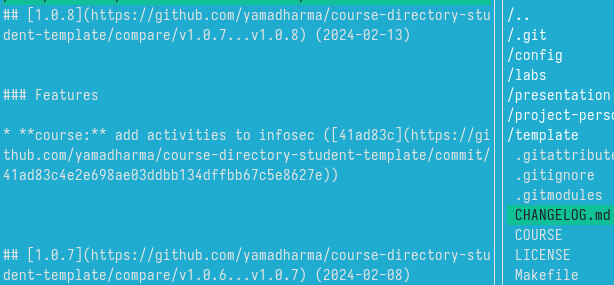{#fig:001 width=60%}

## Редактирование файла

- Редактирование содержимого текстового файла 

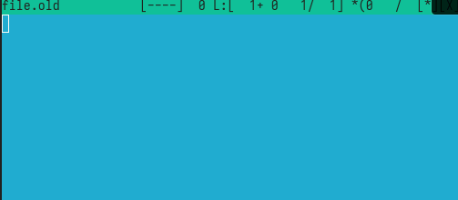{#fig:001 width=60%}

## Создание каталога

- Создание каталога

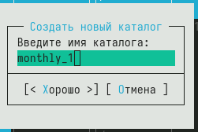{#fig:001 width=60%}

## Копирование в файлов в созданный каталог

- Копирование файлов

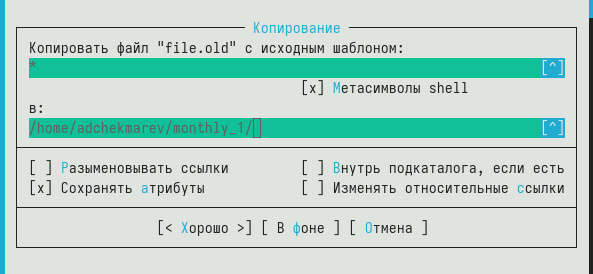

## Поиск в файловой системе файла с заданными условиями

- Поиск файлов с критериями

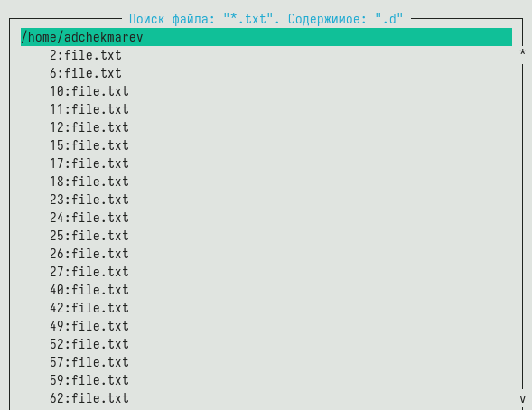

## Выбор и повторение одной из предыдущих команд

- Демонстрация предыдущей команды

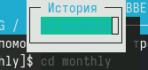

## Переход в домашний каталог

- Меню перехода в домашний каталог

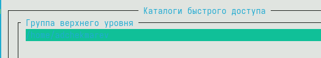

## Анализ файла меню

- Файловое меню

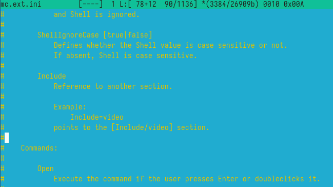

## Анализ файла расширений

- Меню расширений

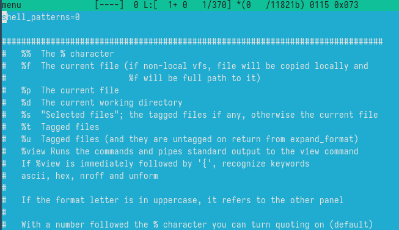{#fig:001 width=50%}

## Подменю Настройки

- Демонстрации настройки панели

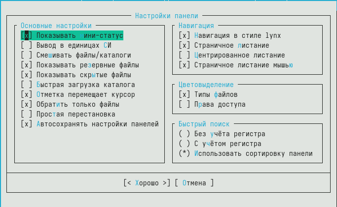{#fig:001 width=50%}

## Создание .txt

- Создадим текстовой файл text.txt.

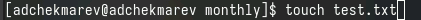{#fig:001 width=60%}

## Редактор mc

- Откроем этот файл с помощью встроенного в mc редактора

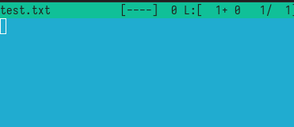{#fig:001 width=60%}

## Вставка текста в файл

- Вставим в открытый файл небольшой фрагмент текста, скопированный из любого другого файла или Интернета.

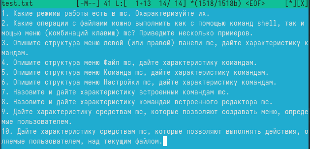{#fig:001 width=60%}

## Удаление строки

- Удалим строку текста под пунктом 4, используя ctrl + y

{#fig:001 width=50%}

## Выделение и копирование

- Выделим фрагмент текста и скопируем его на новую строку.

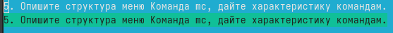

## Выделение и перенос

- Выделим фрагмент текста и перенесем его на новую строку.

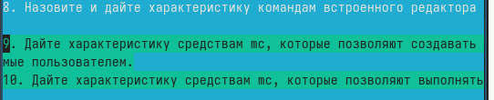

## Сохранение файла

- Сохраним файл. 

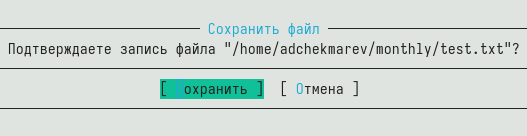{#fig:001 width=50%}

## Отмена последнего действия

- Отменим последнее действие.

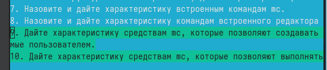{#fig:001 width=50%}

## Открытие файла на языке программирования

- Откроем файл с исходным текстом на некотором языке программирования

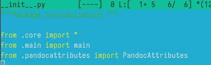{#fig:001 width=50%}

## Выводы

Я освоил основные возможности командной оболочки Midnight Commander. И приобрел навыки практической работы по просмотру каталогов и файлов; манипуляций
с ними.
