---
## Front matter
title: "Отчёт по лабораторной работе №9"
subtitle: "Командная оболочка Midnight Commander"
author: "Чекмарев Александр Дмитриевич | Группа НПИбд-02-23"

## Generic otions
lang: ru-RU
toc-title: "Содержание"

## Bibliography
bibliography: bib/cite.bib
csl: pandoc/csl/gost-r-7-0-5-2008-numeric.csl

## Pdf output format
toc: true # Table of contents
toc-depth: 2
lof: true # List of figures
lot: true # List of tables
fontsize: 12pt
linestretch: 1.5
papersize: a4
documentclass: scrreprt
## I18n polyglossia
polyglossia-lang:
  name: russian
  options:
	- spelling=modern
	- babelshorthands=true
polyglossia-otherlangs:
  name: english
## I18n babel
babel-lang: russian
babel-otherlangs: english
## Fonts
mainfont: PT Serif
romanfont: PT Serif
sansfont: PT Sans
monofont: PT Mono
mainfontoptions: Ligatures=TeX
romanfontoptions: Ligatures=TeX
sansfontoptions: Ligatures=TeX,Scale=MatchLowercase
monofontoptions: Scale=MatchLowercase,Scale=0.9
## Biblatex
biblatex: true
biblio-style: "gost-numeric"
biblatexoptions:
  - parentracker=true
  - backend=biber
  - hyperref=auto
  - language=auto
  - autolang=other*
  - citestyle=gost-numeric
## Pandoc-crossref LaTeX customization
figureTitle: "Рис."
tableTitle: "Таблица"
listingTitle: "Листинг"
lofTitle: "Список иллюстраций"
lotTitle: "Список таблиц"
lolTitle: "Листинги"
## Misc options
indent: true
header-includes:
  - \usepackage{indentfirst}
  - \usepackage{float} # keep figures where there are in the text
  - \floatplacement{figure}{H} # keep figures where there are in the text
---

# Цель работы

Освоение основных возможностей командной оболочки Midnight Commander. Приобретение навыков практической работы по просмотру каталогов и файлов; манипуляций с ними.

# Задания по mc

1. Изучите информацию о mc, вызвав в командной строке man mc.  
2. Запустите из командной строки mc, изучите его структуру и меню.  
3. Выполните несколько операций в mc, используя управляющие клавиши (операции с панелями; выделение/отмена выделения файлов, копирование/перемещение файлов, получение информации о размере и правах доступа на файлы и/или каталоги и т.п.)  
4. Выполните основные команды меню левой (или правой) панели. Оцените степень подробности вывода информации о файлах.  
5. Используя возможности подменю Файл, выполните:  
просмотр содержимого текстового файла;  
редактирование содержимого текстового файла (без сохранения результатов редактирования);  
создание каталога;  
копирование в файлов в созданный каталог.  
6. С помощью соответствующих средств подменю Команда осуществите:  
поиск в файловой системе файла с заданными условиями (например, файла c расширением .c или .cpp, содержащего строку main);  
выбор и повторение одной из предыдущих команд;  
переход в домашний каталог;  
анализ файла меню и файла расширений.  
7. Вызовите подменю Настройки . Освойте операции, определяющие структуру экрана mc(Full screen, Double Width, Show Hidden Files и т.д.)

# Задания по встроенному редактору mc

1. Создайте текстовой файл text.txt.  
2. Откройте этот файл с помощью встроенного в mc редактора.  
3. Вставьте в открытый файл небольшой фрагмент текста, скопированный из любого другого файла или Интернета.  
4. Проделайте с текстом следующие манипуляции, используя горячие клавиши:  
4.1. Удалите строку текста.  
4.2. Выделите фрагмент текста и скопируйте его на новую строку.  
4.3. Выделите фрагмент текста и перенесите его на новую строку.  
4.4. Сохраните файл.  
4.5. Отмените последнее действие.  
4.6. Перейдите в конец файла (нажав комбинацию клавиш) и напишите некоторый текст.  
4.7. Перейдите в начало файла (нажав комбинацию клавиш) и напишите некоторый текст.  
4.8. Сохраните и закройте файл.  
5. Откройте файл с исходным текстом на некотором языке программирования (например C или Java)  
6. Используя меню редактора, включите подсветку синтаксиса, если она не включена, или выключите, если она включена.

# Выполнение лабораторной работы

## mc

Изучим информацию о mc, вызвав в командной строке man mc

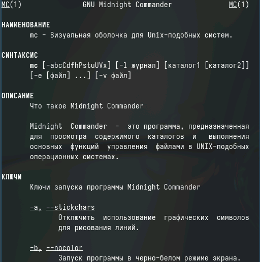

Запустим из командной строки mc, изучим его структуру и меню

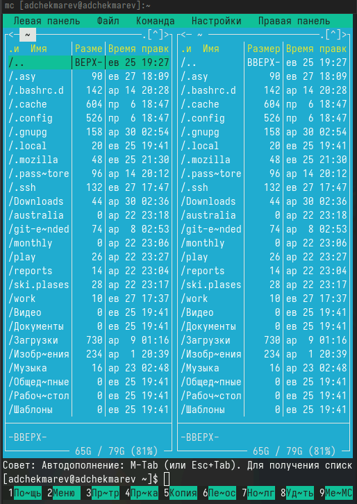

Выполним несколько операций в mc, используя управляющие клавиши 

Выделение/отмена выделения файлов 

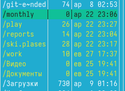

Cкопируем файл

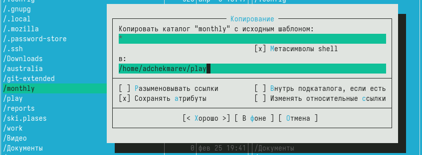

Переместим файл

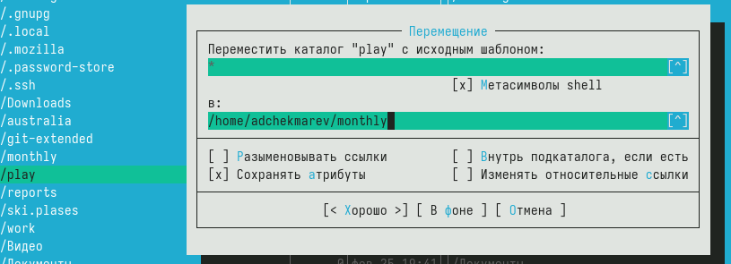
 
Получим информации о размере и правах доступа файла

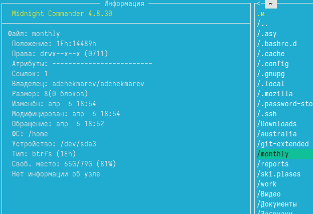
 

Выполним основные команды меню левой (или правой) панели. 

Быстрый просмотр

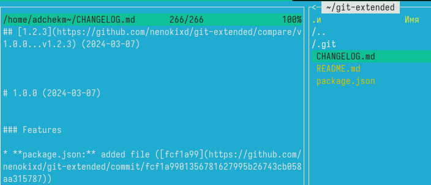

Дерево

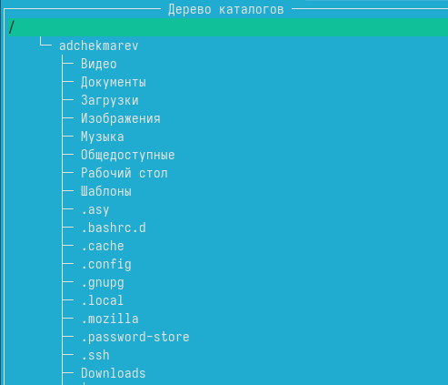

Используя возможности подменю Файл, выполним

Просмотр содержимого текстового файла;

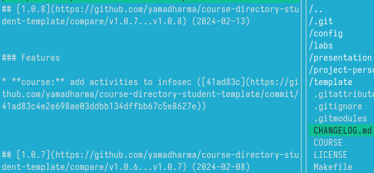

Редактирование содержимого текстового файла (без сохранения результатов редактирования). Воспользуемся "Правкой"

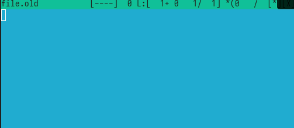

Создание каталога

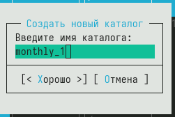

Копирование в файлов в созданный каталог

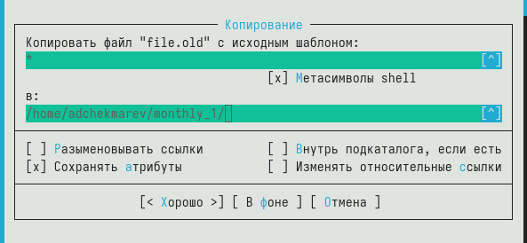

С помощью соответствующих средств подменю Команда осуществим:

Поиск в файловой системе файла с заданными условиями (например, файла с расширением .c или .cpp, содержащего строку main)

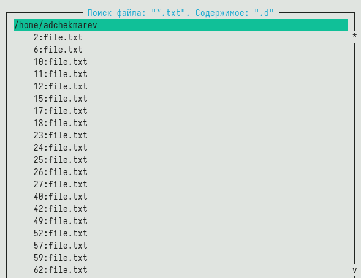

Выбор и повторение одной из предыдущих команд

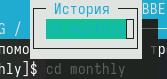

Переход в домашний каталог

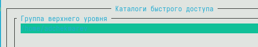

Анализ файла меню и файла расширений

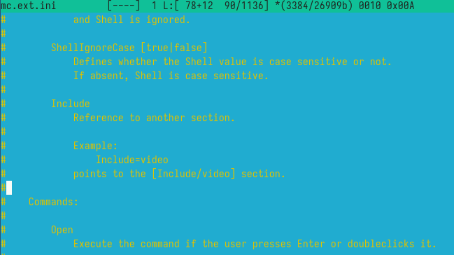

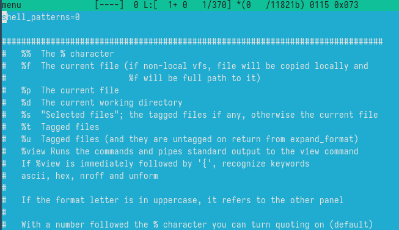

Вызовите подменю Настройки. Освойте операции, определяющие структуру экрана mc (Full screen, Double Width, Show Hidden Files и т.д.)

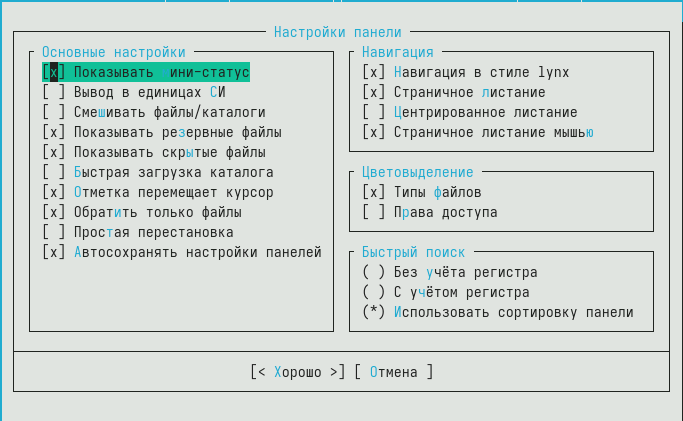

## Встроенный редактор mc

Создадим текстовой файл text.txt.

Откроем этот файл с помощью встроенного в mc редактора

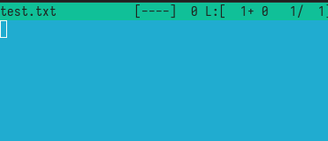

Вставим в открытый файл небольшой фрагмент текста, скопированный из любого
другого файла или Интернета.

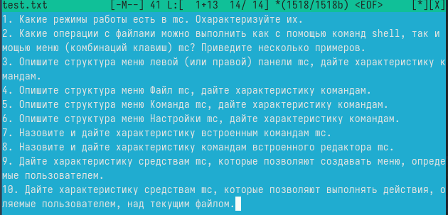

Проделаем с текстом следующие манипуляции, используя горячие клавиши:

Удалим строку текста под пунктом 4, используя ctrl + y

Выделим фрагмент текста и скопируем его на новую строку.

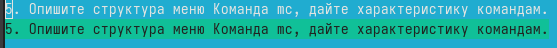

Выделим фрагмент текста и перенесем его на новую строку.

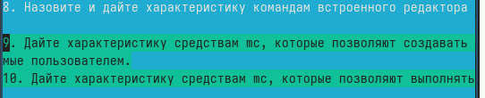

Сохраним файл. 

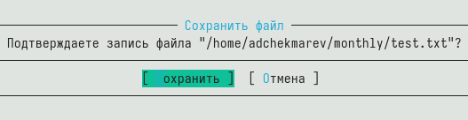

Отменим последнее действие.

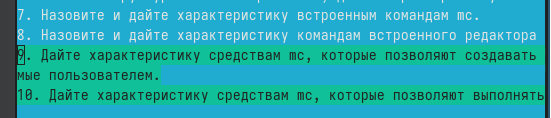

Перейдем в конец файла (нажав комбинацию клавиш) и напишем некоторый текст. ctrl + end  
  
Перейдем в начало файла (нажав комбинацию клавиш) и напишите некоторый текст. ctrl + home  

Сохраним и закроем файл.

Откроем файл с исходным текстом на некотором языке программирования

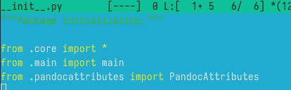

Используя меню редактора, включите подсветку синтаксиса, если она не включена, или выключите, если она включена. ctrl + s

# Контрольные вопросы

1. Какие режимы работы есть в mc. Охарактеризуйте их.  

В Midnight Commander (mc) есть два основных режима работы:  

Режим командной строки (Command Line Mode): В этом режиме пользователь может вводить команды напрямую в командную строку mc для выполнения различных операций над файлами и каталогами.  

Режим меню (Menu Mode): В этом режиме пользователь может использовать графический интерфейс меню для выполнения операций над файлами и каталогами с помощью клавиш и комбинаций клавиш.  

2. Какие операции с файлами можно выполнить как с помощью команд shell, так и с помощью меню (комбинаций клавиш) mc? Приведите несколько примеров.  

Операции с файлами, которые можно выполнить как с помощью команд shell, так и с помощью меню mc, включают в себя:  

Копирование файлов и каталогов.  
Перемещение файлов и каталогов.  
Удаление файлов и каталогов.  
Создание новых файлов и каталогов.  
Изменение прав доступа к файлам и каталогам.  

3. Опишите структура меню левой (или правой) панели mc, дайте характеристику командам.  

Структура меню левой (или правой) панели mc обычно включает следующие команды:  

Просмотр содержимого каталога.  
Копирование, перемещение и удаление файлов.  
Создание новых файлов и каталогов.  
Изменение прав доступа к файлам и каталогам.  
Навигация по файловой системе.  
Поиск файлов.  

4. Опишите структура меню Файл mc, дайте характеристику командам.  

Структура меню "Файл" mc включает команды, связанные с операциями над файлами и каталогами:  

Копирование, перемещение и удаление файлов.  
Создание новых файлов и каталогов.  
Просмотр информации о файлах.  
Изменение прав доступа к файлам и каталогам.  

5. Опишите структура меню Команда mc, дайте характеристику командам.  

Меню "Команда" mc содержит команды для выполнения различных действий, таких как запуск внешних программ, управление архивами и т. д.  

6. Опишите структура меню Настройки mc, дайте характеристику командам.  

Меню "Настройки" mc включает команды для настройки внешнего вида и поведения mc, а также опций отображения файлов.  

7. Назовите и дайте характеристику встроенным командам mc.  

Встроенные команды mc включают в себя операции над файлами и каталогами, такие как копирование, перемещение, удаление, создание и просмотр информации о файлах.  

8. Назовите и дайте характеристику командам встроенного редактора mc.  

Встроенный редактор mc предоставляет возможности для редактирования текстовых файлов, включая подсветку синтаксиса, поиск и замену текста, работу с отступами и т. д.  

9. Дайте характеристику средствам mc, которые позволяют создавать меню, определяемые пользователем.  

Средства mc, позволяющие создавать меню, определяемые пользователем, включают возможность настройки горячих клавиш и привязки команд к ним, а также создание пользовательских расширений и скриптов.  

10. Дайте характеристику средствам mc, которые позволяют выполнять действия, определяемые пользователем, над текущим файлом.  

Средства mc, позволяющие выполнять действия, определяемые пользователем, над текущим файлом, включают возможность запуска пользовательских команд из редактора или просмотрщика файлов, а также использование встроенных команд для выполнения пользовательских действий.  

# Выводы

Я освоил основные возможности командной оболочки Midnight Commander. И приобрел навыки практической работы по просмотру каталогов и файлов; манипуляций
с ними.

# Список литературы{.unnumbered}

::: {#refs}
:::
