---
## Front matter
lang: ru-RU
title: Лабораторная работа №10
subtitle: Текстовой редактор vi
author:
  - Чекмарев Александр Дмитриевич | Группа НПИбд-02-23
institute:
  - Российский университет дружбы народов, Москва, Россия
date: 12 апреля 2024

## i18n babel
babel-lang: russian
babel-otherlangs: english

## Formatting pdf
toc: false
toc-title: Содержание
slide_level: 2
aspectratio: 169
section-titles: true
theme: metropolis
header-includes:
 - \metroset{progressbar=frametitle,sectionpage=progressbar,numbering=fraction}
 - '\makeatletter'
 - '\beamer@ignorenonframefalse'
 - '\makeatother'
 
 
 ## Fonts
mainfont: PT Serif
romanfont: PT Serif
sansfont: PT Sans
monofont: PT Mono
mainfontoptions: Ligatures=TeX
romanfontoptions: Ligatures=TeX
sansfontoptions: Ligatures=TeX,Scale=MatchLowercase
monofontoptions: Scale=MatchLowercase,Scale=0.9
---

# Информация

## Докладчик

:::::::::::::: {.columns align=center}
::: {.column width="70%"}

  * Чекмарев Александр Дмитриевич
  * Группа НПИбд-02-23
  * Российский университет дружбы народов
  * <https://github.com/nenokixd?tab=repositories>

:::
::: {.column width="30%"}

:::
::::::::::::::

## Цель работы

- Познакомиться с операционной системой Linux.
- Получить практические навыки работы с редактором vi, установленным по умолчанию практически во всех дистрибутивах.

## Задания

1. Ознакомиться с теоретическим материалом.
2. Ознакомиться с редактором vi.
3. Выполнить упражнения, используя команды vi.

# Выполнение лабораторной работы. Задание 1. Создание нового файла с использованием vi

## Создание и переход в каталог. Вызов vi и создание файла .sh

- Создадим каталог с именем ~/work/os/lab10.

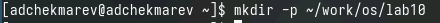

- Перейдем во вновь созданный каталог

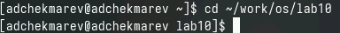

- Вызовем vi и создадим файл hello.sh

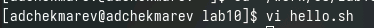

## Редактирование файла

- Нажмем клавишу *i* и введем следующий текст.

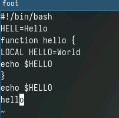

## Взаимодействия в редакторе и создание исполняемого файла

- Нажмем клавишу *Esc* для перехода в командный режим после завершения ввода текста.  
- Нажмем *:* для перехода в режим последней строки и внизу вашего экрана появится приглашение в виде двоеточия.  
- Нажмем *w* (записать) и *q* (выйти), а затем нажмите клавишу *Enter* для сохранения текста и завершения работы.  
- Сделаем файл исполняемым

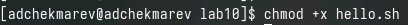

# Задание 2. Редактирование существующего файла

## Вызов редактора

- Вызовем vi на редактирование файла

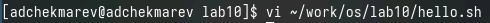 

## Взаимодействия со второй строкой

- Установим курсор в конец слова HELL второй строки.

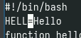 

- Перейдем в режим вставки и заменим на HELLO. Нажмем *Esc* для возврата в командный режим.

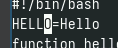

## Взаимодействия с четвертой строкой

- Установим курсор на четвертую строку и сотрем слово LOCAL.

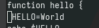

- Перейдем в режим вставки и наберем следующий текст: local, нажмем *Esc* для возврата в командный режим

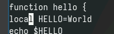

## Взаимодействия с последней строкой

- Установим курсор на последней строке файла. Вставим после неё строку, содержащую следующий текст: echo $HELLO.

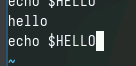

- Нажмем *Esc* для перехода в командный режим.
- Удалим последнюю строку.

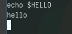

## Отмена изменений и сохранение файла

- Введем команду отмены изменений *u* для отмены последней команды.

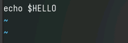

- Введем символ *:* для перехода в режим последней строки. Запишем произведённые изменения и выйдем из vi.

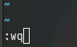

## Выводы

Я познакомился с операционной системой Linux. Получил практические навыки работы с редактором vi, установленным по умолчанию практически во всех дистрибутивах.
