---
## Front matter
title: "Отчёт по лабораторной работе №10"
subtitle: "Текстовой редактор vi"
author: "Чекмарев Александр Дмитриевич | Группа НПИбд-02-23"

## Generic otions
lang: ru-RU
toc-title: "Содержание"

## Bibliography
bibliography: bib/cite.bib
csl: pandoc/csl/gost-r-7-0-5-2008-numeric.csl

## Pdf output format
toc: true # Table of contents
toc-depth: 2
lof: true # List of figures
lot: true # List of tables
fontsize: 12pt
linestretch: 1.5
papersize: a4
documentclass: scrreprt
## I18n polyglossia
polyglossia-lang:
  name: russian
  options:
	- spelling=modern
	- babelshorthands=true
polyglossia-otherlangs:
  name: english
## I18n babel
babel-lang: russian
babel-otherlangs: english
## Fonts
mainfont: PT Serif
romanfont: PT Serif
sansfont: PT Sans
monofont: PT Mono
mainfontoptions: Ligatures=TeX
romanfontoptions: Ligatures=TeX
sansfontoptions: Ligatures=TeX,Scale=MatchLowercase
monofontoptions: Scale=MatchLowercase,Scale=0.9
## Biblatex
biblatex: true
biblio-style: "gost-numeric"
biblatexoptions:
  - parentracker=true
  - backend=biber
  - hyperref=auto
  - language=auto
  - autolang=other*
  - citestyle=gost-numeric
## Pandoc-crossref LaTeX customization
figureTitle: "Рис."
tableTitle: "Таблица"
listingTitle: "Листинг"
lofTitle: "Список иллюстраций"
lotTitle: "Список таблиц"
lolTitle: "Листинги"
## Misc options
indent: true
header-includes:
  - \usepackage{indentfirst}
  - \usepackage{float} # keep figures where there are in the text
  - \floatplacement{figure}{H} # keep figures where there are in the text
---

# Цель работы

Познакомиться с операционной системой Linux. Получить практические навыки работы с редактором vi, установленным по умолчанию практически во всех дистрибутивах.

# Задания

1. Ознакомиться с теоретическим материалом.  
2. Ознакомиться с редактором vi.  
3. Выполнить упражнения, используя команды vi.  

# Выполнение лабораторной работы

## Задание 1. Создание нового файла с использованием vi

Создадим каталог с именем ~/work/os/lab10.

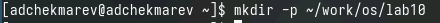

Перейдем во вновь созданный каталог.

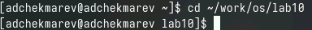

Вызовем vi и создадим файл hello.sh

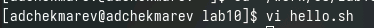

Нажмем клавишу *i* и введем следующий текст.

``` #!/bin/bash
HELL=Hello
function hello {
  LOCAL HELLO=World
  echo $HELLO
}
echo $HELLO
hello
```

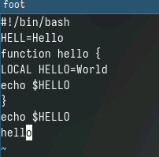

Нажмем клавишу *Esc* для перехода в командный режим после завершения ввода текста.  
 
Нажмем *:* для перехода в режим последней строки и внизу вашего экрана появится приглашение в виде двоеточия.  

Нажмем *w* (записать) и *q* (выйти), а затем нажмите клавишу *Enter* для сохранения текста и завершения работы.  

Сделаем файл исполняемым

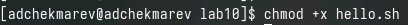

## Задание 2. Редактирование существующего файла

Вызовем vi на редактирование файла

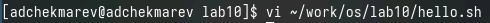

Установим курсор в конец слова HELL второй строки.

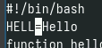

Перейдем в режим вставки и заменим на HELLO. Нажмем *Esc* для возврата в командный режим.

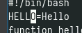

Установим курсор на четвертую строку и сотрем слово LOCAL.

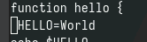

Перейдем в режим вставки и наберем следующий текст: local, нажмем *Esc* для возврата в командный режим

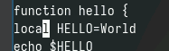

Установим курсор на последней строке файла. Вставим после неё строку, содержащую следующий текст: echo $HELLO.

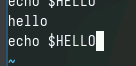

Нажмем *Esc* для перехода в командный режим.  
Удалим последнюю строку.


Введем команду отмены изменений *u* для отмены последней команды.  
Введем символ *:* для перехода в режим последней строки. Запишем произведённые изменения и выйдем из vi.

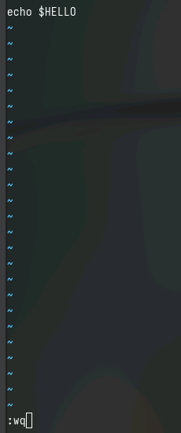


# Контрольные вопросы

1. Дайте краткую характеристику режимам работы редактора vi.  

Командный режим (Command mode): В этом режиме вы можете вводить команды для перемещения по тексту, поиска, удаления, копирования и других операций над текстом.  
Режим ввода (Insert mode): Здесь вы можете вводить текст. Редактор работает как обычный текстовый редактор.  
Режим последней строки (Last line mode): Этот режим используется для выполнения команд, которые начинаются с символа ":". Например, сохранение файла, выход из редактора и т.д.

2. Как выйти из редактора, не сохраняя произведённые изменения?  

В командном режиме наберите :q! и нажмите Enter.


3. Назовите и дайте краткую характеристику командам позиционирования.  

Команды позиционирования:  

h: Сдвигает курсор влево.  
j: Сдвигает курсор вниз.  
k: Сдвигает курсор вверх.  
l: Сдвигает курсор вправо.  

Так же можно воспользоваться стрелками

4. Что для редактора vi является словом?  

В vi слово - это последовательность букв, цифр и символа подчёркивания (_), начинающаяся с буквы или символа подчёркивания.

5. Каким образом из любого места редактируемого файла перейти в начало (конец) файла?  

Для начала файла: В командном режиме нажмите gg.  
Для конца файла: В командном режиме нажмите G.

6. Назовите и дайте краткую характеристику основным группам команд редактирования.  

Вставка и удаление текста.  
Копирование и перемещение текста.  
Поиск и замена.  
Работа с отображением текста (например, скроллинг).

7. Необходимо заполнить строку символами $. Каковы ваши действия?  

В командном режиме наберите :$r $.

8. Как отменить некорректное действие, связанное с процессом редактирования?  

В командном режиме наберите u для отмены последнего действия.

9. Назовите и дайте характеристику основным группам команд режима последней строки.  

Сохранение изменений и выход (:w, :q, :wq).  
Поиск и замена (:s).  
Перемещение по файлу (:n, :1, :$).

10. Как определить, не перемещая курсора, позицию, в которой заканчивается строка?  

В командном режиме наберите $. 

11. Выполните анализ опций редактора vi (сколько их, как узнать их назначение и т.д.).  

Вы можете использовать команду :set для просмотра и установки опций vi.

12. Как определить режим работы редактора vi?  

Режим работы указывается в нижней строке редактора. Например, "INSERT" для режима ввода, "COMMAND" для командного режима.

13. Постройте граф взаимосвязи режимов работы редактора vi.  

Командный режим -> Режим ввода -> Режим последней строчки

# Выводы

Я познакомился с операционной системой Linux. Получил практические навыки работы с редактором vi, установленным по умолчанию практически во всех дистрибутивах.


# Список литературы{.unnumbered}

::: {#refs}
:::
