---
## Front matter
lang: ru-RU
title: Лабораторная работа №11
subtitle: Текстовой редактор emacs
author:
  - Чекмарев Александр Дмитриевич | Группа НПИбд-02-23
institute:
  - Российский университет дружбы народов, Москва, Россия
date: 20 апреля 2024

## i18n babel
babel-lang: russian
babel-otherlangs: english

## Formatting pdf
toc: false
toc-title: Содержание
slide_level: 2
aspectratio: 169
section-titles: true
theme: metropolis
header-includes:
 - \metroset{progressbar=frametitle,sectionpage=progressbar,numbering=fraction}
 - '\makeatletter'
 - '\beamer@ignorenonframefalse'
 - '\makeatother'
 
 
 ## Fonts
mainfont: PT Serif
romanfont: PT Serif
sansfont: PT Sans
monofont: PT Mono
mainfontoptions: Ligatures=TeX
romanfontoptions: Ligatures=TeX
sansfontoptions: Ligatures=TeX,Scale=MatchLowercase
monofontoptions: Scale=MatchLowercase,Scale=0.9
---

# Информация

## Докладчик

:::::::::::::: {.columns align=center}
::: {.column width="70%"}

  * Чекмарев Александр Дмитриевич
  * Группа НПИбд-02-23
  * Российский университет дружбы народов
  * <https://github.com/nenokixd?tab=repositories>

:::
::: {.column width="30%"}

:::
::::::::::::::

## Цель работы

- Познакомиться с операционной системой Linux.
- Получить практические навыки работы с редактором Emacs.

## Задания

1. Ознакомиться с теоретическим материалом.
2. Ознакомиться с редактором emacs.
3. Выполнить упражнения.
4. Ответить на контрольные вопросы.

# Выполнение лабораторной работы.

## Открытие emacs. Создание файла. Набор текста

- Откроем emacs

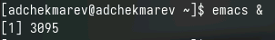{#fig:001 width=40%}

- Создадим файл lab07.sh

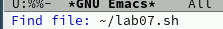{#fig:001 width=39%}

- Наберем текст

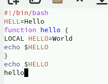{#fig:001 width=30%}

- Сохраним файл с помощью комбинации Ctrl-x Ctrl-s

## Редактирование текста (1)

- Вырежим одной командой целую строку (С-k)

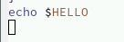

- Вставим эту строку в конец файла (C-y)

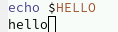

- Выделим область текста (C-space)

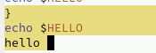 

## Редактирование текста (2)

- Скопируем область в буфер обмена (M-w). Вставим область в конец файла.

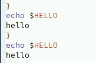{#fig:001 width=15%}

- Вновь выделим эту область и на этот раз вырезать её (C-w)

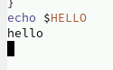{#fig:001 width=10%}

- Отменим последнее действие (C-/)

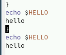{#fig:001 width=15%}

## Rоманды по перемещению курсора

- Переместим курсор в начало строки (C-a)
- Переместим курсор в конец строки (C-e)
- Переместим курсор в начало буфера (M-<)
- Переместим курсор в конец буфера (M->)

## Cписок активных буферов

- Выведим список активных буферов на экран (C-x C-b).

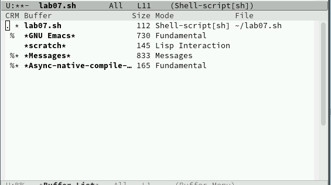{#fig:001 width=60%}

## Перемещение по буферам

- Переместимся во вновь открытое окно (C-x) o со списком открытых буферов и переключимся на другой буфер.
- Закроем это окно (C-x 0).

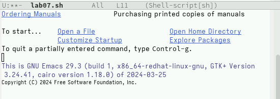{#fig:001 width=60%}

## Переключение между буферами без ввода списка

- Теперь вновь переключимся между буферами, но уже без вывода их списка на экран (C-x b).

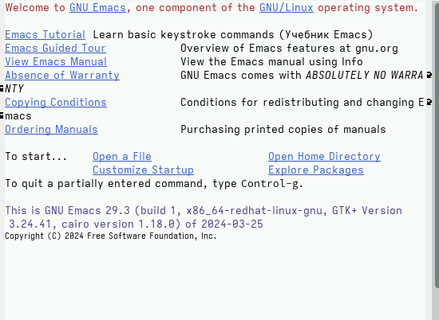{#fig:001 width=60%}

## Управление окнами. Поделим фрейм на 4 части

- Поделим фрейм на 4 части: разделите фрейм на два окна по вертикали (C-x 3), а затем каждое из этих окон на две части по горизонтали (C-x 2).

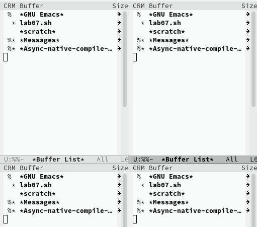{#fig:001 width=40%}

## Открытие новых буферов (файлов)

- В каждом из четырёх созданных окон откройте новый буфер (файл) и введем несколько строк текста.
 
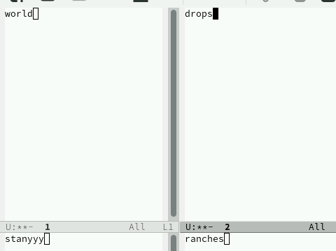{#fig:001 width=60%}

## Режим поиска

- Переключимся в режим поиска (C-s) и найдем несколько слов, присутствующих в тексте.

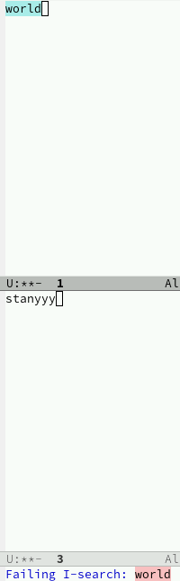{#fig:001 width=30%}

## Замена

- Переключимся между результатами поиска, нажимая C-s.
- Выйдем из режима поиска, нажав C-g.
- Перейдем в режим поиска и замены (M-%), введем текст, который следует найти и заменить, нажмем Enter, затем введем текст для замены. После того как будут подсвечены результаты поиска, нажмем ! для подтверждения замены.
- Заменим drops на hello

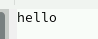

## Альтернативный режим поиска

- Попробуем другой режим поиска, нажав M-s o

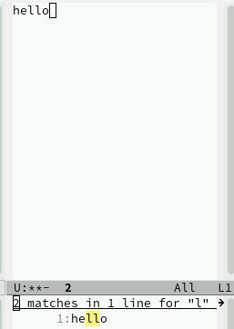{#fig:001 width=40%}

## Выводы

Я познакомился с операционной системой Linux. Получил практические навыки работы с редактором Emacs.
