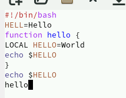

---
## Front matter
title: "Отчёт по лабораторной работе №11"
subtitle: "Текстовой редактор emacs"
author: "Чекмарев Александр Дмитриевич | Группа НПИбд-02-23"

## Generic otions
lang: ru-RU
toc-title: "Содержание"

## Bibliography
bibliography: bib/cite.bib
csl: pandoc/csl/gost-r-7-0-5-2008-numeric.csl

## Pdf output format
toc: true # Table of contents
toc-depth: 2
lof: true # List of figures
lot: true # List of tables
fontsize: 12pt
linestretch: 1.5
papersize: a4
documentclass: scrreprt
## I18n polyglossia
polyglossia-lang:
  name: russian
  options:
	- spelling=modern
	- babelshorthands=true
polyglossia-otherlangs:
  name: english
## I18n babel
babel-lang: russian
babel-otherlangs: english
## Fonts
mainfont: PT Serif
romanfont: PT Serif
sansfont: PT Sans
monofont: PT Mono
mainfontoptions: Ligatures=TeX
romanfontoptions: Ligatures=TeX
sansfontoptions: Ligatures=TeX,Scale=MatchLowercase
monofontoptions: Scale=MatchLowercase,Scale=0.9
## Biblatex
biblatex: true
biblio-style: "gost-numeric"
biblatexoptions:
  - parentracker=true
  - backend=biber
  - hyperref=auto
  - language=auto
  - autolang=other*
  - citestyle=gost-numeric
## Pandoc-crossref LaTeX customization
figureTitle: "Рис."
tableTitle: "Таблица"
listingTitle: "Листинг"
lofTitle: "Список иллюстраций"
lotTitle: "Список таблиц"
lolTitle: "Листинги"
## Misc options
indent: true
header-includes:
  - \usepackage{indentfirst}
  - \usepackage{float} # keep figures where there are in the text
  - \floatplacement{figure}{H} # keep figures where there are in the text
---

# Цель работы

Познакомиться с операционной системой Linux. Получить практические навыки работы с редактором Emacs.

# Задания

1. Ознакомиться с теоретическим материалом.
2. Ознакомиться с редактором emacs.
3. Выполнить упражнения.
4. Ответить на контрольные вопросы.

# Выполнение лабораторной работы

## Основные команды emacs

1. Откроем emacs.


2. Создадим файл lab07.sh с помощью комбинации Ctrl-x Ctrl-f (C-x C-f).


3. Наберем текст:

```
#!/bin/bash
HELL=Hello
function hello {
LOCAL HELLO=World
echo $HELLO
}
echo $HELLO
hello
```



4. Сохраним файл с помощью комбинации Ctrl-x Ctrl-s (C-x C-s).

5. Проделаем с текстом стандартные процедуры редактирования, каждое действие должно осуществляться комбинацией клавиш.

Вырежем одной командой целую строку (С-k).


Вставим эту строку в конец файла (C-y).


Выделим область текста (C-space).


Скопируем область в буфер обмена (M-w). Вставим область в конец файла.


Вновь выделим эту область и на этот раз вырезать её (C-w).


Отменим последнее действие (C-/).


6. Научимся использовать команды по перемещению курсора

Переместим курсор в начало строки (C-a)  
Переместим курсор в конец строки (C-e)  
Переместим курсор в начало буфера (M-<)  
Переместим курсор в конец буфера (M->)


7. Управление буферами

Выведим список активных буферов на экран (C-x C-b).


Переместимся во вновь открытое окно (C-x) o со списком открытых буферов и переключимся на другой буфер.  
Закроем это окно (C-x 0).


Теперь вновь переключимся между буферами, но уже без вывода их списка на экран (C-x b).


8. Управление окнами

Поделим фрейм на 4 части: разделите фрейм на два окна по вертикали (C-x 3), а затем каждое из этих окон на две части по горизонтали (C-x 2).


В каждом из четырёх созданных окон откройте новый буфер (файл) и введем несколько строк текста.


9. Режим поиска

Переключимся в режим поиска (C-s) и найдем несколько слов, присутствующих в тексте.


Переключимся между результатами поиска, нажимая C-s.

Выйдем из режима поиска, нажав C-g.  
Перейдем в режим поиска и замены (M-%), введем текст, который следует найти и заменить, нажмем Enter, затем введем текст для замены. После того как будут подсвечены результаты поиска, нажмем ! для подтверждения замены.  
Заменим drops на hello


Попробуем другой режим поиска, нажав M-s o


# Контрольные вопросы

1. Кратко охарактеризуйте редактор emacs.  

Emacs — это мощный текстовый редактор, который также может быть использован как среда разработки благодаря своей расширяемости. Он имеет множество функций, таких как расширяемая система управления буферами, встроенный интерпретатор языка Emacs Lisp и многое другое.  

2. Какие особенности данного редактора могут сделать его сложным для освоения новичком?  

Сложность Emacs для новичка может возникнуть из-за его нетрадиционного подхода к управлению текстом. Он использует множество комбинаций клавиш, что может потребовать времени для изучения. Также его уникальная философия и обилие функций могут быть перегрузкой для новичка.  

3. Своими словами опишите, что такое буфер и окно в терминологии emacs’а.  

В терминологии Emacs буфер представляет собой область памяти, в которой хранится текст. Окно — это видимая часть буфера, которая отображается на экране. Окно может отображать только один буфер за раз, но один буфер может быть открыт в нескольких окнах.  

4. Можно ли открыть больше 10 буферов в одном окне?  

В Emacs можно открыть больше 10 буферов в одном окне. Ограничений на количество буферов в одном окне нет.  

5. Какие буферы создаются по умолчанию при запуске emacs?  

При запуске Emacs по умолчанию создаются несколько буферов, таких как scratch (для экспериментов и временного кодирования), Messages (для вывода сообщений о работе Emacs), Minibuffer (для ввода команд) и другие, в зависимости от конфигурации.  

6. Какие клавиши вы нажмёте, чтобы ввести следующую комбинацию C-c | и C-c C-|?  

Для ввода комбинаций C-c | и C-c C-| нажмите соответственно Ctrl + c, затем нажмите вертикальную черту "|". Аналогично для комбинации C-c C-|, но вместо вертикальной черты используйте Shift + \  

7. Как поделить текущее окно на две части?  

Чтобы поделить текущее окно на две части, можно использовать команду split-window-horizontally (обычно это Ctrl + x 2). Это создаст два окна, расположенных горизонтально друг над другом.  

8. В каком файле хранятся настройки редактора emacs?  

Настройки редактора Emacs хранятся в файле ~/.emacs или ~/.emacs.d/init.el.  

9. Какую функцию выполняет клавиша backspace и можно ли её переназначить?  

Клавиша backspace в Emacs выполняет функцию удаления символа перед курсором. Её можно переназначить с помощью конфигурации Emacs Lisp.  

10. Какой редактор вам показался удобнее в работе vi или emacs? Поясните почему.  

gedit. Потому что он похож на notepad++, которым я зачастую пользуюсь на windows

# Выводы

Я познакомился с операционной системой Linux. И получил практические навыки работы с редактором Emacs.

# Список литературы{.unnumbered}

::: {#refs}
:::
